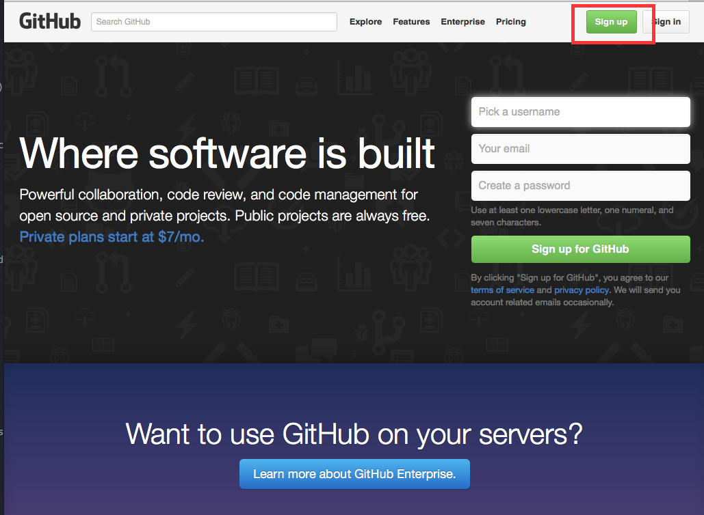
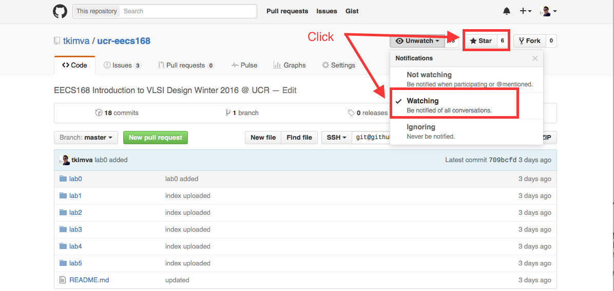
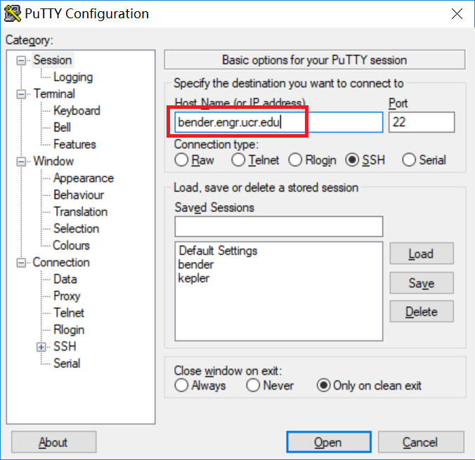
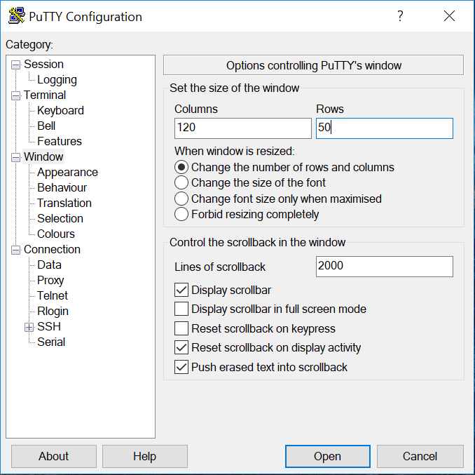
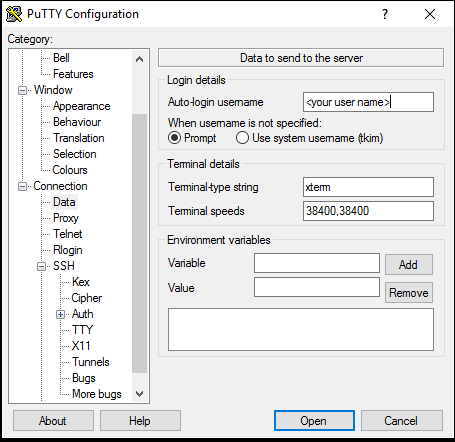
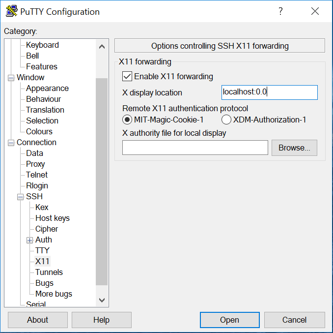
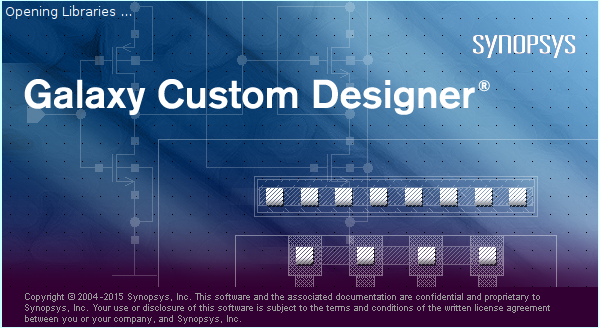
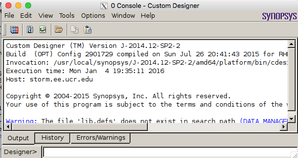

# Pre-Lab

## ENGR account

ENGR account is different than your UCR NetID. It is not combination with numbers (tkim049, this is UCR NetID). If you never activated your ENGR account, or you have an ENGR account but you forgot your password, then please visit [here](https://www.engr.ucr.edu/secured/systems/login.php) and create your one.

For GPP/UCR Extension students, please go to ECE systems (WCH107) and request your temporarily account in person.

## GitHUB

For this class, you need to register and keep watching this lab repository. Please register github first.

go to [github.com](http://github.com) and follow the screenshots below.

After you register, you need to login and go to our lab repository [github.com/tkimva/ucr-eecs168](https://github.com/tkimva/ucr-eecs168). You need to press watching and star as seen below.

## ENGR X-windows systems access

### Windows

The college provides three computational servers for student use both on and off campus. These computational servers provide our IC design toolchains.

To access these servers on Windows, you must first download and install an SSH client (putty) and an X Server (Xming).  Once you have finished downloading the links below.

In our lab (WCH125), `putty` and `Xming` already installed.

To install `putty` and `Xming` in your computer, you can find an instruction at [ here ](http://www.geo.mtu.edu/geoschem/docs/putty_install.html)

#### Configure `Xming` and `putty`

Find `Xming` in the start menu, and launch first. You should be able to find `Xming` in the system tray.

Then, you find `putty` and launch, the following screen is popped up.
and you can put hostname `storm.engr.ucr.edu` and put your user id. The most important thing is to enable X11 forwarding in the `putty`.

Again, you need to run `Xming` first and then `putty` later

### OSX/Linux

For OSX/Linux, you do not need to install SSH/Xwindows tools as these are default software in these operating systems.

We connect `storm.engr.ucr.edu` server thru SSH with X-forwarding service.

For OSX/Linux, you can type following command in your terminal,

`ssh -Y [ENGRID]@storm.engr.ucr.edu`

For example

`ssh -Y tkim@storm.engr.ucr.edu`

## Check Synopsys Galaxy Custom Designer Launch

We already preconfigured every IC design environment, so you do not need to set any environment. You can check toolchain is correctly working. Once you log in `storm.engr.ucr.edu`, you can check if Synopsys tool is working correctly by typing the following command.

`cdesigner&`

Once you see the following screen, then it is ready for next lab.

If you have any question, then you can post your question at issue section in this github.
