# Lab/Tutorial 1

In this tutorial, some contexts use Synopsys tutorials from Vazgen Melikyan (Synopsys) and Hamid Nahmoodi (SFSU). All the tools and PDK are given thru Synopsys University Program.

## Introduction

In this tutorial, you will learn how to draw custom IC layout and simulate your design using 28/32/90nm technologies in Synopsys Custom Design Tools. This tutorial includes the detail steps of schematic, layout, and simulation of designs.

You need to have some basic skill for Linux environment to manage the design file (creation/rename/modify folders and files). If you want to know how to use Linux, there are many of tutorials available on the web. For example, there is small Linux cheat sheets [here](http://www.nixtutor.com/linux/all-the-best-linux-cheat-sheets/) and long tutorials [here](http://tldp.org/LDP/gs/node5.html)


_**Fig. 1 Full custom design flow**_


Fig. 1 shows the full custom design flow with Synopsys design tools. The first three parts of flow are covered in our lab1 and the rest four parts will be covered in the lab2. In this three parts, you design a CMOS inverter in Custom Designer, simulate the circuit in HSPICE, measure and view waveforms of simulation results in Custom Waveview.

For the rest four parts (Lab 2), you will use Custom Designer to create a layout with given technology from Synopsys. IC Validator will be used to verify your design ([DRC](https://en.wikipedia.org/wiki/Design_rule_checking)) and check if your layout matches its schematic ([LVS](https://en.wikipedia.org/wiki/Layout_Versus_Schematic)). In the last two steps, you can do the parasitic extraction of your circuit and do simulation again. Finally, you can compare your simulation and post-simulation. This is our lab 1 and 2. In this tutorial, you will complete the first three steps.

## Part 1: Setup your design workspace

You need to login our `storm.engr.ucr.edu` server first. If you do not know how to connect our server, please check out [lab1](../lab0)


You can use your home folder (`~ or /home/[Account Name]`, in the example, [Account Name will be `tkim` or `zsun`, you need to use your own account) or you can create a new folder to have your design for this eecs168 course. To create your design folder, you need to type followings. The first command let you move your home folder, and `mkdir` command is to create your folder.

```
cd ~
mkdir eecs168
```

Once you generate your workspace folder, you need to go to the folder
```
cd eecs168
```
Then, you need to install Synopsys PDK ([Process Design Kit](https://en.wikipedia.org/wiki/Process_design_kit)) (technology library into your workspace as follows.

For 32/28 nm Synopsys PDK
```
cp /usr/local/synopsys/pdk/SAED3228nm_iPDK/install/lib.defs ./
```

For 90nm Synopsys PDK
```
cp /usr/local/synopsys/pdk/SAED_PDK90nm/install/lib.defs ./
```

You can choose either 32/28 nm PDK or 90nm. In this class, 90nm PDK is recommended for your class work. You can choose 32/28 nm PDK but it might be required more strict rules on DRC, so you need to be more careful about your layout design with 32/28nm PDK. Above procedure is just required for one time, you do not need to re-do above command `cp` for the next time.

Once PDK library is installed correctly in your workspace, then you can run `custom designer` as follows

```
cdesigner&
```

By adding `&` after the command, you can put a command in the background in Linux system. So, you can do another job while `Custom Designer` is running.

Custom Designer Console should open up without any warning message in Fig. 2

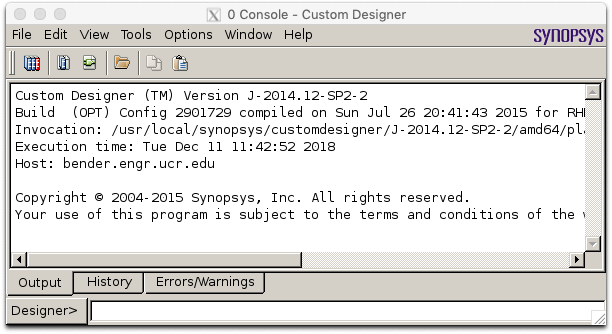

_**Fig. 2 Custom Designer Setup with PDK**_


If you see any warning message, in Fig. 2, that means that your PDK was not setup correctly, so you need to copy PDK's `lib.def` in your workspace again.

Let's launch Library manager first, then you go to Tools -> Library manager, then Fig Library manager is launched. You may see `SAED_PDK_90` library in the libraries list.

Then, go to File -> New -> Library to create a new library. New library windows will pop up. You can put your new library name in the name in the attributes section. For the PDK technology, you can choose `Import file` and choose your technology file (.tf extension) in the PDK. You can under the following folder for 90nm.

```
/usr/local/synopsys/pdk/SAED_PDK90nm/techfiles/saed90nm_1p9m_cd.tf
```

After you put name and technology file (.tf) and click Ok. See Fig 3.


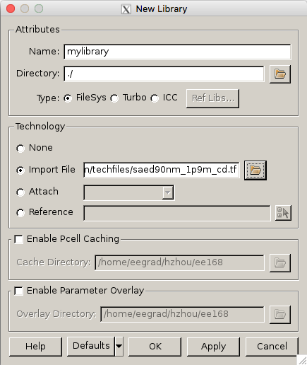

_**Fig. 3. New library creation**_


## Part 2: Creating a cell view

In the main windows, go to File -> New -> CellView to create a new Cell View under the library you made. We made `mylibrary`, and you enter a new name, here we may use cell name as `inverter` then choose view name as `schematic`. For the editor, you use `Schematic Editor` as in Fig 4.

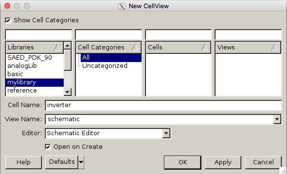

_**Fig. 4. New Cellview**_

After clicking `OK` then, schematic design windows open up as seen in in Fig. 5.

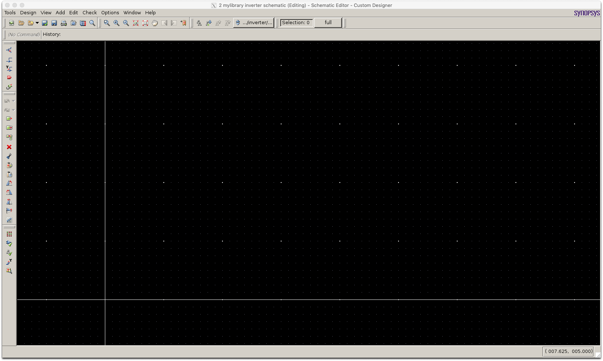

_**Fig. 5. New Schematic Windows**_

Here, you need to make sure right PDK library used. From your console window (first launched windows after you typed `cdesigner`), go to Tools -> Technology Manage.  Then you have to choose `SAED_PDK_90` in attachment for your `mylibrary`.

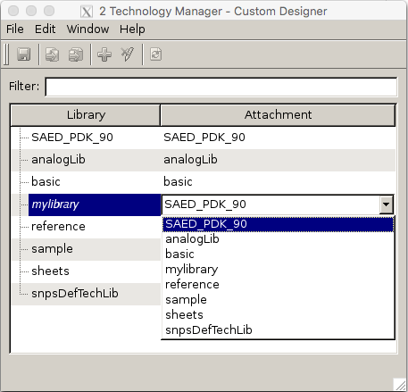

_**Fig. 6. Technology Manager**_


Go to your schematic window, and click Add > Instance, then select `SAED_PDK_90` for the library and select pmos4t and nmos4t for your p-mos and n-mos Cellview
For pmos4t width, assign 0.5um and for n-mos 4t width, assign 0.25um as seen in Fig. 7. You can modify these values later with property editor (Edit -> Properties -> Property Editor).

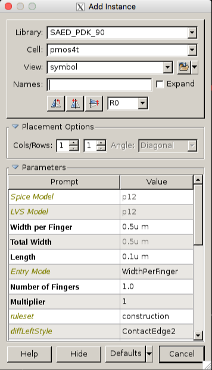

_**Fig. 7. Adding instance for p-mos and n-mos**_

After placing the p-mos and n-mos transistors, the schematic should look like figure 8 below.

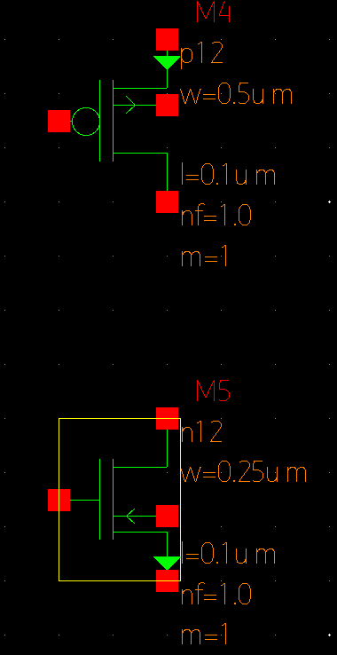

_**Fig. 8. Placing p-mos and n-mos**_


After you place, you need to add wires to the schematic as seen in Fig 9. Go to Add -> Wire in the menu of the schematic editor and draw wire with your mouse and you need to press `ESC` key to escape the selected mode.

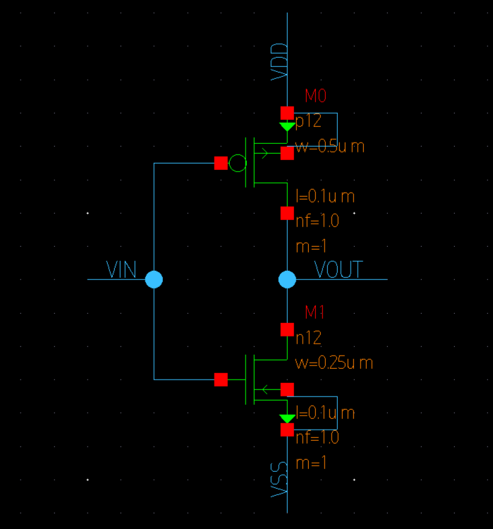

_**Fig. 9. Add wires**_


After drawing all the required wires, then you can assign wire names (Add -> Wire name). Once you choose Wire name mode, you need to type wire name first in the top window shown in Fig 10. After typing wire name, then you click the wire you want to assign.

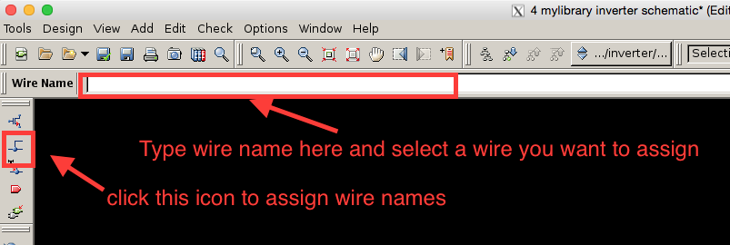

_**Fig. 10. Add wire names**_


After adding wires and wire names, you may need to add pins for input and output. To add pins to the schematic, go to Add -> Pin to add pins for input (VIN, AVDD, AVSS) and output (VOUT) for your schematic. You can type in a name for the pin and select whether the pin is an input or output port. Then place the pin on a wire or if the wire in schematic view already has a name you can click on the wire and the pin will get the name of the wire. Note that the pin names in schematic view should match the label names in layout view (AVDD, AVSS, VIN, VOUT, etc) for future reference.

See Fig. 11 and Fig. 12 for reference on how to add pins.

Afterward, your circuit should look similar to figure 13 below after you add the pins. As a general convention, use uppercase letters for naming pins instead of lowercase letters.


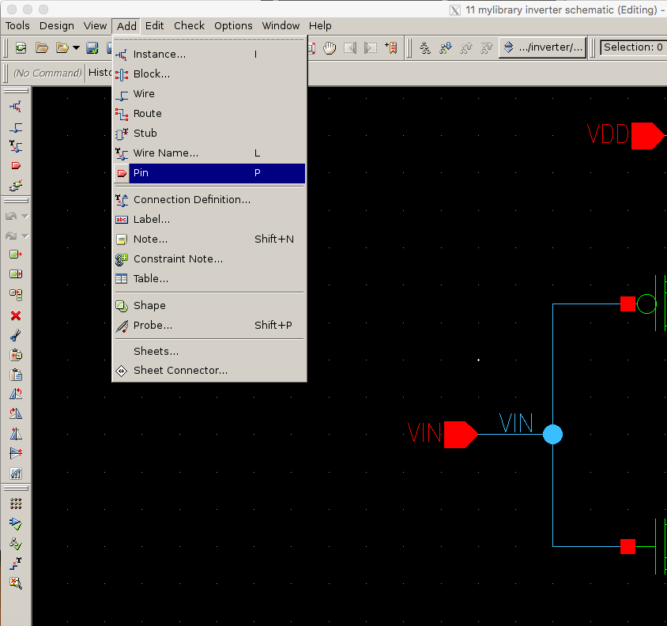

_**Fig. 11. Adding pins**_


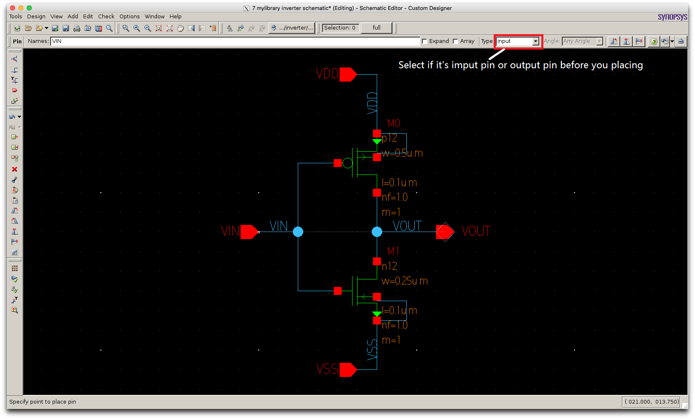

_**Fig. 12. Adding pins**_


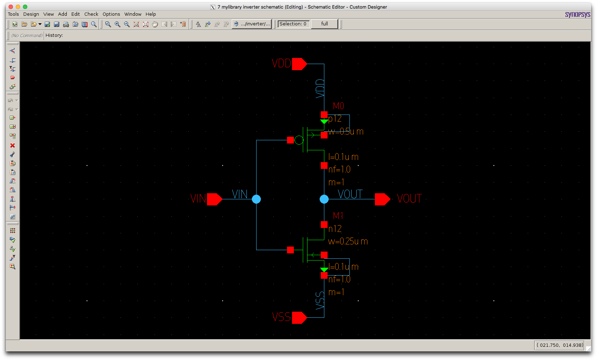

_**Fig. 13. Complete Schematic with pins**_


Save your schematic by clicking save icon or go to Design -> Save.
Now we want to create a symbol for the inverter schematic to use for future designs instead of redrawing it every time. To create a symbol for the inverter, go to Design -> New CellView -> From CellView.

Make sure library and cell names match and click OK. See figure 14 below for reference.

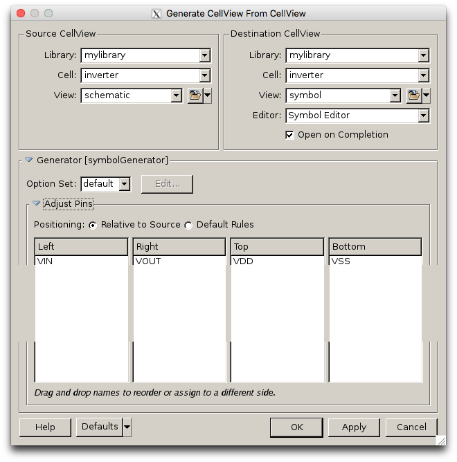

_**Fig. 14. Cellview generation from cellview**_


Now we have a transistor level model of an inverter (symbol). See Fig. 15 for reference.

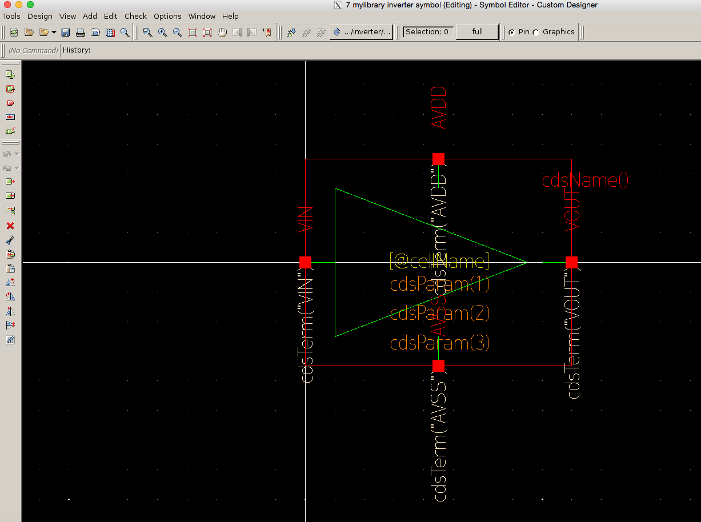

_**Fig. 15. Design symbol for inverter**_

You may also modify the appearance of the inverter symbol here by using the shape tools, Add -> Shape. Now save and close the symbol window.
From the Custom Design Console, go to File -> New -> CellView and select mylibrary under the library column. Enter a new name for “Cell Name” in this case I used inverter_testbench and choose schematic for “View Name”. For the editor choose Schematic.
Click OK. See Fig. 16 for the reference. Note that this schematic file will be used as a sandbox for circuits using the inverter symbol we created earlier.

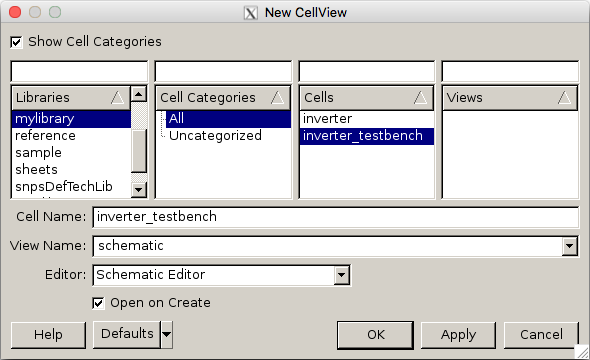

_**Fig. 16. New CellView Creation**_

Now that you have a new schematic window, go to Add -> Instance. In the add instance window, select “mylibrary” as the library, “inverter” as the cell, and “symbol” for the view to select the inverter you just made and place it on the schematic. See Fig. 17 for reference. Also in the add instance window, select “analogLib” for the library and choose: vsource, vpulse and gnd for the cell while placing the part for each selection on the schematic.


_**Fig. 17. Drawing an Instance of an Inverter**_

Now add wires to the circuit using Add -> Wire and use Add -> Pin to add an output pin on the VOUT signal of the inverter so the schematic looks like figure 18 below. Don’t worry if your values for vpulse and vsource don’t match up with figure 18 since we will be modifying them next.


_**Fig. 18. Testbench for Inverter**_

By clicking on property editor icon and selecting a component in schematic view, you can edit a component's property. You can also use Edit -> Properties -> Property Editor to edit the properties of the parts. Select vpulse and modify its properties as shown in Fig.19. Select vsource and modify its properties as shown in Fig.19.

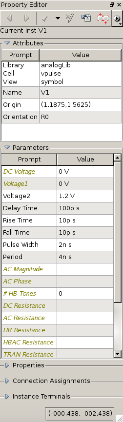
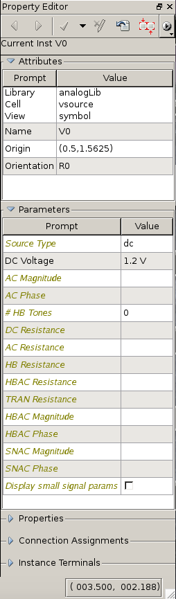

_**Fig. 19. Property editor**_


Your final schematic should look like Fig. 18 above with the applied property edits for vpulse and vsource. The circuit is now ready for simulation. Also don’t forget to save your schematic by clicking Save icon or go to Design -> Save.


## Part 3: Simulation and analysis

In SAE, we will run a DC sweep and a transient analysis.
To run SAE, go to Tools -> SAE in the schematic window. This will launch the window in Fig. 20, which consists of three primary sections. Section one contains the design variables. Section Two contains the values being measured in the circuit. Section three displays the types of analysis being run. See figure 20 below for reference.

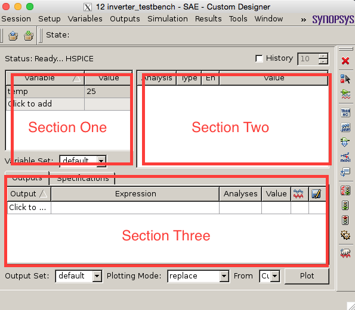

_**Fig. 20. SAE window**_


To setup the simulation model files, go to Setup -> Models Files. A model files window will open as shown in figure 21 below. Next click on section one as shown in figure 21 and browse the directory and select the SAED90nm.lib file. You can find the file in the following directory:

```
/usr/local/synopsys/pdk/SAED_PDK90nm/hspice/SAED90nm.lib
```

In section two of the model files window (see Fig. 21), select TT_12 as your transistor type. Click OK when done.


_**Fig. 21. HSPICE simulation model**_


Next to setup analysis type, go to Setup -> Analysis and the window in figure 22 will appear. Stay on the general tab and select `tran` to setup the transient analysis type. Setup the remaining options as shown in Fig. 22 and click Apply.

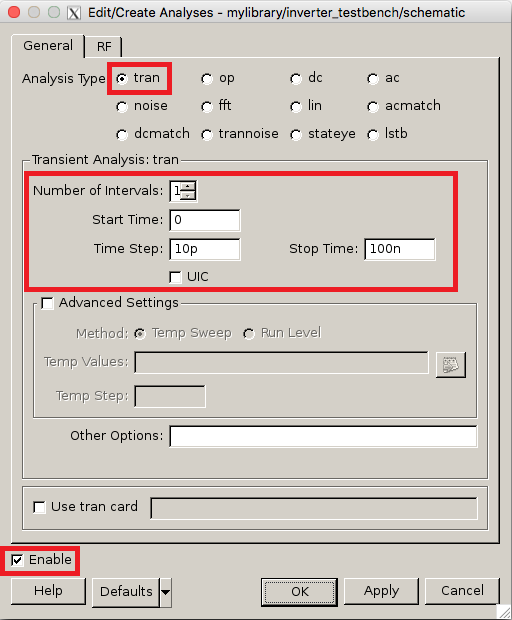

_**Fig. 22. Transient Simulation Setup**_


In the same window, select `dc` to setup a DC sweep. Fill out the options as shown in Fig. 23 below. Click OK when done.

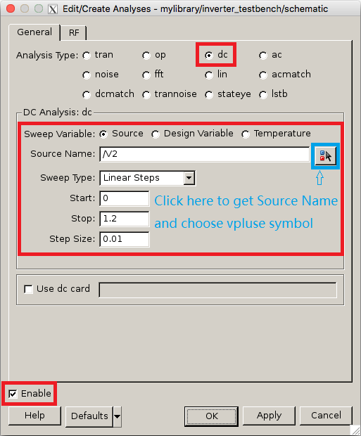

_**Fig. 22. DC Simulation Setup**_


The following step is to choose the desired simulations results and select the nodes in the circuit to measure. In section TWO of Fig. 20 do the following steps:


To setup the circuit output voltage:

1. Click under the output field, and write “Vout” or a name for an output variable of the inverter.
1. Click under the expression column and choose the output node from the schematic. In this case, click on pointer icon and select the wire labeled “VOUT” as shown below in Fig. 24 in the schematic window. You can also write an equation that uses the values of some nodes in that schematic.
1. Under analysis, select the type of analysis you want to run. In this case, select `dc` and `tran` to run the transient and DC analysis for this variable.


To setup the circuit input voltage:
1. Click under the output field in a new row, and write “Vin” or a name for an input variable of the inverter.
1. In the same row, click under the expression column and choose the input node from the schematic. In this case, click on pointer icon and select the wire labeled “VIN” as shown below in figure 24 in the schematic window.
1. Under analysis, select the type of analysis you want to run. In this case, select `dc` and `tran` to run the transient and DC analysis for this variable.


To setup the circuit source current:
1. Click under the output field in a new row, and write “isupply” or a name for a current variable.
1. In the same row, click under the expression column and choose the voltage source from the schematic. In this case, click on and select the voltage source labeled “V0” as shown below in Fig. 24 in the schematic window. Notice that current is being measured rather than voltage.
1. Under analysis, select the type of analysis you want to run. In this case, select `dc` and `tran` to run the transient and DC analysis for this variable.

Afterward, the SAE window should look something similar to figure 25 below. Note that the expression values in figure 25 may not match with your values which are fine since those are dependent on the names used in the schematic for the voltage sources and wires.


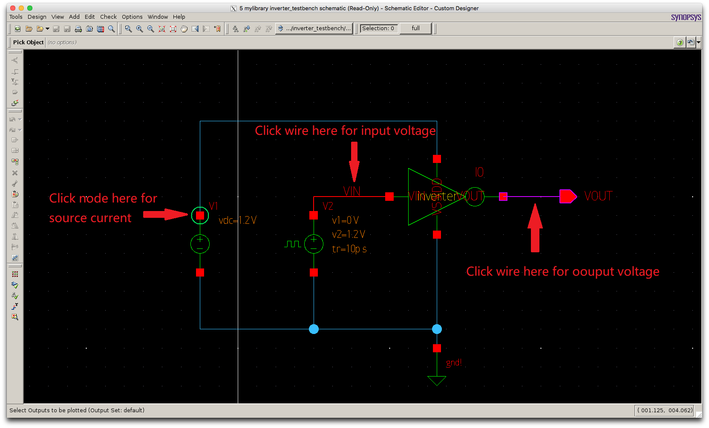

_**Fig. 24. Schematic Windows**_


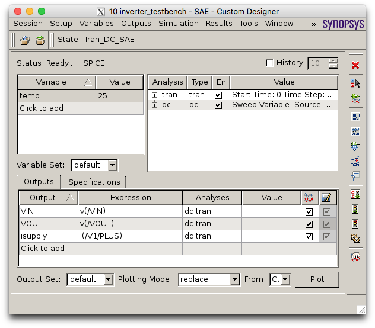

_**Fig. 25. Updated SAE Window**_


Now save your simulation setups by going to Session -> Save State. In the new window that opens, select OpenAccess from the three main categories at the top and give a name for the session in the name field. Click OK when done. See Fig. 26 below for reference.

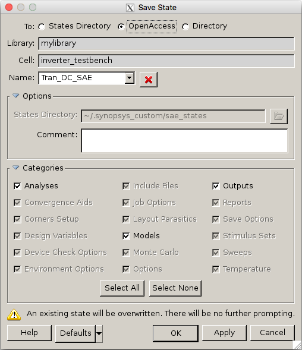

_**Fig. 26. Save State Window**_


To run the simulation, go to Simulation -> Netlist and Run. The status of simulation is reported in Custom Designer Console window. If you see “Simulation completed successfully” it means that your simulation is successfully done (Fig. 27).


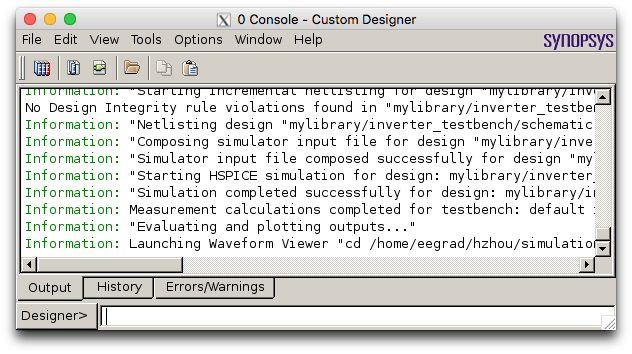

_**Fig. 27. Custom Designer Console**_


After running simulation successfully, a WaveView window will open up. You can select the type of analysis you want to view by selecting the respective tab in the bottom left corner of the window.
For the transient analysis waveform, click the `tran` tab in the bottom left corner. See Fig. 28 for the transient analysis. For the DC sweep waveform, click the dc tab in the bottom left corner.
See Fig. 29 for the dc sweep analysis You now have run transient and dc analysis successfully.


_**Fig. 28. Transient Analysis in Waveview**_


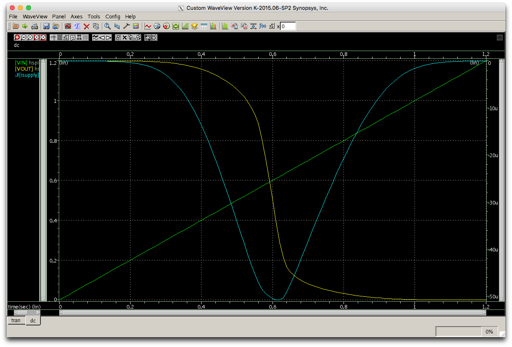

_**Fig. 29. DC Sweep Analysis in Waveview**_


## Part 4: Waveform and analysis

The measurement tool in the WaveView window provides many methods for measuring the waveforms. Here is a list of several features and measurements you can do in WaveView:

Zooming In and Out:

To zoom in on your waveform, click top-left zoom-in icon to do a vertical or horizontal zoom by dragging a box over the waveform with the mouse. Click zoom-out icon to unzoom. Also you can press X for a full unzoom of the waveform.

Grouping and Ungrouping Signals:

First off, it is handy to know how to group and ungroup waveforms in WaveView. See Fig. 30 for ungrouping waveforms and see figure 31 for grouping waveforms.

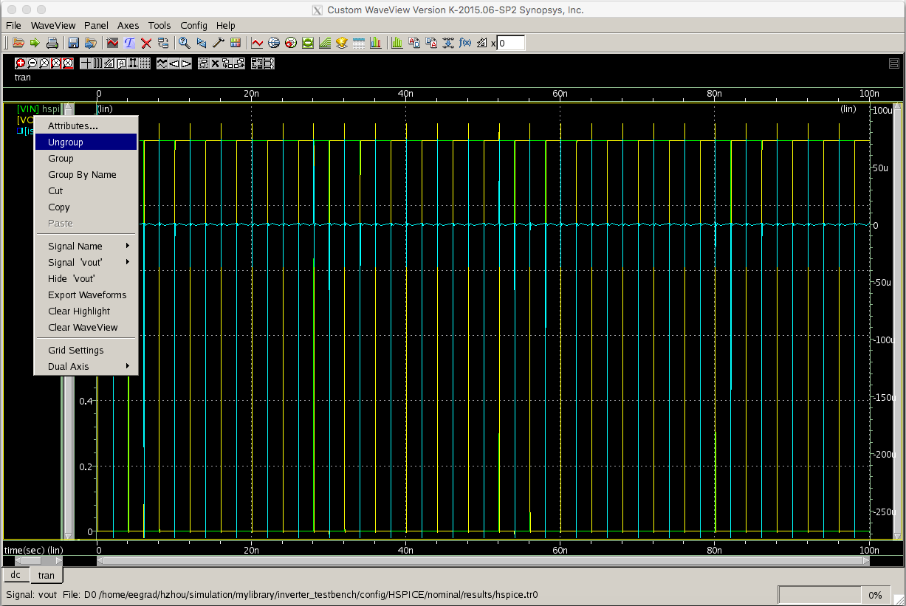

_**Fig. 30. Ungrouping Waveforms**_


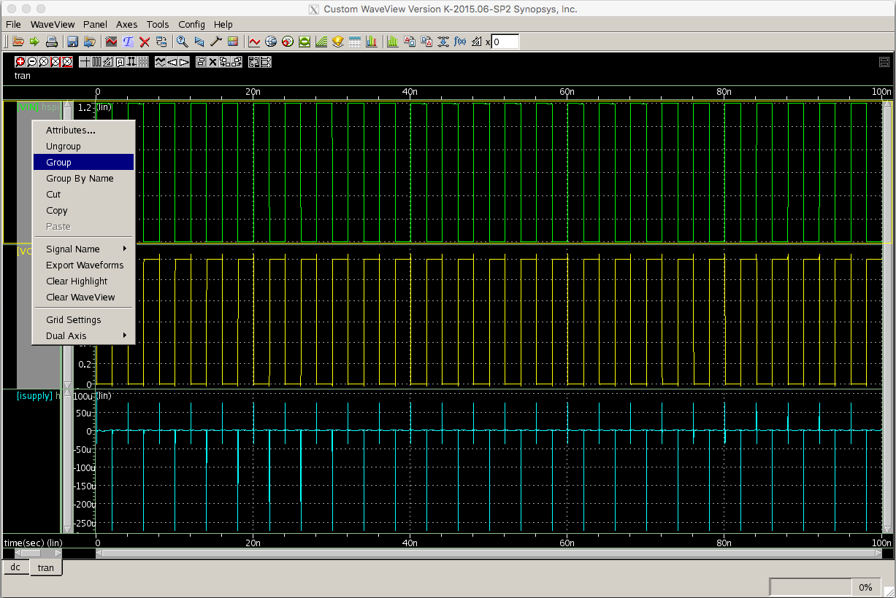

_**Fig. 31. Grouping Waveforms**_

To group the waveforms in Waveview together, select the names of the signals to be grouped in the signals list and hold down `Ctrl` for each additional signal to add. Once you have all the signals you want to group selected, right click on the mouse and select `Group` from the dropdown menu to group the selected waveforms.

Delay Measurements of Vin and Vout at 50% to 50%:

To measure delay between the input and output signals of the inverter at 50% select `tran` tab in the bottom left hand corner of the WaveView window. Group the Vout and Vin waveforms together so the two waves overlap each other (see figure 31 on how to group signals). Open the measurement tool by going to Tools -> Measurement… or by clicking ruler icon in the WaveView window. Click the All tab in the measurement tool window and fill out the options as shown below in figure 32. Click Ok when done.

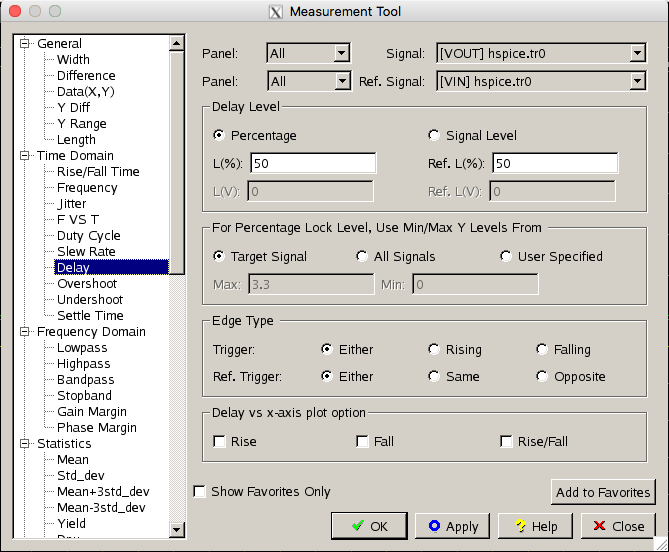

_**Fig. 32. Delay Analysis**_

After clicking Ok, a delay measurement box will appear on the waveform. Just drag the box to the waveform you want to measure (in this case the Vin and Vout overlapping waveforms) and the delay value will appear in the box. You can also drag the delay measurement box along different valid points of the waveform to get more delay values. See Fig. 33 below for the delay measurements box.

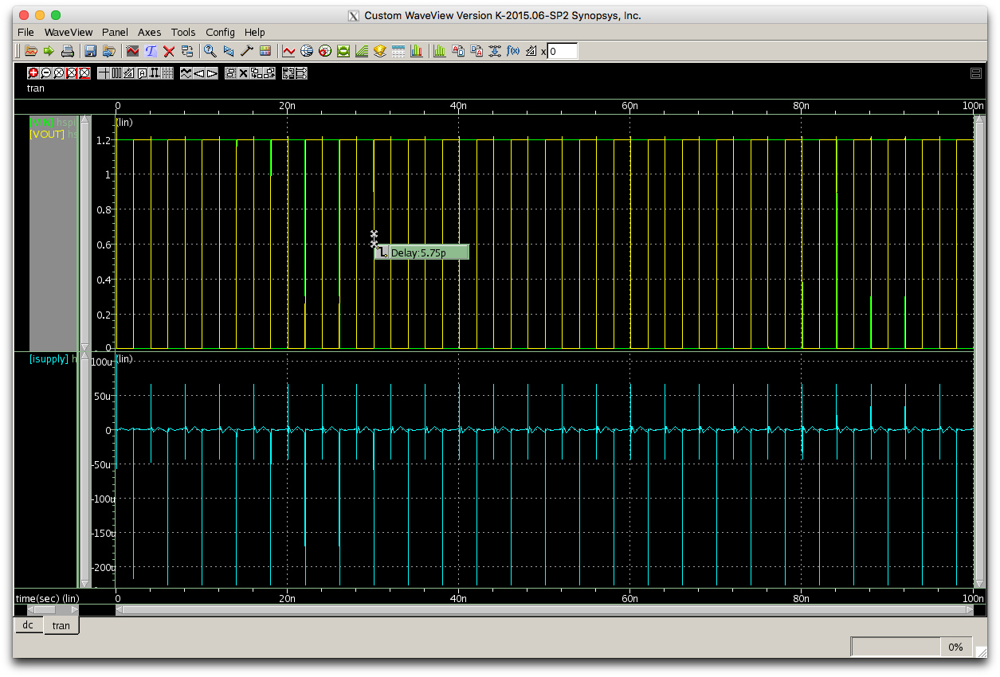

_**Fig. 33. Delay Waveform Measurement**_


Rise/Fall Time Measurements at 90% and 10% for Vout:

To measure fall and rise time, select the `tran` tab in the bottom left-hand corner of the WaveView window and ungroup all the waveforms as described in figure 30. Open the measurement tool by going to Tools -> Measurement… or by clicking ruler icon in the WaveView window. Click the All tab in the measurement tool window and fill out the options as shown below in Fig. 34. Click Ok when done.

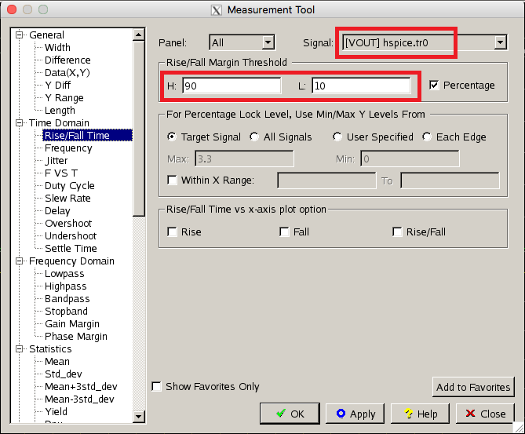

_**Fig. 34. Rise/Fall Measurement Tool**_


After clicking Ok, a rise/fall measurement box will appear on the waveform. You can drag the rise/fall measurement box along the Vout waveform to get the rising and falling delay times. Notice that when the rise/fall measurement box shows a rising red curve the tool is measuring rising delay time from 10% of the signal to 90% of the signal. Also when the rise/fall measurement box shows a falling green curve the tool is measuring the falling delay time from 90% of the signal to 10% of the signal. See figure 35 for reference, it shows two measurement boxes and zooms in on Vout.

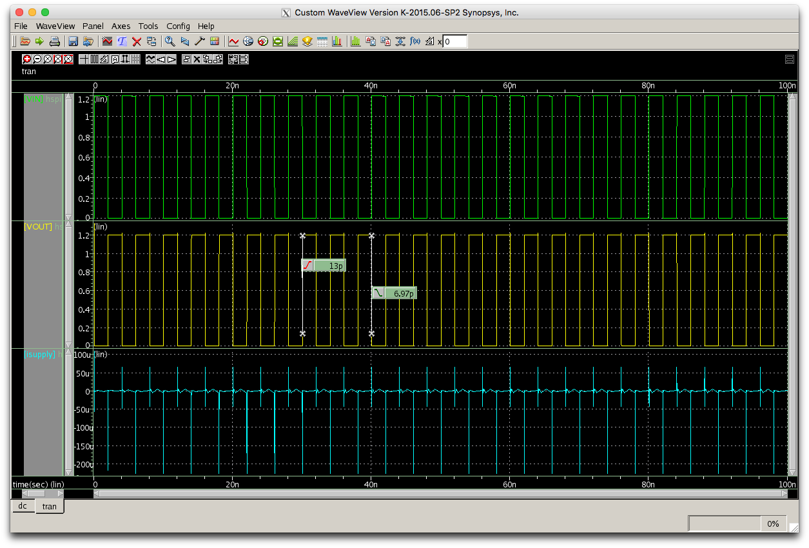

_**Fig. 35. Rise/Fall Waveform measurement**_


Average Current Measurement:

To measure average current, select the `tran` tab in the bottom left-hand corner of the WaveView window and ungroup all the waveforms as described in figure 30. Delete the Vout and Vin waveforms so only the isupply waveform shows. You can delete a waveform by selecting its name in the signal list on the left side of the WaveView window and pressing delete on the keyboard and clicking ok. You can always recover these signals later by clicking Plot on the SAE window.

Open the measurement tool by going to Tools -> Measurement… or by clicking ruler icon in the WaveView window. Scroll down in the menu window on the left and then click on the Average measurement within the Level submenu as shown in Fig. 36. Click Ok when done.

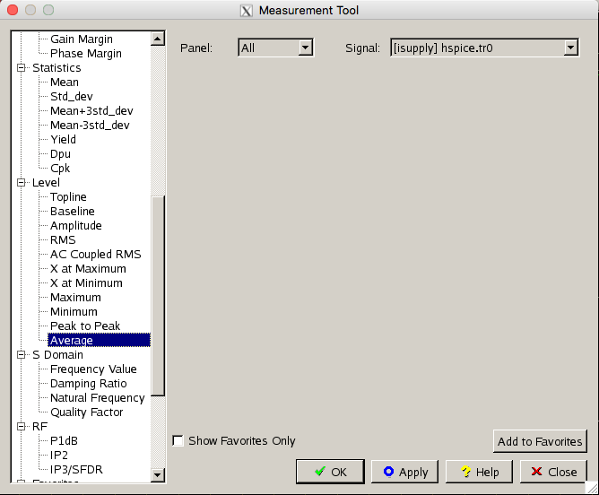

_**Fig. 36. Average Measurement Tool**_


After clicking Ok, an average measurement box will appear on the waveform. Drag the box toward the waveform until it displays the average value. See Fig. 37 below for reference.


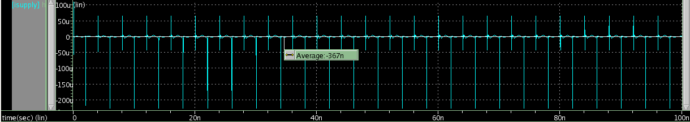

_**Fig. 37. Average Waveform Measurement**_


Frequency Measurement:

To measure frequency, select `tran` tab in the bottom left hand corner of the WaveView window and ungroup all the waveforms as described in Fig. 30.

Open the measurement tool by going to Tools -> Measurement… or by clicking ruler icon in the WaveView window. Click the All tab in the measurement tool window and fill out the options as shown below in Fig 38. Click Ok when done.

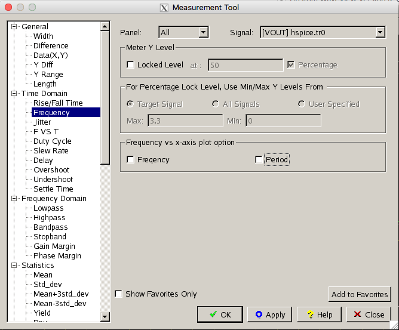

_**Fig. 38. Frequency Analysis**_


After clicking Ok, a frequency measurement box will appear on the waveform. Drag the box toward the waveform you want to measure until it displays the frequency value. See Fig. 39 below for reference.


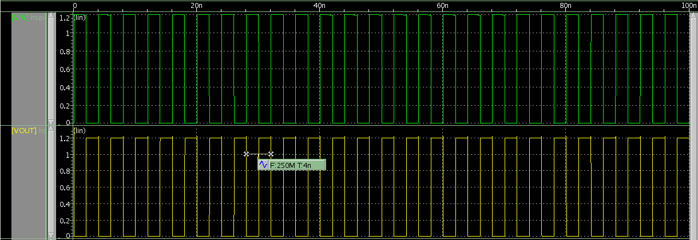

_**Fig. 39. Frequency Waveform Measurement**_


## Schematic Tips 

You don't need to draw whole wire to connect port, and you can assign the same name instead, then it becomes virtual connection. In case of many transistor being placed, you don't need to connect all bulks to AVDD or AVSS, and you can just draw wire with AVDD or AVSS nets. As seen in the Fig 41, you can draw wire along with assigning wire name.

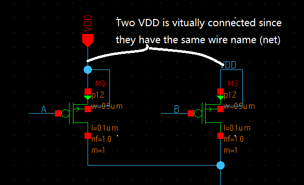

_**Fig. 40. Nets connection by assigning the same wire name**_

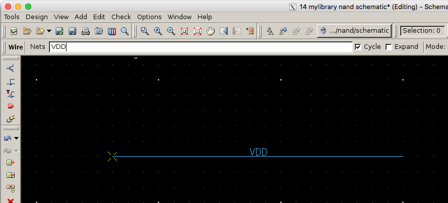

_**Fig. 41. Assigning wire name with drawing wire**_


When you have some weird warning message for solder dot on crossing wires like Fig 41, then please revise as Fig 42. 
Fig 41 and Fig 42 are both correct but they generate some warning since Fig 41 is a common possible unexpected wrong connection.

_**Fig. 42. Cross wires warning**_


_**Fig. 43. a solution for warning**_


## Lab1

### Objective

Lab 1 is to learn how to design your circuit, generate netlist, and simulate given netlist for your layout design in lab 2. You will learn three IC design tools (Custom Designer, Waveform View, HSPICE) in this lab and the followings are expected to be delivered in your lab report.

### Deliverables for your lab report.

* Name, SID, Session(021,022), ENGR ID, UCR NetID, your partner name

* Summary of what you learned thru this lab (One paragraph)

* An inverter schematic view as seen in Fig 13.

* An inverter symbol view as seen in Fig 15.

* A test-bench for your inverter design as seen in Fig 18.

* A transient analysis waveform as seen in Fig. 28.

* A DC Sweep analysis waveform as seen in Fig 29.

* A delay measurement annotated waveform as seen in Fig 33.

* A rise/fall measurement annotated waveform as seen in Fig 35.

* An average measurement annotated waveform as seen in Fig. 37.

* A frequency measurement annotated waveform as seen in Fig. 39.

* Some of the issues if you have (One paragraph)

### What to submit

* Lab report (PDF format)

file name should be following

`lab1-[My UCR NET ID].pdf`

for example, my UCR Net ID is `tkim049`, so filename should be

`lab1-tkim049.pdf`

* Tar and Zip your design folder you made

`cd ~/eecs168` or you made

`tar -cvzf lab1-[My UCR NET ID].tgz ./`

for example, my ucr Net ID is `tkim049`, so do like following

`tar -cvzf lab1-tkim049.tgz ./`

* You need to submit two files (*.pdf, *.tgz) in iLearn

### Lab Report Due

* One week. 1/22 Friday 11:59pm.

### Next lab

In lab 2, you will learn Layout design, DRC, LVS, Parasitic Extraction, and post-simulation with parasitic extraction.
