## Lab2

### Objective

Lab 2 is to learn how to design your layout, validate with DRC and LVS. You will learn three IC design tools (Layout using Custom Compiler, DRC and LVS using IC Validator) and design inverter and NAND gates in this lab.

## Lab Report Due

* __Oct. 31, 2025__ (Friday)

# Lab/Tutorial 2

In this tutorial, some contexts use Synopsys tutorials from Vazgen Melikyan (Synopsys) and Hamid Nahmoodi (SFSU). All the tools and PDK are given thru Synopsys University Program.

## Introduction

In this tutorial, you will learn how to draw custom IC layout and simulate your design using 90nm technology with Synopsys Custom Design Tools. This tutorial includes the detailed steps of schematic, layout, and simulation of designs.

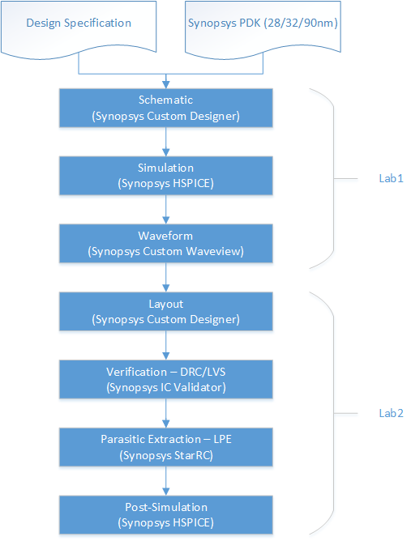

## ============= First Week =============
## Part 5: Creating Layout (continues from lab1)

To design a layout, you need to be familiar with the Lamba-based rules. This helps you save time for design cycle and debugging Design Rules Check (DRC) errors. For Synopsys PDK, you can access 90nm technology we are currently using in the following location at `/usr/local/synopsys/pdk/SAED90nm_PDK_10222017/documentation/SAED90nm_Disign_Rules_v1.9_18032015.pdf` at `bender.engr.ucr.edu`. 
You can download this file to your desktop using a file transfer application (WinSCP, Filezilla) or use the network drive and then use your computer's pdf viewer.

Run the following command in your 'eecs168' folder through Putty/xterm:

```
cp /usr/local/synopsys/pdk/SAED90nm_PDK_10222017/documentation/SAED90nm_Disign_Rules_v1.9_18032015.pdf SAED_90_Design_Rule.pdf
```

It is recommended that you keep checking your layout with the DRC tool while you design. In this tutorial you just sequentially design first and then check your DRC later. However, in practice, you need to keep checking your layout to find errors earlier and correct the mistakes.

__Be careful not to submit your lab report with any DRC or LVS errors.__

Start with Custom Compiler. Type `cdesigner&` and open your design from lab1 you finished. Go to file-> New -> CellView on your Custom Compiler Console. You need to make sure the name of the cell is the same as the schematic cell. Now, it is inverter (refer Fig.1), so click OK and the new layout workspace will be popup (refer Fig. 2)


_**Fig. 1. Creating New Layout**_


_**Fig. 2. New Layout Workspace**_


__One tip__: There is realtime DRC tool, which so-called SmartDRD technology. You can check in the following icon 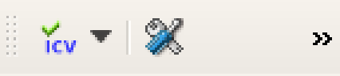 in the toolbar of your layout window, which provides realtime DRC checking tool. If your design is very large, enabling this helper may degrade your performance. It has `assist` and `visual` options. The `visual` mode only annotates the object spacing and DRC violations. Whereas, the `assist` mode attends to create barriers between objects to help enforce DRC compliance.

First we need to know each layer naming. The meaning of each layer is the following:

__Note that this design tool is based on p-substrate__.

- NWELL : N-type Well (N-tub)
- DIFF : Diffusion Layer
- PIMP : P-type diffusion (p-diff)
- NIMP : N-type diffusion (n-diff)
- PO : Polysilicon layer
- M1 : Metal-1 Layer
- CO : Contact Layer
- M1PIN : Metal-pin-naming layer

### Ruler

Go to `Create ruler` by clicking on  . Click once to start drawing the ruler and again to end it. Draw two rulers about the lengths shown in Fig.3 (about 3um by 2um can be a good start). 

### NWELL Layer

Select the `NWELL` layer in the layers panel on the right and select `Create-> Rectangle` (Fig.3).

Draw a rectangle that approximately fits the dimensions of the rulers you set. You can always adjust the dimensions of this rectangle by using the tools (stretch object, refer icon , move object, refer icon ) that existed on left side of layout window then clicking the side you want to stretch or move.

 

_**Fig. 3. Drawing N-Well Layer**_


_**Fig. 4. Drawing N-Well Layer**_

After you have created an N-well (N-tub), move your mouse over it. Notice at the top left there are two fields that tell you what layer you are on and the coordinates. This is useful information if you are having trouble figuring out what a layer is and when you are fixing errors found in DRC.

### DIFF Layer

Now we are going to make diffusion areas for PMOS, NMOS and body connections. From our schematic, we know that the width of the PMOS should be 0.5um and the width of NMOS should be 0.25um (refer lab1). The location of the diffusion should be similar to the ones in Fig.5. There are two horizontal diffusion areas that are the NMOS and PMOS devices, and two vertical rectangles that will be the body connections. Place rulers down to help you make sure the width of the diffusion areas for the NMOS and PMOS match our schematic area exactly.

Select the `DIFF` layer again use the `Create Rectangle` tool to draw the diffusion area. Use rulers to check the width of the rectangles. If the widths are different than the widths of the devices in the schematic, you will not pass LVS. 

__You can also use the property editor in `Edit -> Property Editor` or select shape and press 'Q' to change the dimensions of the rectangle to exact values.__

The size of the diffusion areas and body connections can be modified later. I recommend you look ahead and see what else you will need to add to your layout so you can make these locations large enough to accomodate future material. 


_**Fig. 5. Layout with NWell and Diffusion**_

### PIMP Layer and NIMP Layer

Now we will add the P-implant and N-implant areas. When manipulating layers on top of each other sometimes it is useful to “hide” a layer, like you would do in a program like Photoshop.

Use the p-diff(PIMP layer) and n-diff (NIMP layer) layers with the `Create Rectangle` to cover and surround the diffusion and body connection areas. It is important to note that the `PIMP` is drawn to the edge of the `NWELL` where the `NWELL` meets the `NIMP`. This can be seen in Fig.6. The PMOS area should be covered with `PIMP` and the `NMOS` with `NIMP`, except for the body connections which have the opposite implantation.

TIPS: There cannot be any overlap between `NIMP` and `PIMP` so be sure to zoom in and make these meet exactly. You can seperate these two but you will then need to ensure you leave a large enough gap between to pass DRC. The implant areas just need to cover the diffusion and connection areas but extra room can help you later, so it is ok if you make them large.

For example:

Rule DIFF.E.1: Source/drain active to well edge (min enclosure by well) is 0.24um, we make it 0.3um.

Rule PIMP.E.1: Enclosure of P+Active is 0.14um, we make it 0.2um.


_**Fig. 6. Drawing PIMP and NIMP layers**_

### PO Layer

Now we select the `PO` layer (Polysilicon) and use the `Create -> Interconnect` tool to draw a strip of poly through both PMOS and NMOS diffusion areas. Make sure the poly is sticking out past the diffusion areas by at least the amount specified in the design rule manual. When drawing the Poly path, make sure the width is 0.1um to match the transistor lengths in the schematic, see Fig.9 to set width/thickness for the draw path tool. Create a rectangle of poly in the center of the strip that would be used for the input signal, see Fig.7. This strip does not have to be inside the N-tub.

__Double-click to complete drawing the path.__

Rule PO.EX.1: Minimum gate extension of active (end cap) is 0.18um.


_**Fig. 7. Drawing Polysilicon**_

### CO Layer

Select the `CO` (contact) layer and use the `Create Rectangle` or `Create Polygon` tool in conjunction with rulers to make a contact 0.13 by 0.13. You can also use the property editor to get these exact values. After you have created one contact click on   and the contact and make a copy to place the other contacts. Contact placements are shown in Fig.8. Check to see that your contact placements meet the design rules.

Rule CO.W.1: Exact contact size is 0.13um.

Rule CO.S.1: Minimum contact spacing is 0.13um.

Rule CO.S.2: (Contact inside DIFF) Minimum space to gate is 0.12um, i.e., we make it 0.155um.

Rule CO.E.1: Minimum enclosure by poly is 0.04um.

Rule CO.E.2: Minimum enclosure by DIFF is 0.04um, i.e., we make it 0.055um.

Rule CO.E.3: Minimum enclosure by poly at least two apposite sides 0.05um.


_**Fig. 8. Drawing Contacts**_

### M1 Layer

Select the `M1` (Metal-1) layer and again select the `Create Interconnect` tool. This time in the toolbar that pops up, click on the width box to then enter 0.14 in the Width field.


_**Fig. 9. Modifying Width**_

Draw the `M1` layer the way it is shown in Fig.10. Make sure the metal is covering the contacts by the amount specified in the design rule manual. You can also draw rectangles over the contacts to cover them more.

Rule M1.W.1: Minimum width is 0.14um.

Rule CO.E.6: Minimum enclosure of any contact (CO outside M1 is not allowed) is 0.005um.

Rule CO.E.7: Minimum enclosure of contact at end of line is 0.05um.


_**Fig. 10. Drawing Metal Connections**_

### M1PIN Layer

Select the `M1PIN` layer. Select the `Create -> Text -> Label` tool and place text labels labeled as VDD, VSS, VIN, and VOUT (refer Fig.11), where the center point of label should be put within the metal wire. Note that you need to match the label names in layout as the labeled pins in the schematic in order to pass LVS (Layout vs Schematic). Fill in the name in the toolbar and 0.1 as height. 

You have now completed the initial layout and can move onto DRC. Save your layout by going to `Design -> Save`. As a general convention, use uppercase letters for labels instead of lowercase letters.


_**Fig. 11. Labeling Connections**_

Fig.12 shows another inverter layout. In real design, you should try to make the dimensions small in the case of meeting design rules.  


_**Fig. 12. Another Inverter Layout**_

## PART 6: Running DRC

After the inverter layout has been drawn to accurately represent the schematic, to verify that the layout meets all the basic design rules, we need to run `IC Validator` for a DRC (Design Rule Check). Save the layout cell by clicking on Save. In Layout Editor, go to `Verification -> DRC -> Setup and Run`.
Locate the runset file rules.drc.9m_saed90ev_saed90_icv.rs from the following directory and click Ok (Fig.13).

```
/usr/local/synopsys/pdk/SAED_PDK90nm/icv/drc/rules.drc.9m_saed90_icv.rs
```


_**Fig. 13. Runset File**_

You should check your library, cell, and view are correctly set and Format should be `OpenAccess` to communicate with `IC Validator` Don't forget to enable `Launch Debugger` and `View Output` to see DRC result.


_**Fig. 14. DRC Setup**_

Click OK. After DRC is done, you will see a message on your Console indicating that DRC is
done, see Fig.15.


_**Fig. 15. DRC result in Console**_

When the layout is free from all the errors and meets all the design rules, you can see `Completed with no erros` message in the console. But if not, the debugger will launch, and you can see which bug you have it.


_**Fig. 16. DRC Debug -- Run Summary**_


_**Fig. 17. DRC Debug -- DRC Errors**_

In Fig 16 and 17, it shows 1 violation found, to see the error detail, you need to click `DRC Erros` tab. Then see your design name and double click error, then it shows where the error comes from.

Also for debugging screen again, you can go to `Verification -> DRC -> Debug`, see Fig.18.


_**Fig. 18. DRC Debug**_


## Part 7: Running LVS

The LVS (Layout versus Schematic) performs comparison to verify that the design layout accurately represents the electronic equivalent of the design schematic. `IC Validator` LVS verifies whether the physical design matches the schematic by extracting the devices, verifying the connectivity between the devices and comparing the extracted information with the schematic netlist.

__Notice that in order to pass LVS, schematic names and layout names must match exactly__. Make sure the names for labels and pins are using uppercase letters instead of lowercase letters. Also transistor dimensions for gate width and length in layout and schematic must match. See Fig 19 and 20 for reference.


_**Fig. 19. Layout versus Schematic (LVS)**_


_**Fig. 20. Layout versus Schematic (LVS)**_

In the layout window go to `Verification -> LVS -> Setup and Run`. Please make sure your setup mirrors the Fig.21.

Under main option select the file “rules.lvs.9m_saed90.ev” as `Run Dir` in the following directory:
```
[under your project folder]/pvjob_mylibrary.inverter.icv.lvs
```
Here, we assume library name is `mylibrary` and cell name is `inverter` here.

You need to make sure of all `OpenAccess` for Layout and Schematic/Config. Check `Launch Debugger` and `View Output`.

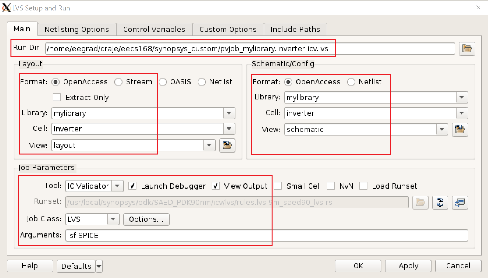

_**Fig. 21. LVS Setup -- Main**_

Under Netlisting Option tab, for the netlister, select: CDL if not already selected. See Fig.22.


_**Fig. 22. LVS Setup -- Netlisting Options**_


Under the Custom Options tab, leave the defaults as shown in Fig.23. Click OK when done.


_**Fig. 23. LVS Setup -- Custom Options**_

Like DRC, you can use debugging window to fix your LVS problem in Fig.24.


_**Fig. 24. LVS Debug**_

After fix every thing, you can see `PASS` message in Fig.25.


_**Fig. 25. LVS Pass**_

## Part 8: Design NAND Gate

From your lecture class, we learned NAND gate schematic and its layout. Now, from Lab1 and Lab2 tutorials, we learned how to draw schematic, simulate, and layout your circuit. Now we draw NAND gate schematic and layout. f'=a*b, so you need to design your NAND gate schematic and design testbench with your NAND symbol to simulate with HSPICE, then you need to draw layout for NAND gate with successful DRC and LVS.

1. Design your `NAND` gate cell (see lecture notes)

2. Design your `NAND` symbol

3. Design your testbench for simulation `NAND_testbench` cell

4. Do transient simulation with two different inputs and one output, you need to show if `NAND` gate is correctly working. You need to setup your testing variables such as timing, Input signal frequencies (`AIN`, `BIN`) with appropriate `VDD` and `VSS`.

5. Draw `NAND` gate layout (see lecture notes)

6. DRC for `NAND` gate layout

7. LVS for `NAND` gate layout


## ============= Second Week =============

In this tutorial, you will learn how to do parasitic extraction/ post layout simulation and hierarchical design. You will use your Inverter design for your parasitic extraction and post layout simulation. For your hierarchical design, you will eventually design Ring Oscillator. You need to check off until Ring Oscillator.


## Part 9: Parasitic Extraction

You need to keep working on Inverter schematic and layout for this extraction.

From your lab2, after passing DRC and LVS you can now move on to LPE (Layout Parasitic Extraction). In this phase, resistances and capacitances will be extracted from the layout. In layout window go to `Verification -> LPE -> Setup and Run`. Please make sure your setup the Fig.26 for the Main tab, you need to click the "View output" Option to see the output window.

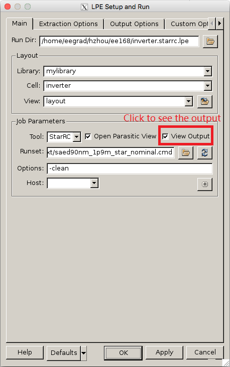

_**Fig. 26. LPE Setup -- Main**_

In Fig.27, 'Extraction Options' tab, you need to change your `Runset Report File` to yours. It is located under `pvjob_[your library name]_[your cellview name].icv.lvs` folder.

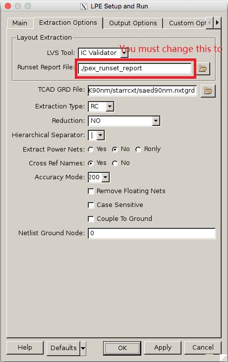

_**Fig. 27. LPE Setup -- Extract Options**_

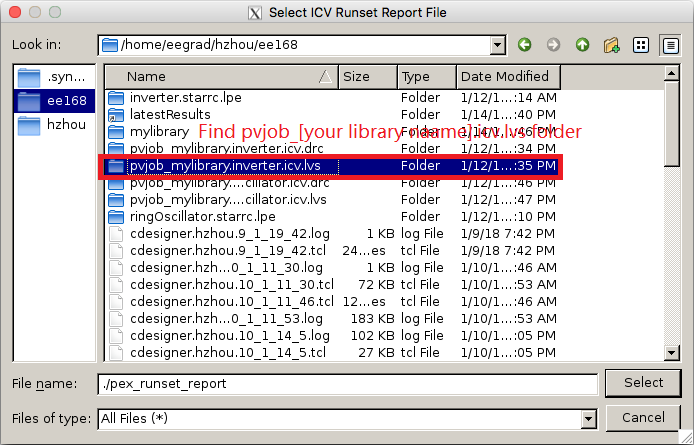

_**Fig. 28. Select ICV Runset Report File**_

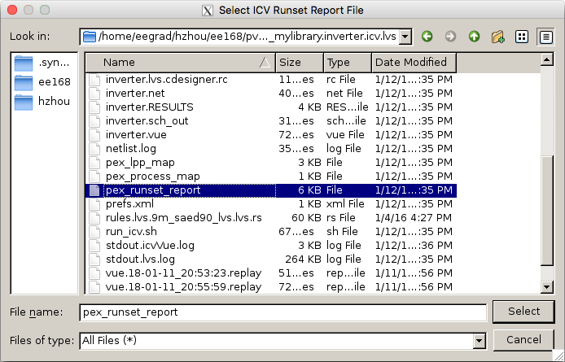

_**Fig. 29. Select ICV Runset Report File**_

As shown in Fig.30, change 'Extract power nets' to `YES` and make sure the netlist ground node matches the ground node name in the schematic and layout. Here, choose `VSS` for our ground. Note that you cannot use 'GND' or 'gnd' as ground node name.

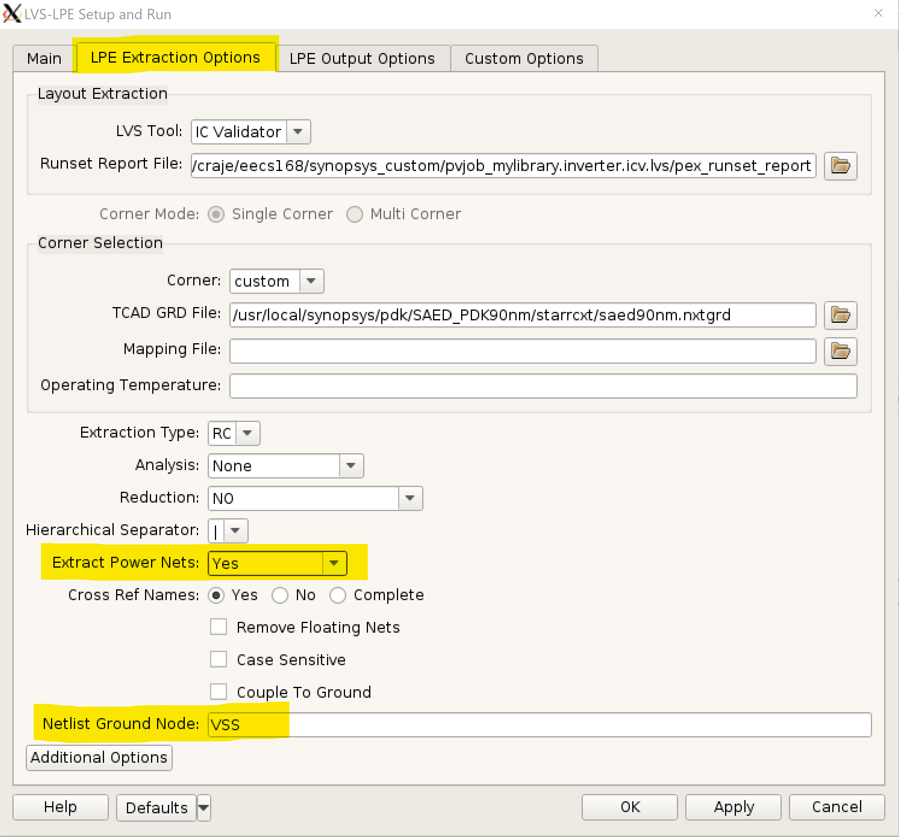

_**Fig. 30. LPE Setup -- Extract Options**_

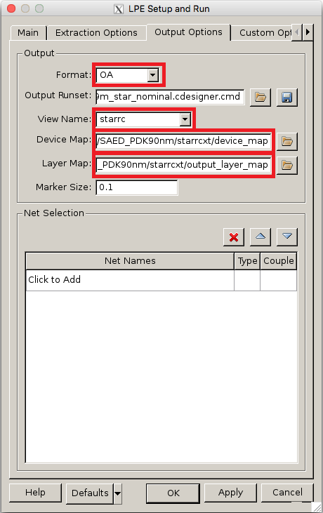

_**Fig. 31. LPE Setup -- Output Options**_

Make sure the other options in this tab match up with Fig.27-31.

Device Map:
```
/usr/local/synopsys/pdk/SAED90nm_PDK_10222017/starrcxt/device_map
```
Layer Map:
```
/usr/local/synopsys/pdk/SAED90nm_PDK_10222017/starrcxt/output_layer_map
```

Now click on `OK`. Then you will see Customer Designer as Fig.32.

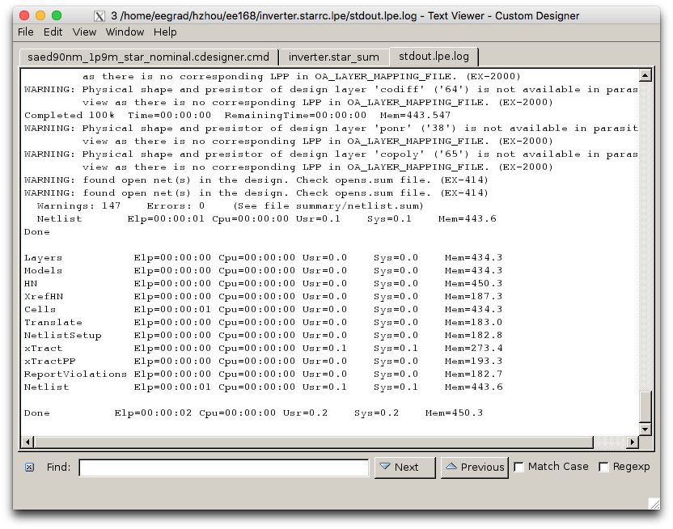

_**Fig. 32. LPE Output**_

After some time you should able to see the following message as shown in the console window if the parasitics were generated correctly. See Fig.33.

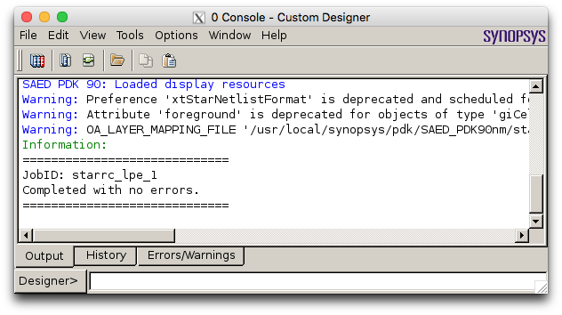

_**Fig. 33. Console Output**_

After LPE has successfully run, a parasitic view window should open. See Fig 34 and 35 for reference. The RC components are very small in the window that opens up (Fig.34) so you may need to zoom in to see the details (Fig.35). It may help to drag a box around the RC components using the mouse cursor to highlight them, then zoom in to see them. Also note that your parasitic view may not match exactly as shown below which is fine since this depends on differences in layout

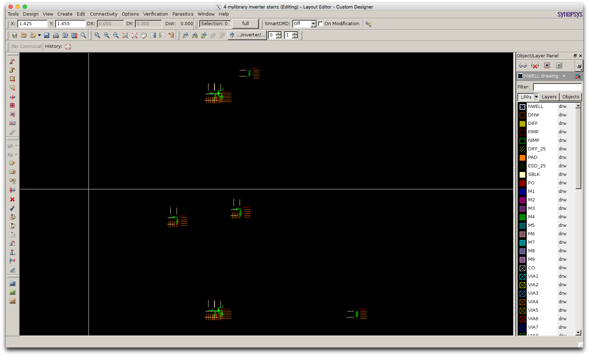

_**Fig. 34. Parasitic View**_

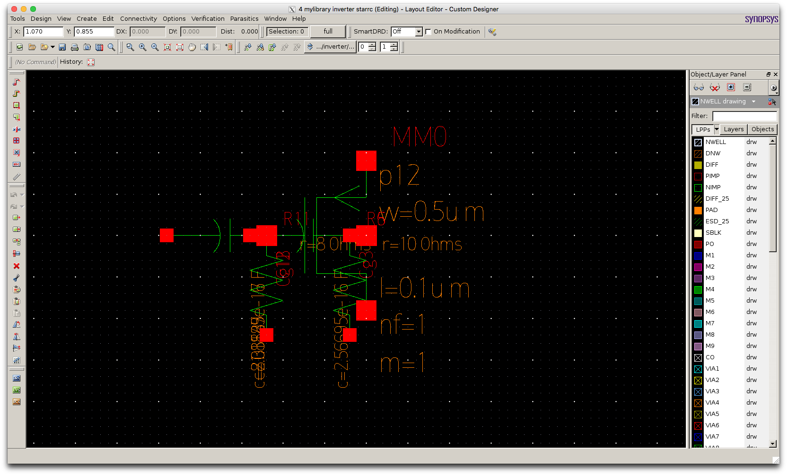

_**Fig. 35. Parasitic View Zoom In**_

You have successfully generated the parasitic view for the inverter and are ready to run post layout simulation. Save the parasitic view with `Design -> Save`. The parasitic view will be saved as “starrc” for the view name.


## Part 10: Post Layout Simulation

After parasitic extraction we want to apply the parasitics to the schematic for a more accurate representation of our inverter and test it. From the Custom Compiler Console window go to `File -> Open Design` and open the inverter circuit schematic created earlier.

Select the following options for the following columns:

- Libraries: mylibrary
- Cells: inverter_testbench
- Views: schematic

See Fig.36 for reference. Once all options are highlighted, click `Open` and the schematic that was created earlier for testing the inverter will open, see Fig.37 for reference.

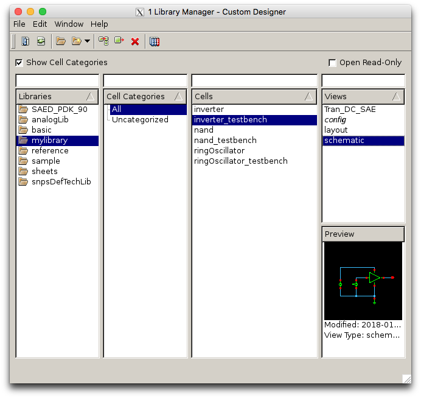

_**Fig. 36. Opening Circuit with Inverter Schematic**_

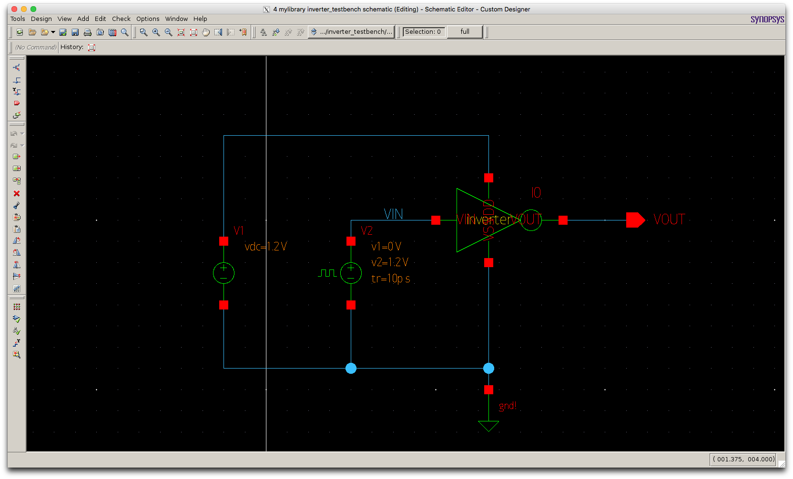

_**Fig. 37. Testbench Circuit for Inverter**_

After opening the testbench circuit, make sure the circuit is similar to the one shown in Fig.37. Now the parasitics need to be loaded into the inverter cell used in the circuit. From the Custom Compiler Console window, go to `File -> New -> CellView`. In the New CellView window, create a new configurations file as follows:

- Select inverter_testbench for the cell.
- Set view name to config
- Set editor to Hierarchy Editor

See Fig.38 below for reference and click `OK`.

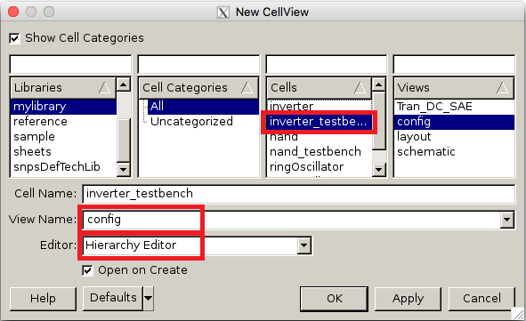

_**Fig. 38. Configurations File Setup**_

A Hierarchy Editor window will display. Setup the view and list options as noted in Fig.39 below.

- View: schematic
- View Search List: schematic hspice symbol
- View Stop List: symbol

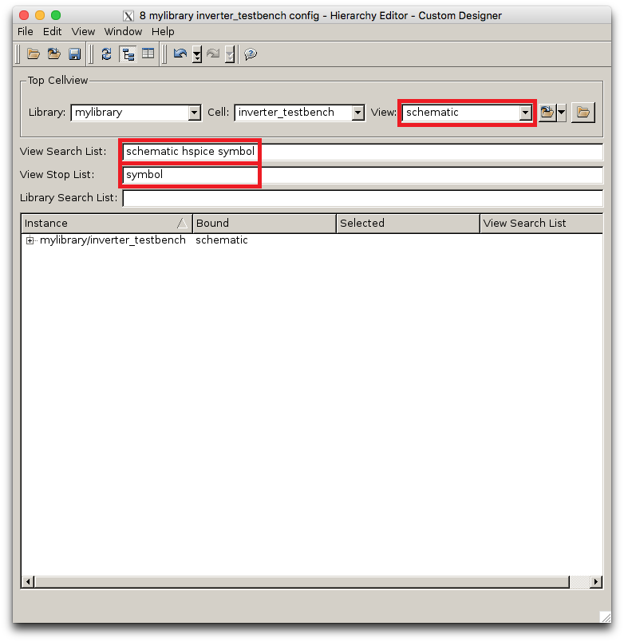

_**Fig. 39. Hierarchy Editor**_

In order to map the parasitics generated from LPE to your inverter cell, select `starrc` under the 'Selected' column for the inverter instance, see Fig.15 for reference. The format for your inverter instance name in the instance column is schematic_instance_name (mylibrary, inverter). Notice that as starrc is selected, resistor and capacitor instances will show up under the instance column, this substitution replaces the inverter cell with its equivalent schematic containing its resistive and capacitive components. Afterwards save the settings by going to `File -> Save`.

For future reference, to apply parasitics for a general case, a schematic must have its equivalent schematic symbol and layout created since a layout is used to generate the parasitics and a schematic symbol is used as a vessel to hold the parasitics. The testbench schematic is created to test the symbol containing the schematic with its applied parasitics.

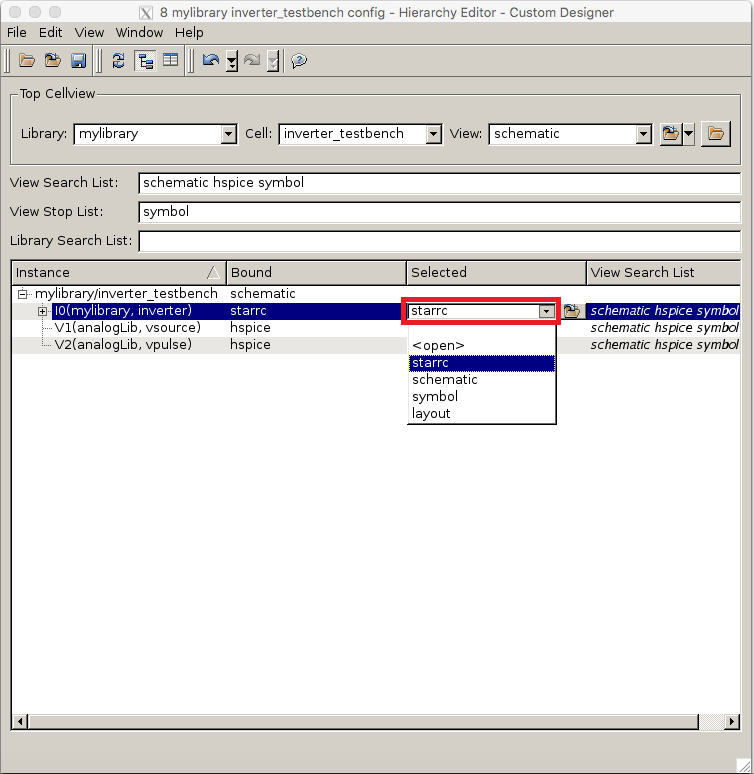

_**Fig. 40. Loading Parasitics into the Inverter**_

To start simulation with parasitics, go to `Tool -> Library Manager` from the Custom Compiler Console window. In the Open Design window that opens, select `inverter_testbench` under the cells column and `config` under the views column and right click on config under views. Select `Open Design` from the drop down menu. See Fig.41 below for reference.

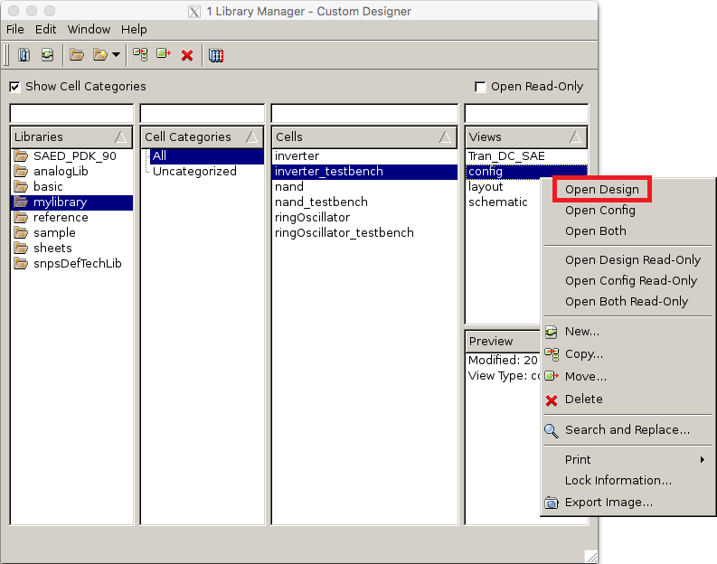

_**Fig. 41. Open Design with Parasitics**_

Afterwards, a schematic view should open up with parasitics applied, see Fig.42 below for reference. To check if the parasitics were applied, you can double click on the inverter symbol/cell and it should display the same parasitics view that was generated from running LPE. To change between parasitic and schematic views, select the desired view in the yellow box noted in Fig.43.

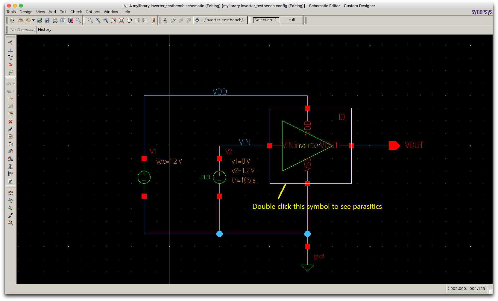

_**Fig. 42. Schematic with Parasitics Applied to the Inverter**_

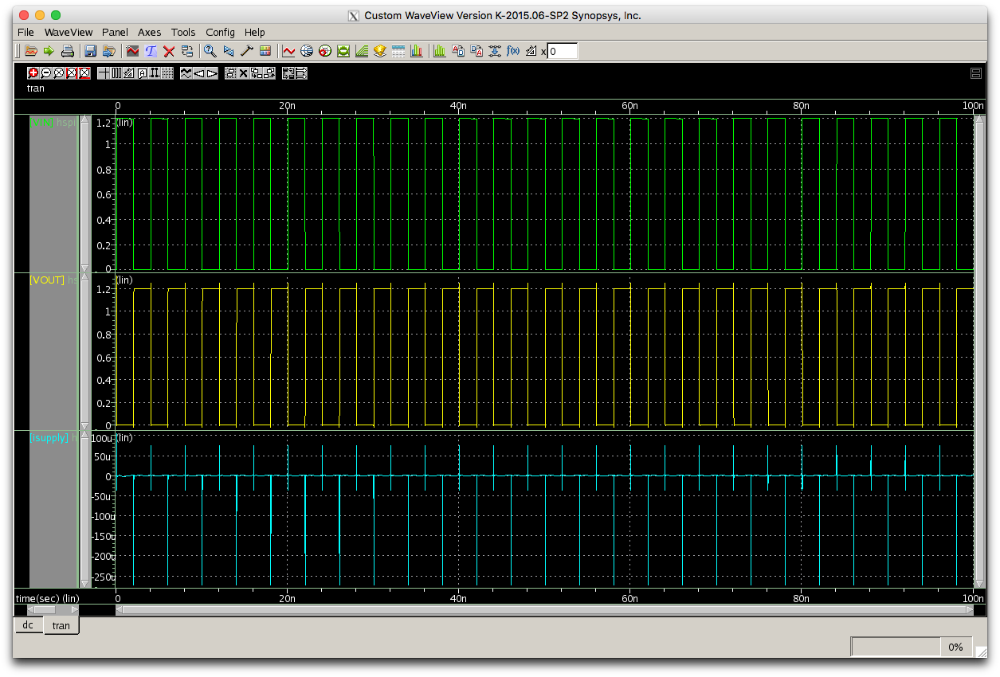

_**Fig. 43. Simulation result with parasitic extraction**_

Now go ahead and simulate your circuit as you did previously in Part 3 of the tutorial. From the schematic window, go to `Tools -> PrimeWave` to open a new SAE window. When comparing the two waveforms (inverter parasitics to inverter without parasitics) take note of the difference between delays from VIN to VOUT for transient waveforms. The result can be seen in Fig.43.


__Tip__:
If there is a mismatch error in the console regarding mismatched nets that are uppercase and lowercase between parasitics (starrc) and the symbol when running the SAE simulation, set all pin names to use uppercase letters in schematic and set all layout labels to use `uppercase letters` as well. After this change, you need to run LVS, LPE, regenerate the inverter symbol, redo the configurations file for the testbench, and rerun the SAE.


## Part 11: Hierarchical Design - (Last tutorial)

Using smaller instances of circuits to create a larger design is what hierarchical design is all about. In this section, we use an inverter we created earlier and use several instances of it to create a five stage oscillator in schematic and layout views.

Create a new schematic for the ring oscillator by going to `New -> CellView` from the Custom Compiler Console and setup the options as shown in Fig.44 below. The setup is as follows:

- Library: mylibrary
- Cell Name: ringOscillator
- View Name: schematic
- Editor: Schematic Editor

Click `OK` when done.

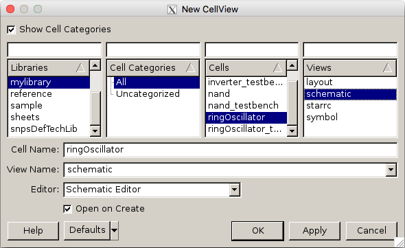

_**Fig. 44. Ring Oscillator Schematic Setup**_

In the schematic window, building a ring oscillator circuit as shown below in Fig.45.
For the inverter instances, look for them in `Add -> Instance` to open the add instance window. In the add instance window, choose `mylibrary` for library, `inverter` for cell, and `symbol` for the view and place five instances of the inverter on the schematic.

Add wires with `Add -> Wire`.

For the pins, go to `Add -> Pins` and place two `input` pins for the VDD and VSS signals, and place five input/Output pins at each inverter output. For the five `input/output` pins, I called them VIO1-5 in the schematic. Feel free to give the wires the same names as the pins using `Add -> Wire Name`. Also as a convention, use uppercase letters for pin names instead of lowercase letters.

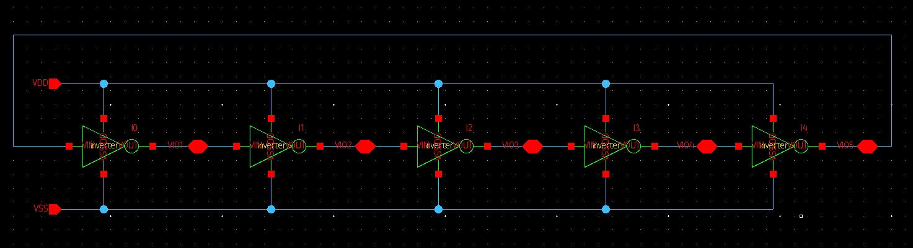

_**Fig. 45. Ring Oscillator Schematic**_

Save your schematic using `Design -> Save`. Now create a symbol of your inverter using `Design -> New CellView -> From CellView`. Make sure your options match up as shown below in Fig.46 and click `OK`.

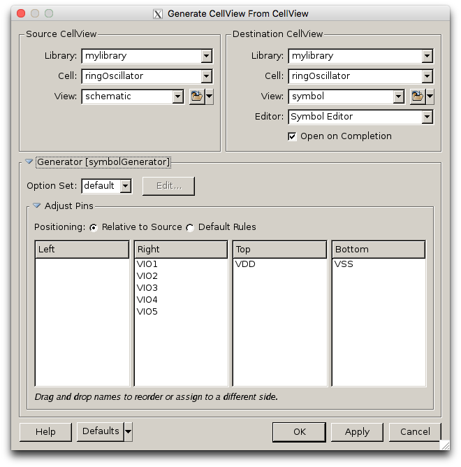

_**Fig. 46. Ring Oscillator Symbol Setup**_

After clicking OK, a new schematic window opens up with the ring oscillator symbol. Feel free to move around the pin placements for a better pin organization. See Fig.47 below for reference. Save the symbol when done with `Design -> Save`.

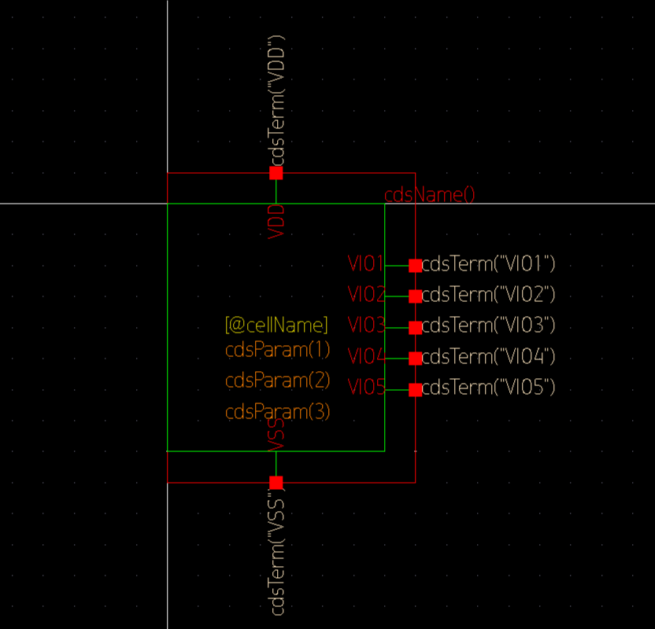

_**Fig. 47. Ring Oscillator Symbol**_

Now create a new schematic to use as a testbench for the ring oscillator by going to `New -> CellView` from the Custom Compiler Console and setup the options as shown in Fig.48 below. The setup is as follows:

- Library: mylibrary
- Cell Name: ringOscillator_testbench
- View Name: schematic
- Editor: Schematic Editor

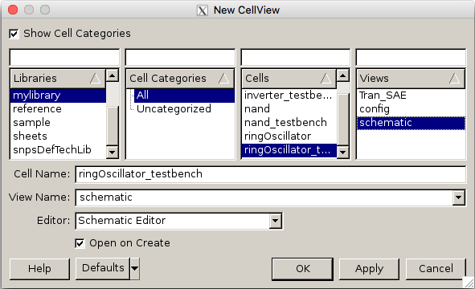

_**Fig. 48. Ring Oscillator Testbench Setup**_

Afterwards a new schematic window should open. In the new schematic window, setup the ring oscillator testbench circuit as shown in Fig.49.

To place a ringOscillator instance, look for them in `Add -> Instance` to open the add instance window. In the add instance window, choose `mylibrary` for library, `ringOscillator` for cell, and `symbol` for the view and place an instance of your ring oscillator on the schematic. Also place an instance of ground and a voltage source in the schematic. You can find these instances under library: `analogLib` and cell: `gnd` and cell: `vsource` respectively. For the voltage source, set the voltage to 1.2 volts.

Add wires with `Add -> Wire`.

For the pins, go to `Add -> Pins` and place five output pins for each of the five `VIO#` pins. Feel free to give the wires the same names as the pins using `Add -> Wire Name`. Save with `Design -> Save` once your testbench circuit is done.

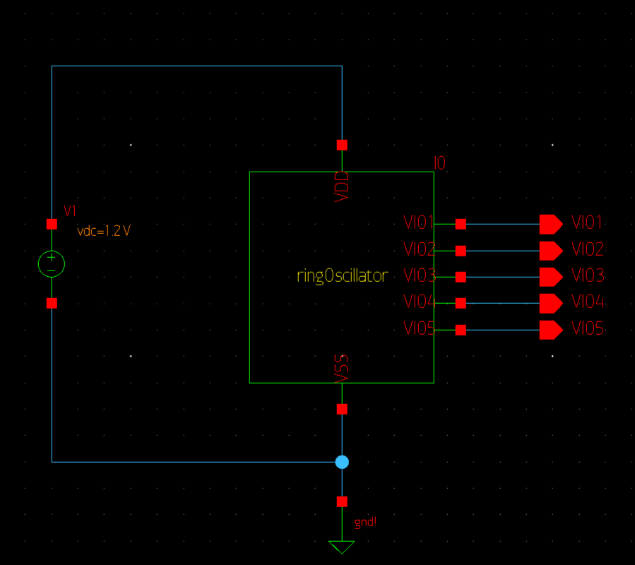

_**Fig. 49. Ring Oscillator Testbench Circuit**_

Now we need to create a new layout so go to `New -> CellView` from the Custom Compiler Console and setup the options as shown in Fig.50 below.

- Library: mylibrary
- Cell Name: ringOscillator
- View Name: layout
- Editor: Layout Editor

Click `OK` when done.

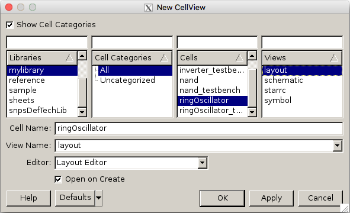

_**Fig. 50. Ring Oscillator Layout Setup**_

In the new layout window, we can use the layout of the inverter created earlier to build a ring oscillator circuit. Go to `Create -> Instance` to open up a new create instance window. In the window select `mylibrary` for library, `inverter` for cell, and `layout` for the view and place five instances of the inverter layout on the layout screen. See Fig.51 for reference.

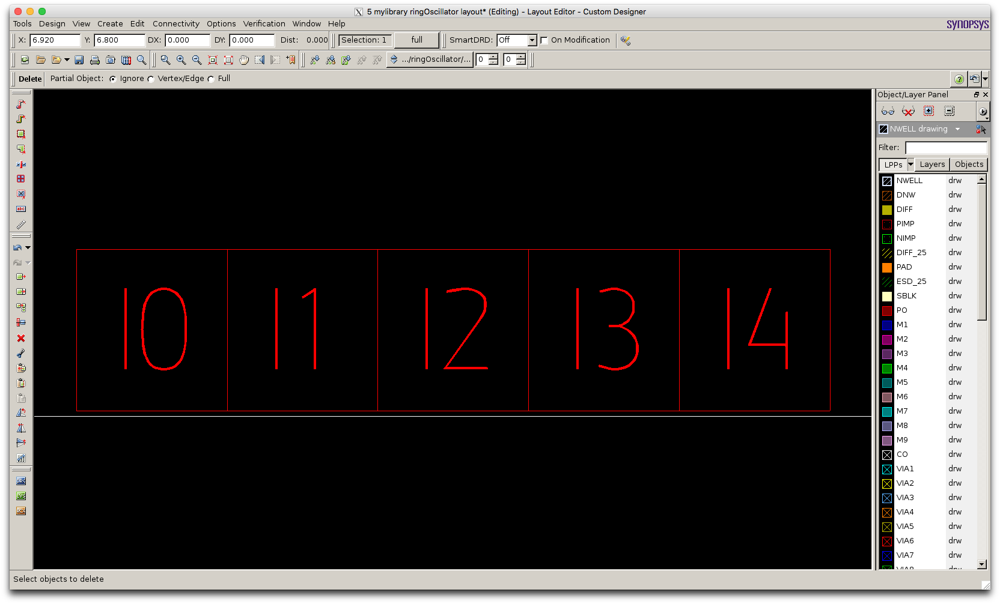

_**Fig. 51. Placing Five Inverter Layout Instances**_

Notice that the layout components for the inverter layouts don’t display. This is because the inverter layouts are hiding one level up in the hierarchy. In order to view them, change the hierarchy bounds, which is the rightmost number from 0 to 1 or 5 or 32, as shown in Fig.52 below. The numbers represent a range of hierarchy levels that are displayed where the left number is the lower limit and the right number is the higher limit. Afterwards the inverter layouts are viewable as shown in Fig.53.

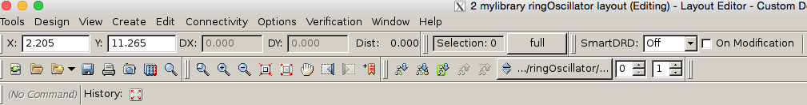

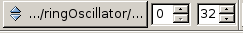

_**Fig. 52. placing Five Inverter Layout Instances**_

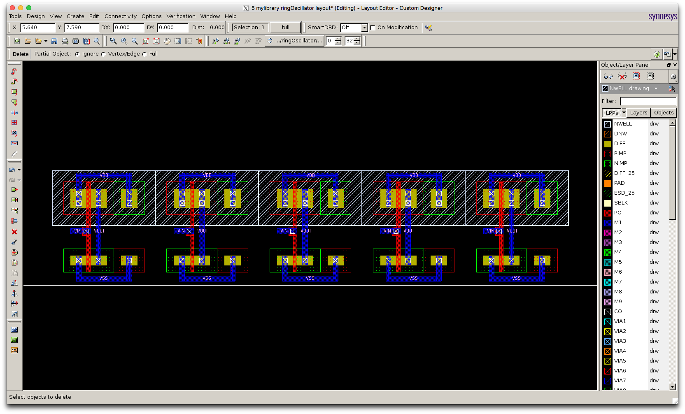

_**Fig. 53. Viewing Inverter Layout Instances**_

Now draw metal paths with `Create -> Interconnect` using the `M1` layer under the LPP panel. Connect all VDD signals with a single M1 connection and all VSS signals with a single M1 connection. Also connect the output of an inverter to the input of the next inverter using the `M1` layer. Note that ouput of inverter 5 connects to input of inverter 1 with a M2 layer. __Do not forget to connect `M1 and M2` layers using `VIA1`. Refer Fig.54.__

__See 'Extra Tutorial' below__

In addition you need to add labels for the metal connections just added. To add labels, select the `M1PIN` layer in the LPP panel and go to `Create -> Text -> Label`. Enter a name for each label in the box noted in Fig.55 and place the text labels as noted by the red boxes in Fig.54. Label names used are: `VDD, VSS, VIO1, VIO2, VIO3, VIO4, and VIO5`. Remember that in order to pass LVS, your M1PIN label names in layout need to match up with the pin names from your ring oscillator schematic. Also names for schematic pins and names for layout labels should use uppercase letters. Save the layout.

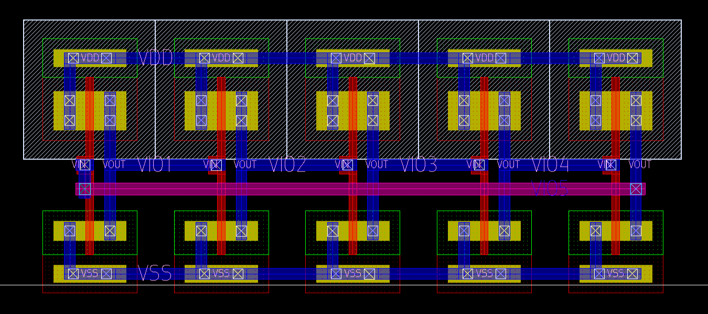

_**Fig. 54. Ring Oscillator Layout using Metal2 (refer Fig.68)**_

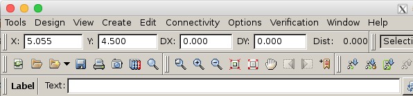
_**Fig. 55. Label Text**_

After your layout matches Fig.54, go to `Verification -> DRC -> Setup and Run` to setup and run DRC (as done earlier in lab2 of the tutorial). Leave the options on the custom tab as their defaults. Click `OK` when done.

Debug any DRC errors that come up. When DRC is passed, continue on to `Verification -> LVS -> Setup and Run` to run LVS. In LVS, leave the defaults for the custom options tab. Click `OK` when done.

Under main option select the file “rules.lvs.9m_saed90.ev” as `Run Dir` in the following directory:

```
[under your project folder]/pvjob_mylibrary.ringOscillator.icv.lvs
```

At this point if there are any LVS errors, an error window will show up. Debug any errors you have and rerun LVS until you pass it. After running LVS successfully, go to `Verification -> LPE -> Setup and Run` to run parasitic extraction.

See Fig.56 below for reference on setups.

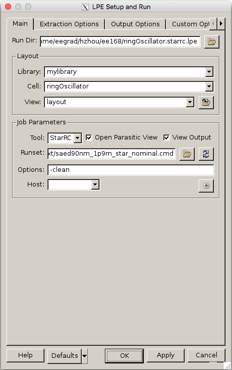

_**Fig. 56. LPE Setup -- Main**_

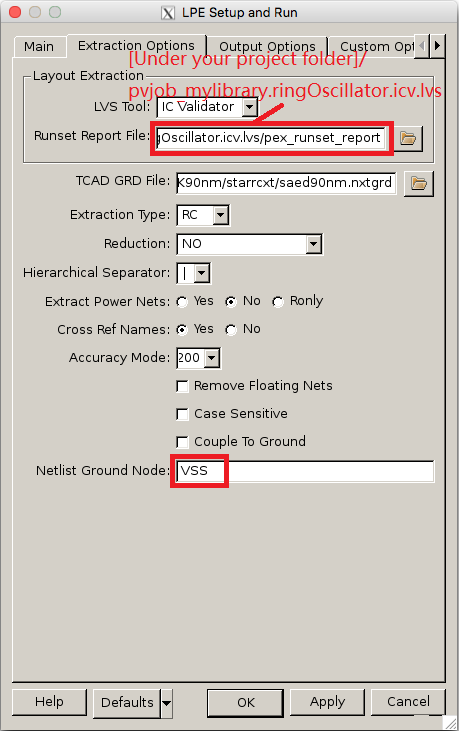

_**Fig. 57. LPE Setup -- Extraction Options**_

Under the Output Options tab make sure that you have the same setup as shown in Fig.58. Make sure the Device Map and Layer Map files are set as noted below if not already set by default.

Device Map:
```
/usr/local/synopsys/pdk/SAED90nm_PDK_10222017/starrcxt/device_map
```
Layer Map:
```
/usr/local/synopsys/pdk/SAED90nm_PDK_10222017/starrcxt/output_layer_map
```

Leave the custom options tab with their set defaults. Click `OK` when done.

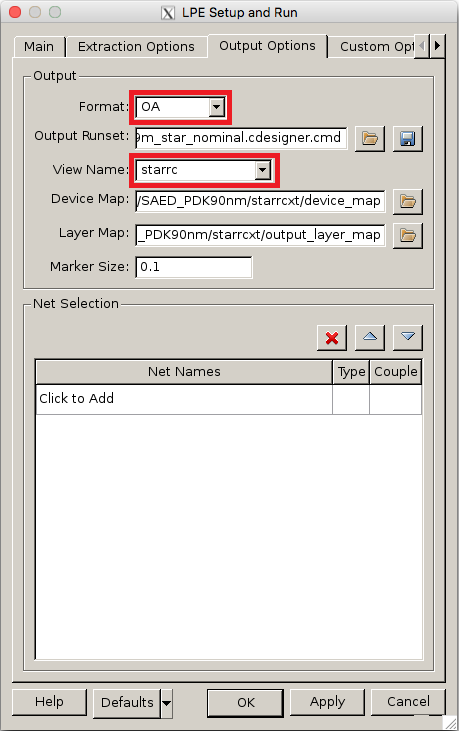

_**Fig. 58. LPE Setup -- Output Options**_

If LPE ran successfully, a parasitics view will open up. The parasitics are small so drag a box over it with a mouse cursor and zoom in to see individual components if you don’t see it at first. See Fig.59 below for reference. Afterwards save the parasitics view with `Design -> Save`.

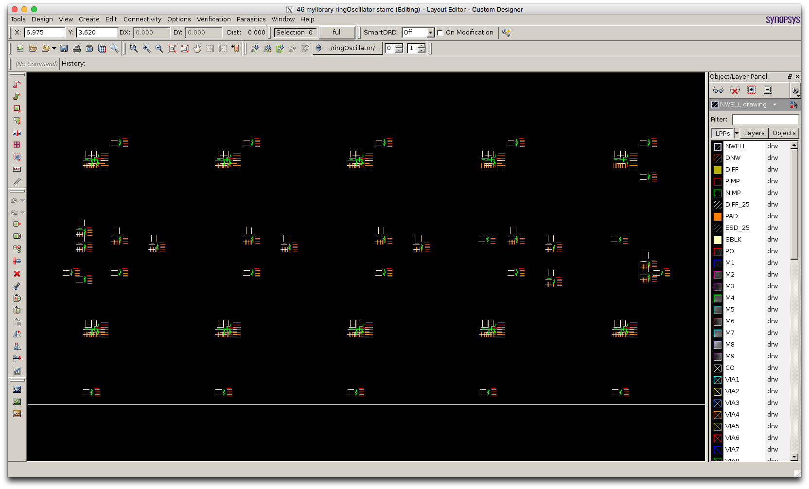

_**Fig. 59. Parasitics View**_

After parasitic extraction, create a new configuration files by going to `File -> New -> CellView` in the custom designer console. Setup the options as noted in Fig.60 to setup a configurations file for the ring oscillator testbench. Click `OK` when done.

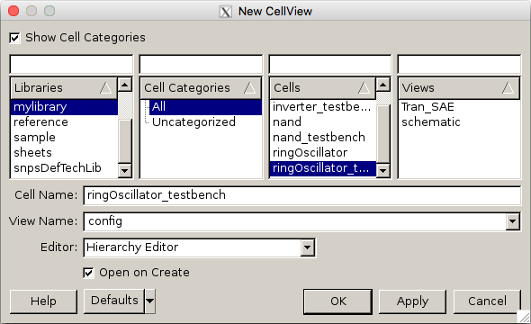

_**Fig. 60. Configurations File Setup**_

A new configurations file will open up. From here, setup the options as noted in Fig.61 to load the ring oscillator parasitics into the ring oscillator symbol. Save with `File -> Save` when done.

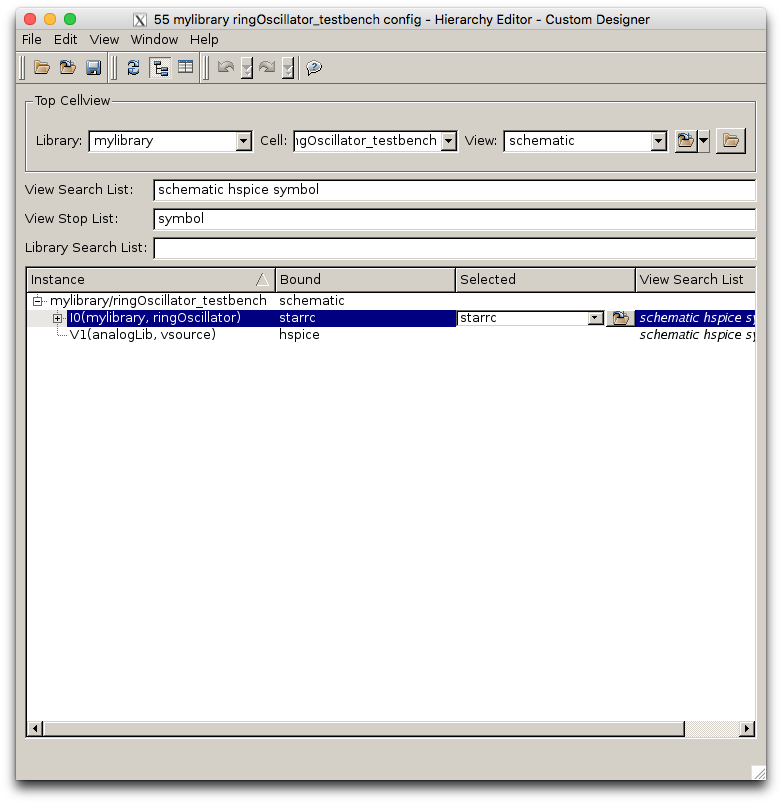

_**Fig. 61. Configurations File Setup**_

To start simulation with parasitics, go to `File -> Open Design` from the Custom Compiler Console window. In the Open Design window that opens, select `ringOscillator_testbench` under the cells column and config under the views column and right click on `config` under views. Select `Open Design` from the drop down menu. See Fig.62 below for reference.

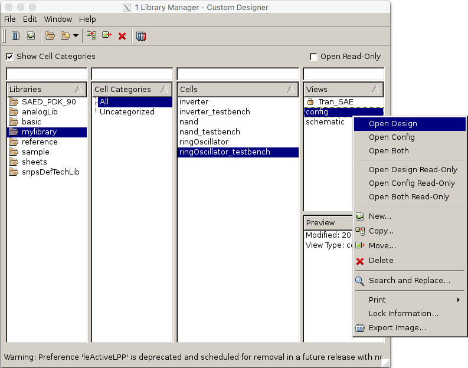

_**Fig. 62. Open Design with Parasitics**_

Afterwards a schematic window opens up with the ring oscillator testbench circuit created earlier, see Fig.63 for reference. To check if the parasitics were properly loaded into the ring oscillator, double click the ring oscillator symbol and the parasitics view generated from LPE earlier should display.

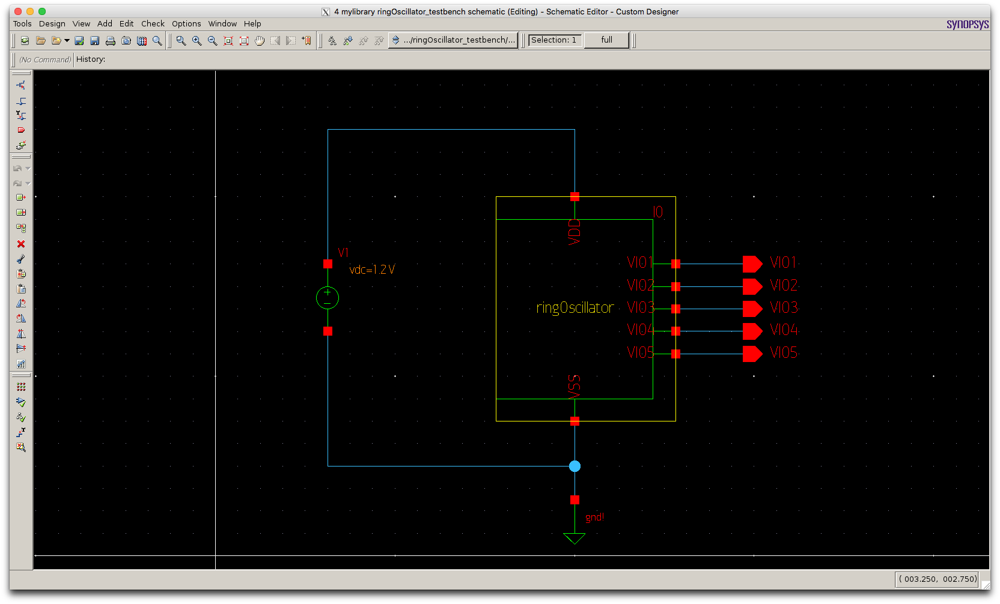

_**Fig. 63. Ring Oscillator Testbench Circuit**_

From the ring oscillator testbench window, you can simulate the circuit by using PrimeWave as noted in 'PART 3' of the tutorial __(LAB 1)__. To open SAE, go to `Tools -> PrimeWave` from the schematics window and setup the simulation for a transient analysis and plot the voltages for the VIO1, VIO2, VIO3, VIO4, and VIO5 voltages. For the transient analysis setup in SAE, use 1ps for step time and 1ns for stop time.

__REMEMBER TO CHANGE SIMULATOR TO 'PRIMESIM HSPICE' AND ALSO ADD 'MODEL FILES'__

__Side Notes for Using Convergence Aids to Initialize Voltages:__
Also note that it may be helpful to give a wire in the circuit an initial voltage before running simulation. This particular setup applies to circuits such as a five stage ring oscillator circuit shown in Fig.64. In addition to the setup noted in part 3 for SAE, before running the simulation, go to `Setup -> Convergence Aids` in the SAE window.

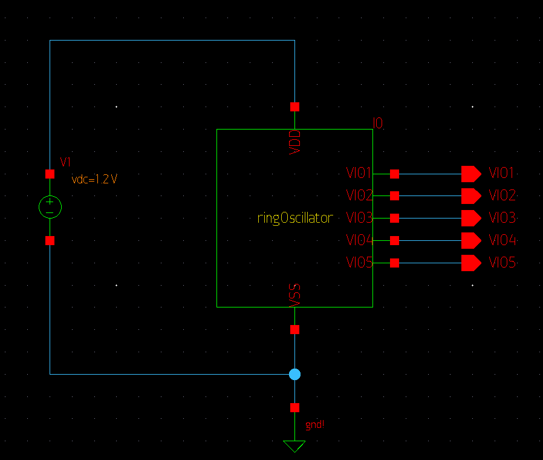

_**Fig. 64. Where to Click on Schematic for Node Setup in Ring Oscillator**_

Setup the options as noted in Fig.65 below. You may need to setup multiple initial voltages to drive the inverters since one initial voltage may not be enough to drive the entire ring oscillator. It is suggested that you setup at least two initial voltages using alternating voltages of 0 and 1.2 for consecutive inverter nodes in the ring oscillator circuit. See Fig.66 for multi- node initialization and see Fig.64 on where to click in the schematic for node setups. Click `OK`, when done and run the simulation as noted in part 3 of the tutorial in Fig.67.


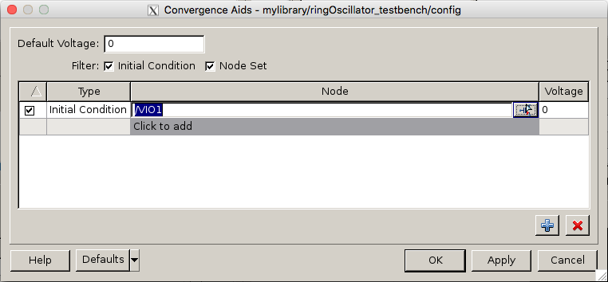

_**Fig. 65. Setting up Convergence Aids**_

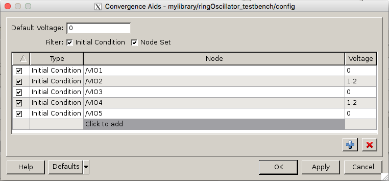

_**Fig. 66. Setup for Multiple Initial Voltages**_

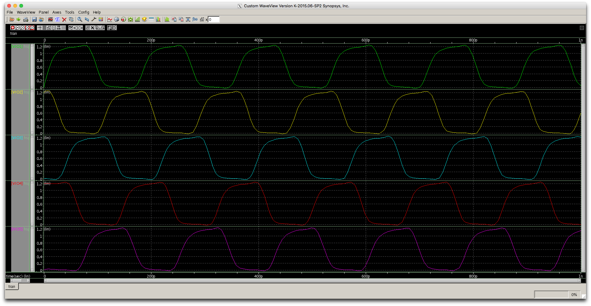

_**Fig. 67. Simulation result for ring oscillator**_

You have now finished transient simulation of the ring oscillator circuit with applied parasitics.

## Extra tutorial 

### Use multiple layers

- Using M2 Layer (or higher like M3, M4...) in Layout

For designs that require require an extra metal layers in layout, designers can use a metal layer higher up (like M2) to make connections if the lower metal layers (like M1) are too constricting to allow any other connections.

In the ring oscillator layout, M1 (blue layer) is replaced with M2 (pink layer). See Fig.68 for reference (Ring Oscillator with M2 layer). Also note that M1 layers can run under M2 layers without physically connecting unless there is a VIA1 layer in between them.

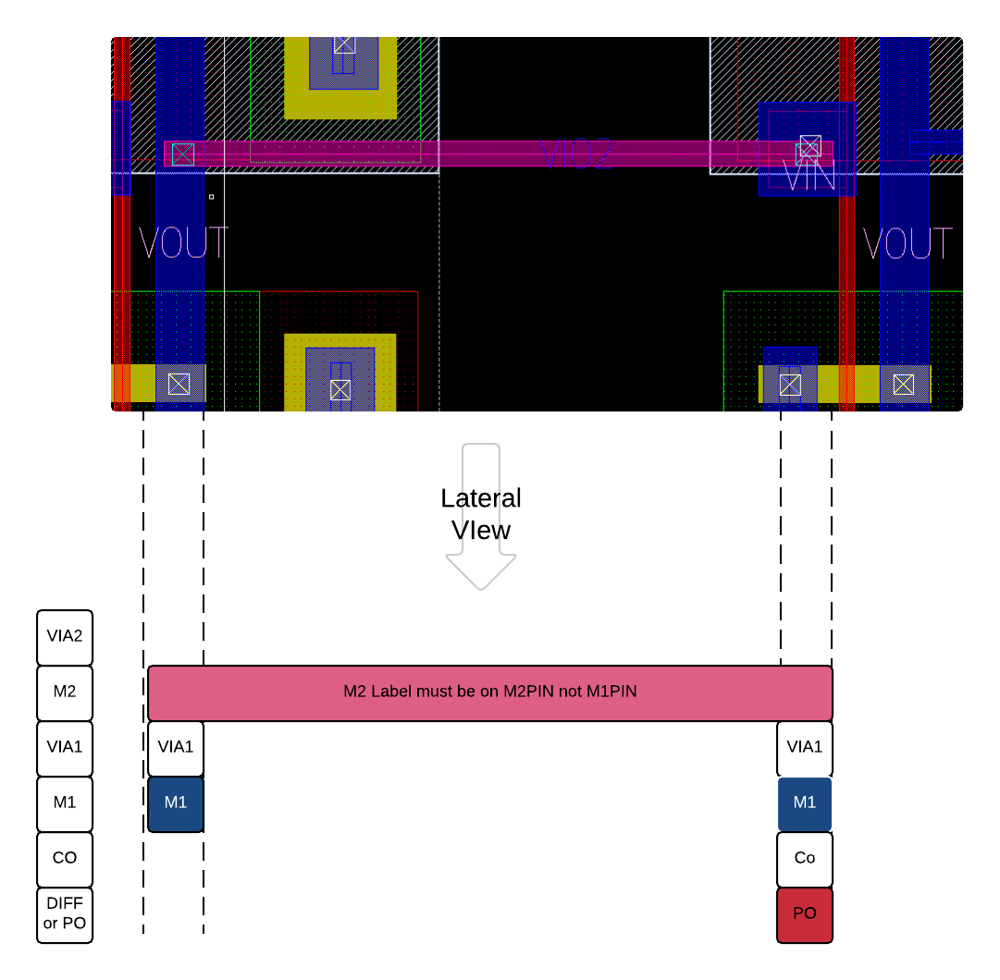

_**Fig. 68. Multiple layer (M2) example**_

In order to connect different layers to each other, all metal layers and contacts/VIAs must exist in between them. For example, to connect a metal 2 layer (M2) to diffusion (DIFF), a contact layer (CO), metal 1 layer (M1), and a VIA1 layer must exist between them. See figure.43 for reference. Also see figure.106 in circle A for a layout drawing example.
To use higher metal layers not shown, use their corresponding VIA layers to interconnect between the desired layers. For example, to connect M2 to M3, a VIA2 layer/contact must be drawn in between them.

Contact (CO) size is 0.13um x 0.13um and VIA1 size is 0.14um x 0.14um for 90nm design.

### Source-drain sharing

- Connect MOS in parallel

Fig.69 shows an example of two NMOS connecting in parallel (body is not connected in this example). Fig.70 shows the layout of Fig.69. Fig.71 shows another layout with source-drain sharing. 

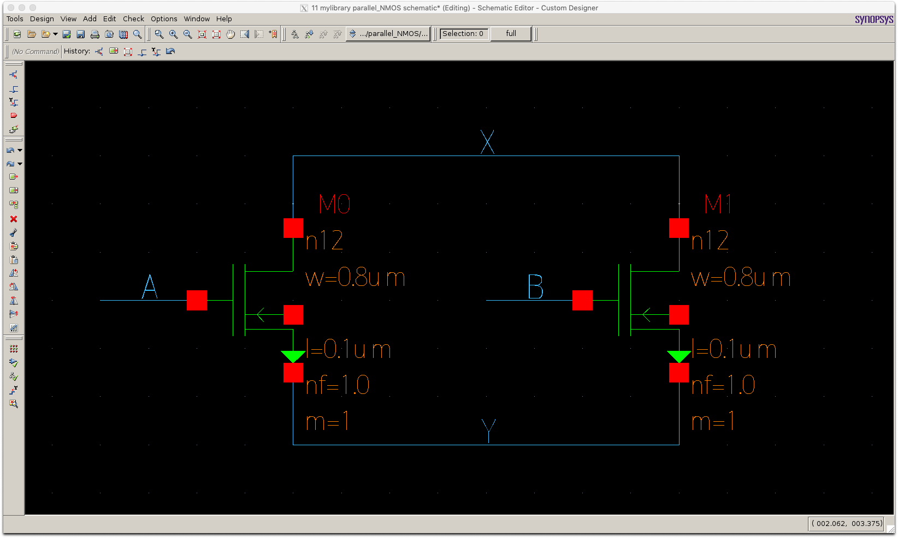

_**Fig. 69. Two parallel-connected NMOS transistors**_

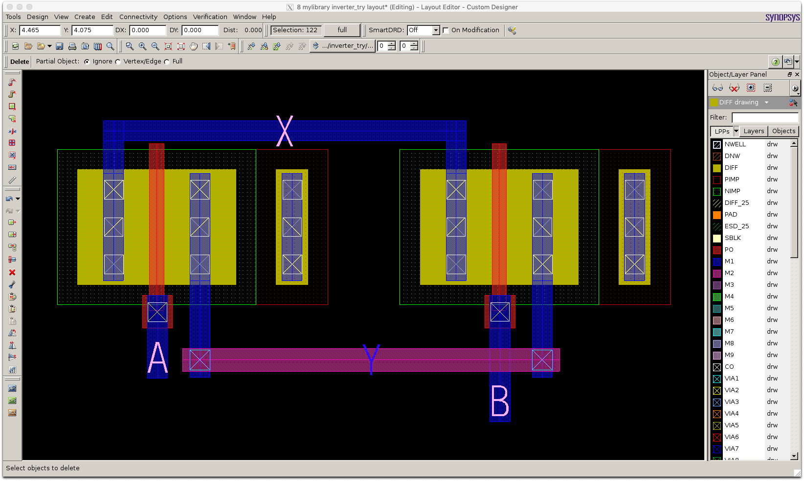

_**Fig. 70. Use two independent NMOS layout**_

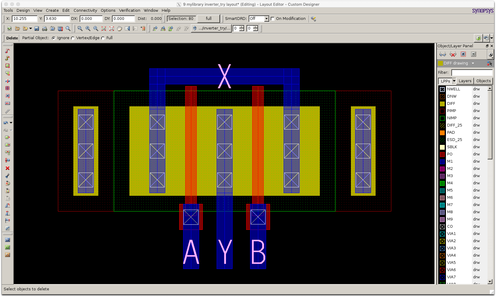

_**Fig. 71. Layout with source-drain sharing**_

- Connect MOS in series

Fig.72 shows an example of two PMOS connecting in series (body is not connected in this example). Fig.73 shows the layout of Fig.72. Fig.74 shows another layout with source-drain sharing. 

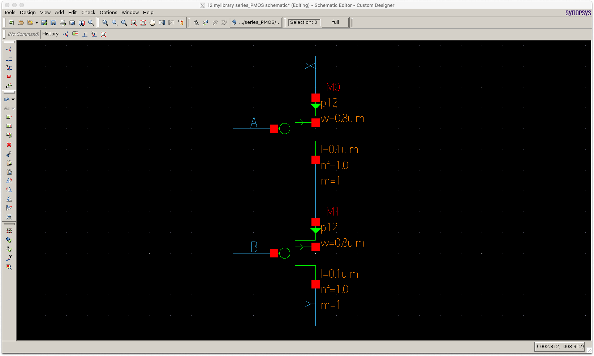

_**Fig. 72. Two series-connected PMOS transistors**_

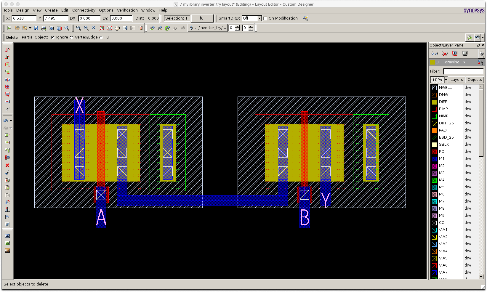

_**Fig. 73. Use two independent PMOS layout**_

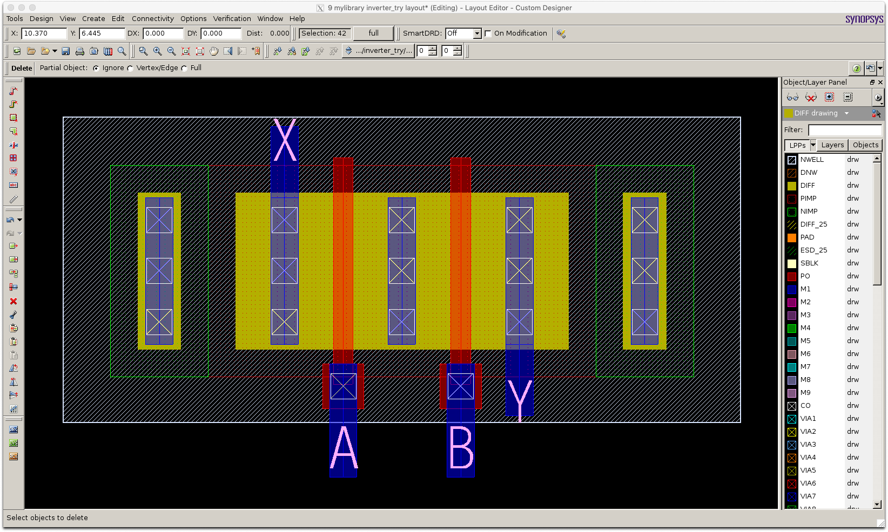

_**Fig. 74. Layout with source-drain sharing**_

### Place body along the top

Fig.75 shows an example of PMOS circuit (body is not connected in this example). Fig.76 shows the layout of Fig.75.

In digital circuit design, usually M1, M3, M5 are used for vertical routing, M2, M4, M6 are used for horizontal routing.

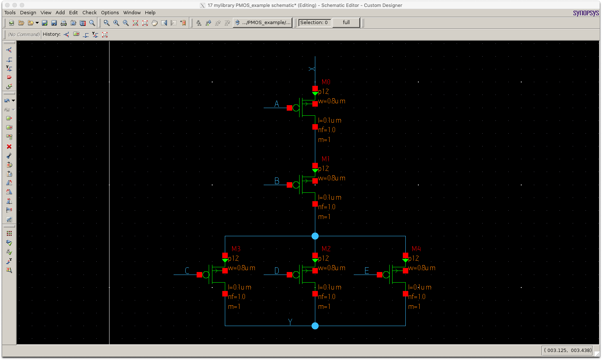

_**Fig. 75. Five PMOS circuit**_

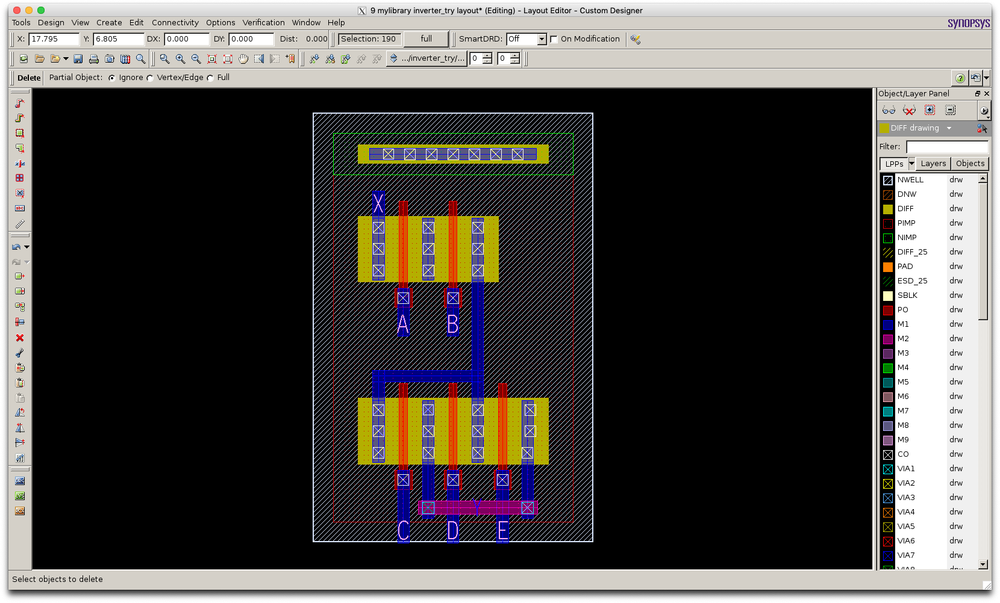

_**Fig. 76. Layout with source-drain sharing and body along the top**_


## Lab2

### Objective

Lab 2 is to learn how to design your layout, validate with DRC and LVS. You will learn three IC design tools (Layout using Custom Compiler, DRC and LVS using IC Validator) and design inverter and NAND gates in this lab and the following are expected to be delivered in your lab report.


### Checkoff

* inverter layout, DRC, LVS

* NAND schematic, testbench, simulation waveform

* NAND layout, DRC, LVS

* Parasitic Extraction and post-layout simulation waveform

* Ring oscillator layout and post-layout simulation


### Deliverables for your lab report.

* Name, SID, Session(021,022,023,024), ENGR ID, UCR NetID

* Summary of what you learned through this lab (One paragraph)


---- First Week Contents from here
* Your inverter layout in Fig.11 or Fig.12.

* Inverter Layout, DRC, LVS

* A DRC Result with `CLEAN` for your inverter layout in Fig.18.

* A LVS Result with `PASS` for your inverter layout in Fig.24.

* Your NAND gate schematic (Only NAND cell)

* Your NAND gate test bench schematic for simulation

* Your Waveform View result with transient analysis result (SAE, HSPICE) to show `OUT'=AIN*BIN`, you need one capacitance load (0.05p F) at the output connecting your `OUT` to `GND` to remove noise of `OUT`. `AIN` can be 5n pulse width and 10n period `BIN` can be 10n pulse width and 20n period for simulation. Expected result of NAND Simulation can be seen in figure shown below.


* Your NAND gate layout

* An DRC Result with `CLEAN` for your NAND gate layout.

* An LVS Result with `PASS` for your NAND gate layout.

---- Second Week Contents from here

* Your inverter parasitic view in Fig.34.

* Your post simulation result in Fig.43.

* Your ring oscillator schematic (with hierarchical design)

* Your ring oscillator layout

* Your ring oscillator testbench

* An DRC Result with `CLEAN`

* An LVS Result with `PASS`

* Your ring oscillator __POST-layout SIMULATION__ result (with parasitic extraction)


* Some of the issues if you have (One paragraph)

### What to submit

* Lab report (PDF format)

file name should be following

`lab2-[My UCR NET ID].pdf`

for example, my UCR Net ID is `tkim049`, so filename should be

`lab2-tkim049.pdf`

* Tar and Zip your design folder you made

`cd ~/eecs168` or you made

`tar -cvzf lab2-[My UCR NET ID].tgz ./`

for example, my ucr Net ID is `tkim049`, so do like following

`tar -cvzf lab2-tkim049.tgz ./`

* You need to submit two files (\*.pdf, \*.tgz) in eLearn


### Next lab

In lab 3, you will learn Hierarchical design with 4-bit Full Adder. In addition, we will start to design Standard Cell for our full chip later.