# Lab/Tutorial 2

In this tutorial, some contexts use Synopsys tutorials from Vazgen Melikyan (Synopsys) and Hamid Nahmoodi (SFSU). All the tools and PDK are given thru Synopsys University Program.

## Introduction

In this tutorial, you will learn how to draw custom IC layout and simulate your design using 28/32/90nm technologies in Synopsys Custom Design Tools. This tutorial includes the detail steps of schematic, layout, and simulation of designs.

## Part 5: Creating Layout (continues from lab1)

To design a layout, you need to be familiar with the Lamba-based rules design. This helps you save your time for design cycle and debugging Design Rules Check (DRC) errors. For Synopsys PDK, you can access 90nm technology we are currently using in the following location at `/usr/local/synopsys/pdk/SAED_PDK90nm/documents/SAED_90_Design_Rule.pdf` at `storm.engr.ucr.edu`. To see this document, you can launch a `evince` viewer from our server. Due to the license issue, please do neither download this document in your computer nor re-post this publicly.

```
evince /usr/local/synopsys/pdk/SAED_PDK90nm/documents/SAED_90_Design_Rule.pdf
```

It is recommended that you keep running and check with DRC tool for your layout design while you design. In this tutorial you just sequentially design first and then check your DRC later. However, in practice, you need to keep checking your DRC with layout to find errors earlier and correct your errors and mistakes.

__Be careful not to submit your lab report with any DRC or LVS errors.__


Start with Custom Designer. Type `cdesigner&` and open your design from lab1 you finished. Go to file-> New -> CellView on your Custom Designer Console. You need to make sure the name of the cell is the same as the schematic cell. Now, it is inverter (refer Fig.40), so click OK and the new layout workspace will be popup (refer Fig. 41)

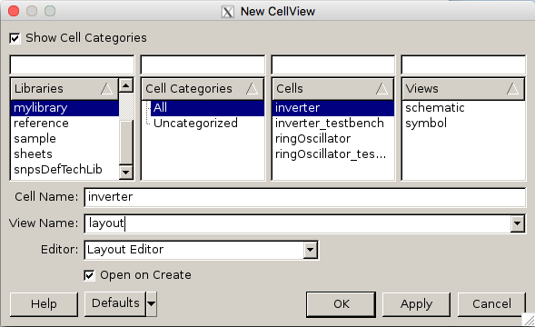

_**Fig. 40. Creating New Layout**_

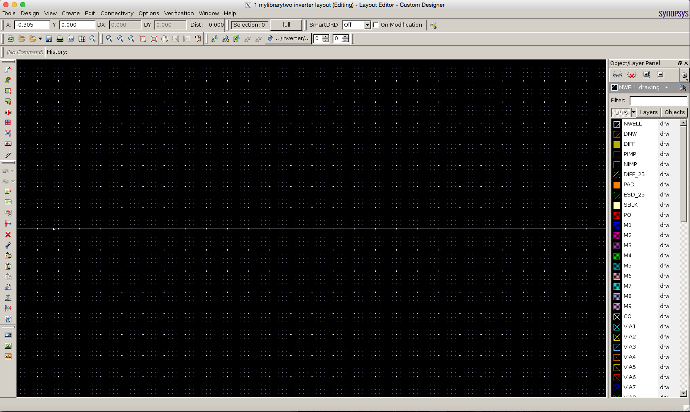

_**Fig. 41. New Layout Workspace**_


__One tip__: There is realtime DRC tool, which so-called SmartDRD technology. You can check in the following icon 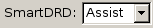 in the toolbar of your layout window. Which provides realtime DRC checking tool. If your design very large, enabling this helper may degrade your performance. It has `assist` and `visual` options. The `visual` mode only annotates the object spacing and DRC violations. Whereas, the `assist` mode attend to create barriers between objects to help enforce DRC compliance.

More details can be founded at [here](https://www.synopsys.com/Tools/Implementation/CustomImplementation/CapsuleModule/smartDRD_tech_bgr.pdf)

First we need to know each layer naming. The meaning of each layer is the following:

Note that this design tool based on p-substrate.

- NWELL : N-type Well
- DIFF : Diffusion Layer
- PIMP : P-type diffusion (p-diff)
- NIMP : N-type diffusion (n-diff)
- PO : Polysilicon layer
- M1 : Metal-1 Layer
- CO : Contact Layer
- M1PIN : Metal-pin-naming layer


Go to `Create ruler` by clicking on  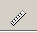 . Click once to start drawing the ruler and again to end it. Draw two rulers about the lengths shown in Fig. 42 (about 3 micrometers by 3 micrometers can be a good start). Select the `NWELL` layer in the layers panel on the right and select `Create-> Rectangle` (Fig.42).

Draw a rectangle that approximately fits the dimensions of the rulers you set. You can always adjust the dimensions of this rectangle by using the tools (stretch object, refer icon 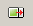, move object, refer icon 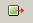) that existed on left side of layout window then clicking the side you want to stretch or move.


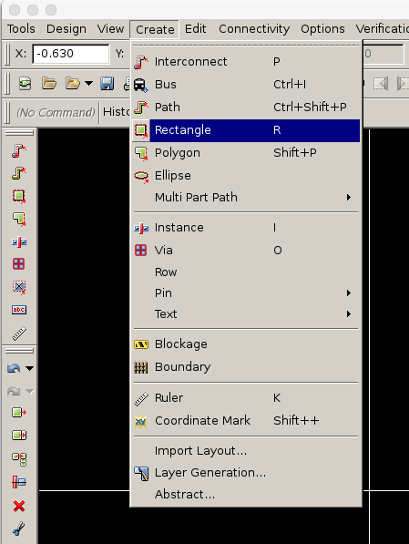 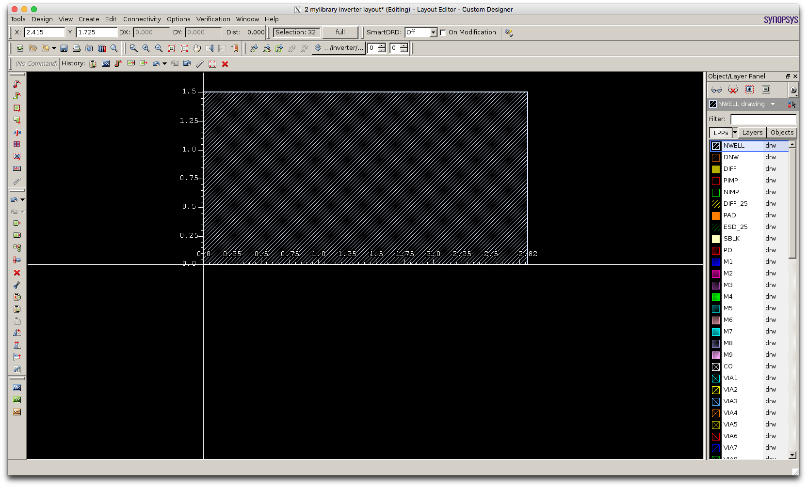

_**Fig. 42. Drawing Rulers and N-Well Layer**_

After you have created an N-well (N-tub), move your mouse over it. Notice at the top left there are two fields that tell you what layer you are on and the coordinates. This is useful information if you are having trouble figuring out what a layer is and when you are fixing errors found in DRC.

Now we are going to make diffusion areas for PMOS, NMOS and body connections. From our schematic, we know that the width of the PMOS should be 0.5um and the width of NMOS should be 0.25um (Refer lab1). The location of the diffusion should be similar to the ones in Fig. 44. There are two horizontal diffusion areas that are the NMOS and PMOS devices, and two vertical rectangles that will be the body connections. Place rulers down to help you make sure the width of the diffusion areas for the NMOS and PMOS match our schematic area exactly. Select the “DIFF” layer again use the `Create Rectangle` tool to draw the diffusion area. Use rulers to check the width of the rectangles. If the widths are different than the widths of the devices in the schematic, you will not pass LVS. You can also use the property editor in `Edit -> Property` Editor to change the dimensions of the rectangle to exact values.


_**Fig. 43. Drawing Diffusion**_


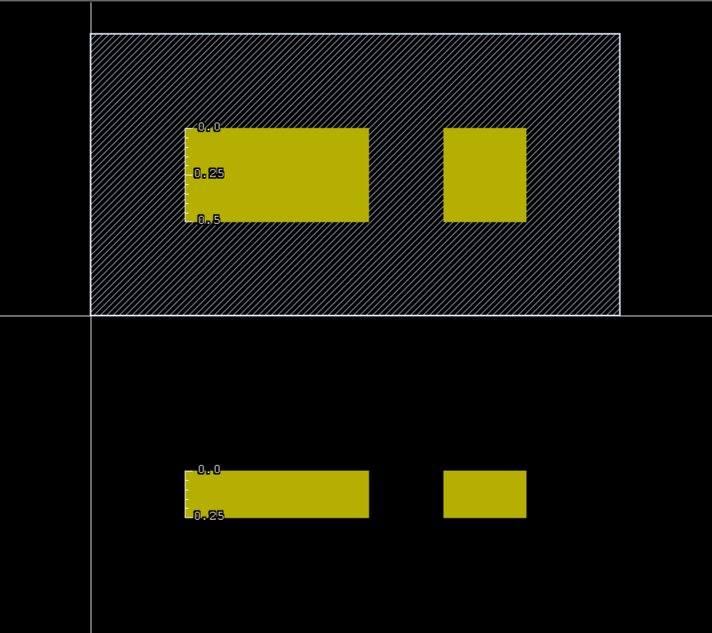

_**Fig. 44. Layout with NWell and diffusion**_

Now we will add the P-implant and N-implant areas. When manipulating layers on top of each other sometimes it is useful to “hide” a layer, like you would do in a program like Photoshop.
You can do hide or reveal layers in Cosmos by clicking .

Use the p-diff(PIMP layer) and n-diff (NIMP layer) layers with the `Create Rectangle` to cover and surround the diffusion areas. It is important to note that the `PIMP` is drawn to the edge of the `NWELL` where the `NWELL` meets the `NIMP`. This can be seen in Fig. 45. The PMOS area should be covered with `PIMP` and the `NMOS` with `NIMP`, except for the body connections which have the opposite implantation.

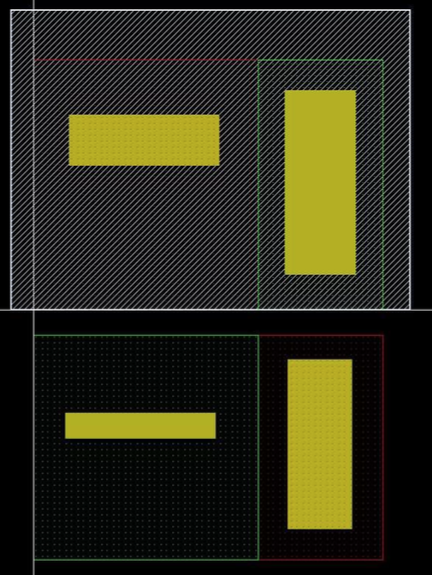

_**Fig. 45. Drawing PIMP and NIMP layers**_

Now we select the `PO` layer (Polysilicon) and use the `Create -> Path` tool (Fig. 46) to draw a strip of poly through both PMOS and NMOS diffusion areas. Make sure the poly is sticking out past the diffusion areas by at least the amount specified in the design rule manual. When drawing the Poly path, be sure to make sure the thickness is 0.1um to match the transistor lengths in the schematic, see figure 49 to set width/thickness for the draw path tool. Create a rectangle of poly in the center of the strip that would be used for the input signal, see Fig. 47.

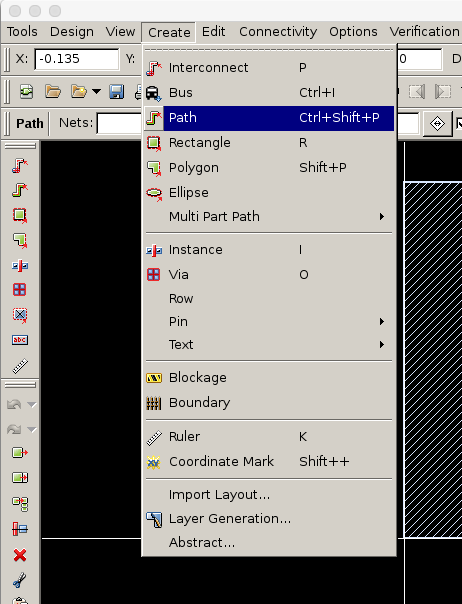

_**Fig. 46. Drawing a path**_

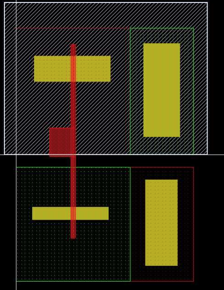

_**Fig. 47. Drawing Polysilicon (PO Layer)**_

Select the “CO” (contact) layer and use the `Create Rectangle` or `Create Polygon tool` in conjunction with rulers to make a contact 0.13 by 0.13. You can also use the property editor to
get these exact values. After you have created one contact click on 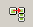  and the contact and make a copy to place the other contacts. `Contact` placements are shown in Fig. 48. Check to see that your contact placements meet the design rules.

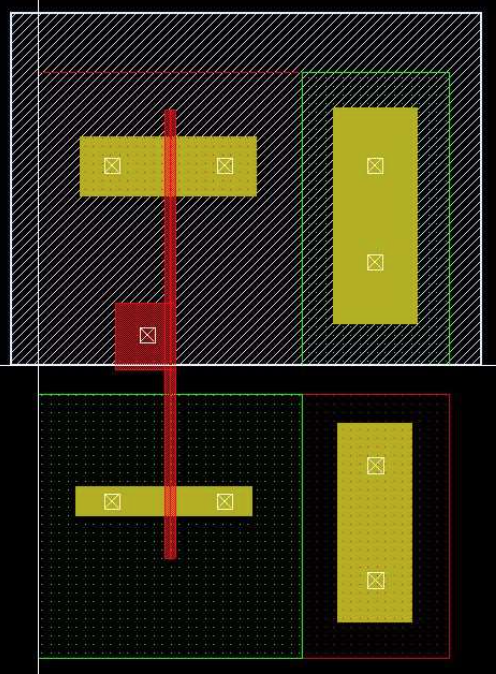

_**Fig. 48. Drawing Contacts**_

Select the M1 (Metal-1) layer and again select the `Create -> Path` tool. This time in the `Create Path` window that pops ups, click on the width box to then enter 0.16 in the Width field as shown in fig.49.


_**Fig. 49. Modifying Width**_

Draw the M1 layer the way it is shown in Fig.50. Make sure the metal is covering the contacts by the amount specified in the design rule manual. You can also draw rectangles over the contacts to cover them more.

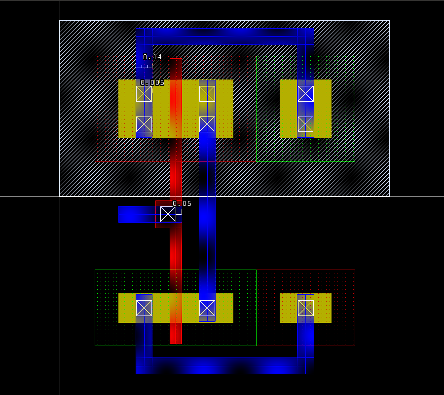

_**Fig. 50. Drawing Metal Connections**_

Select the M1PIN layer. Select the `Create -> Text -> Label` tool and place text labels labeled as AVDD, AVSS, VIN, and VOUT (refer Fig. 51). Note that you need to match the label names in layout as the labeled pins in the schematic in order to pass LVS (Layout vs Schematic) later. You have now completed the initial layout and can move onto DRC. Save your layout by going to `Design -> Save`.
As a general convention, use uppercase letters for labels instead of lowercase letters.

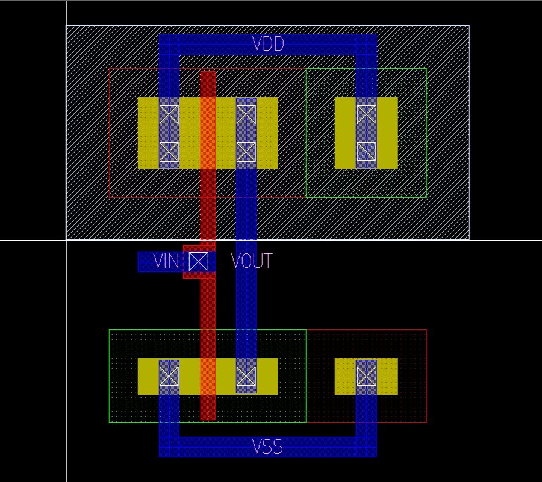

_**Fig. 51. Labeling Connections**_


## PART 6: Running DRC

After the inverter layout has been drawn to accurately represent the schematic, to verify that the layout meets all the basic design rules, we need to run `IC Validator` for a DRC (Design Rule Check). Save the layout cell by clicking on Save. In Custom Designer Editor, go to `Verification -> DRC -> Setup` and Run.
Locate the runset file rules.drc.9m_saed90ev_saed90_icv.rs from the following directory and click Ok (Fig 52).

```
/usr/local/synopsys/pdk/SAED_PDK90nm/icv/drc/rules.drc.9m_saed90_icv.rs
```

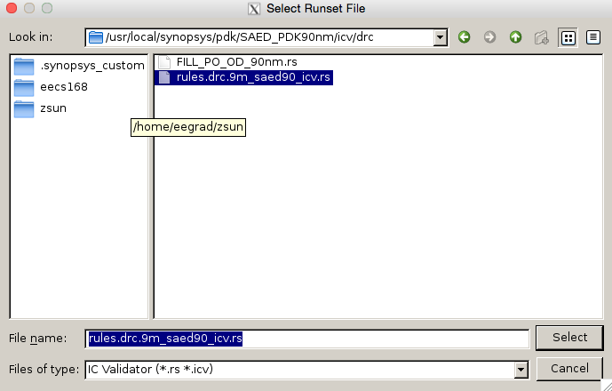

_**Fig. 52. Runset File**_

You should check your library, cell, and view are correctly set and Format should be `OpenAccess` to communicate with `IC Validator` Don't forget to enable `Launch Debugger` and `View Output` to see DRC result.

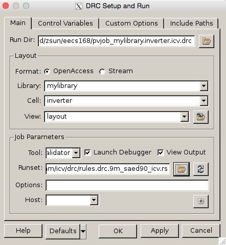

_**Fig. 53. DRC Setup**_

Click OK. After DRC is done, you will see a message on your Console indicating that DRC is
done, see Fig. 54.


_**Fig. 54. DRC result**_

When the layout is free from all the errors and meets all the design rules, you can see `Completed with no erros` message in the console. But if not, the debugger will launch, and you can see which bug you have it.


_**Fig. 55. DRC debugging**_

In Fig. 55, it shows 1 violation found, to see the error detail, you need to clock `DRC Erros` tab. Then see your design name and double click error, then it shows where the error comes from.


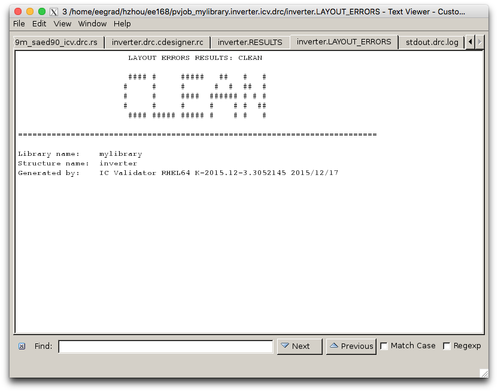

_**Fig. 56. DRC passed**_

Also for debugging screen again, you can go to `Verification -> DRC -> Debug`, see Fig. 57.

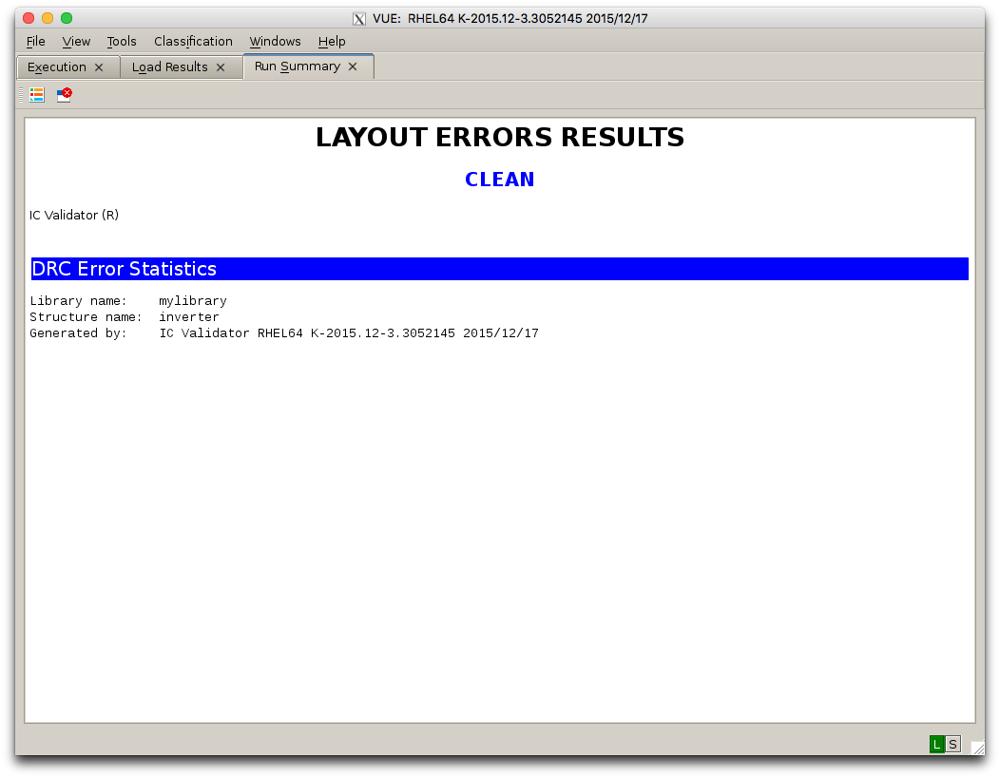

_**Fig. 57. DRC Errors**_


## Part 7: Running LVS

The LVS (Layout versus Schematic) performs LVS comparison to verify that the design layout accurately represents the electronic equivalent of the design schematic. `IC Validator` LVS verifies whether the physical design design matches the schematic by extracting the devices, verifying the connectivity between the devices and comparing the extracted information with the schematic netlist.

Notice that in order to pass LVS, schematic names and layout names must match one to one. Make sure the names for labels and pins are using uppercase letters instead of lowercase letters. Also transistor dimensions for gate width and length in layout and schematic must match. See Fig. 58 for reference.

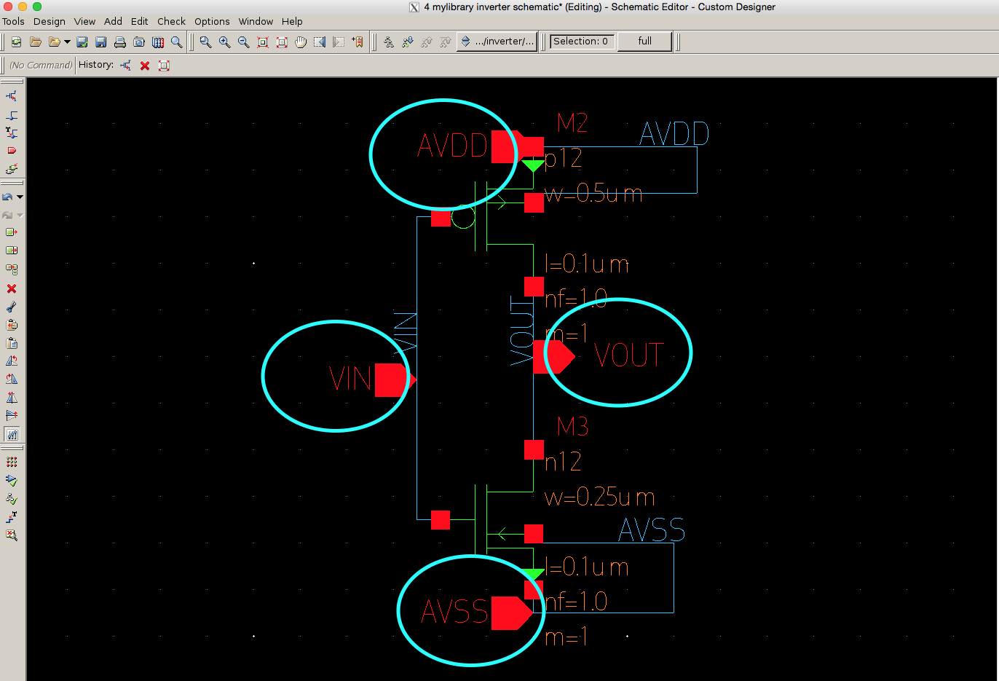
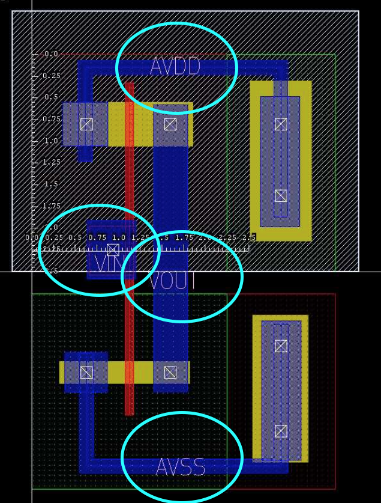

_**Fig. 58. Layout versus Schematic (LVS)**_

In the layout window go to `Verification -> LVS -> Setup and Run`. Please make sure your setup mirrors the Fig.59.

Under main option select the file “rules.lvs.9m_saed90.ev” as `Run Dir` in the following directory:
```
[under your project folder]/pvjob_mylibrary.inverter.icv.lvs
```
Here, we assume library name is `mylibrary` and cell name is `inverter` here.

You need to make sure of all `OpenAccess` for Layout and Schematic/Config

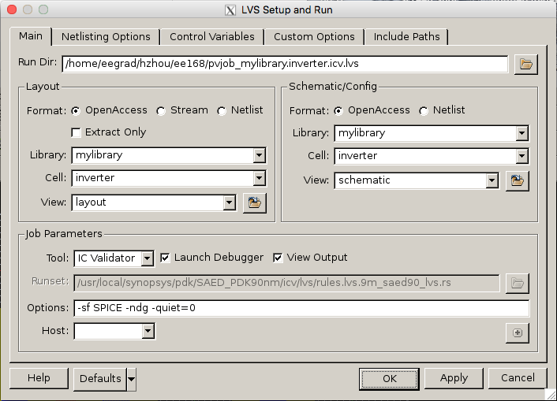

_**Fig. 59. LVS Setup**_

Under Netlisting Option tab, for the netlister, select: CDL if not already selected. See Fig. 60.

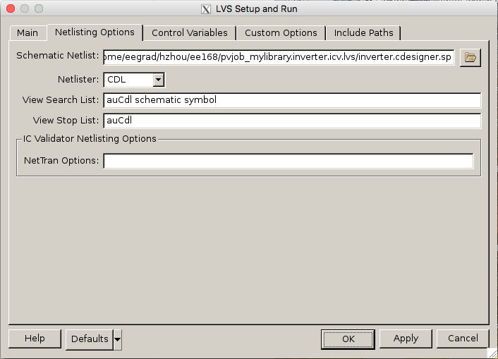

_**Fig. 60. LVS Setup Netlisting Options Tab**_


Under the Custom Options tab, leave the defaults as shown in Fig 62. Click OK when done.

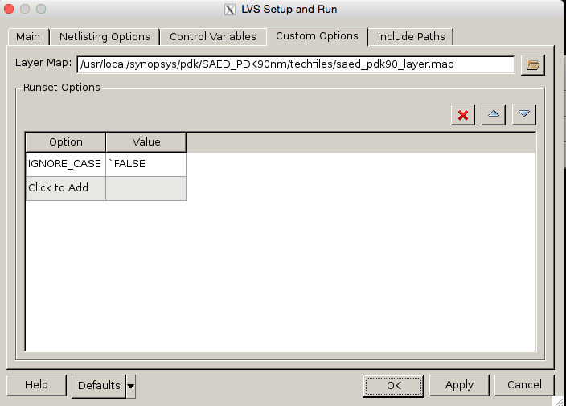

_**Fig. 62. LVS Setup Custom Options Tab**_

On your Console window you should get the following message as in Fig. 63 if you passed LVS.

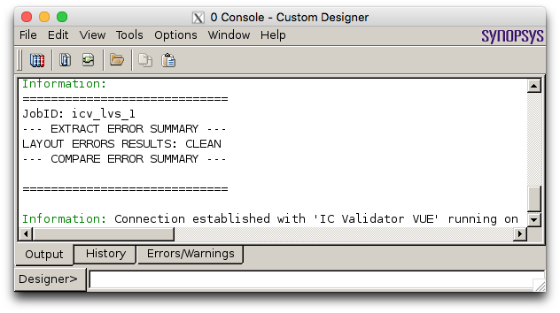

_**Fig. 63. LVS Passed**_

Like DRC, you can use debugging window to fix your LVS problem in Fig 64.

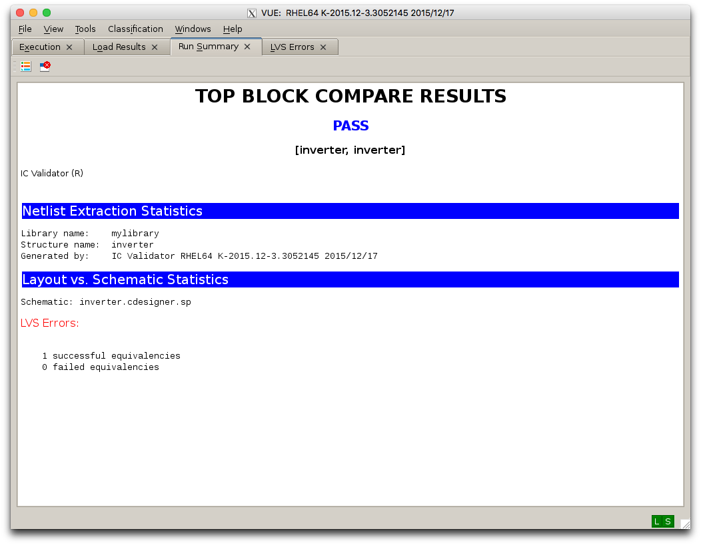

_**Fig. 64. LVS Passed**_

After fix every thing, you can see `PASS` message in Fig. 65

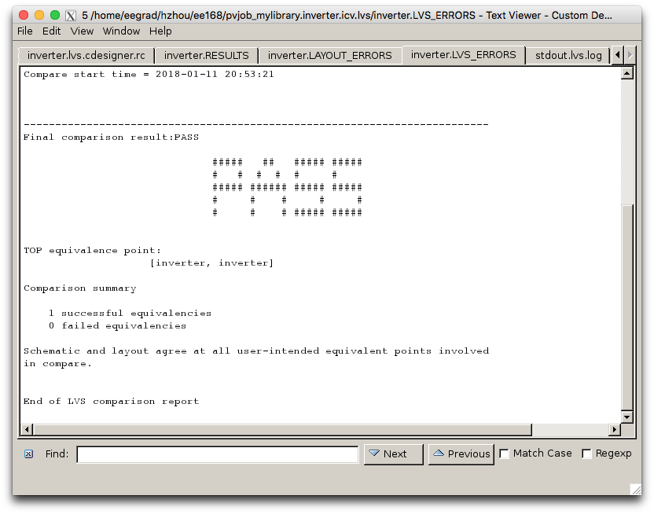

_**Fig. 65. LVS Passed**_

## Part 8: Design NAND Gate (You don't need to finish this part during lab but for your lab report, you need to finish this)

From your lecture class, we learned NAND gate schematic and its layout. Now, from Lab1 and Lab2 tutorials, we learned how to draw schematic, simulate, and layout your circuit. Now we draw NAND gate schematic and layout. f'=a*b, so you need to design your NAND gate schematic and design testbench with your NAND symbol to simulate with HSPICE, then you need to draw layout for NAND gate with successful DRC and LVS.

1. Design your `NAND` gate cell (see lecture notes)

1. Design your `NAND` symbol

1. Design your testbench for simulation `NAND_testbench` cell

1. Do transient simulation with two different inputs and one output, you need to show if `NAND` gate is correctly working. You need to setup your testing variables such as timing, Input signal frequencies (`AIN`, `BIN`) with appropriate `AVDD` and `AVSS`.

1. Draw `NAND` gate layout (see lecture notes)

1. DRC for `NAND` gate layout

1. LVS for `NAND` gate layout


## Lab2

### Objective

Lab 2 is to learn how to design your layout, validate with DRC and LVS. You will learn three IC design tools (Custom Designer, IP Validator) and design inverter and NAND gates in this lab and the followings are expected to be delivered in your lab report.

### Deliverables for your lab report.

* Name, SID, Session(021,022), ENGR ID, UCR NetID, your partner name

* Summary of what you learned thru this lab (One paragraph)

* Your inverter layout in Fig. 51.

* An DRC Result with `no errors` for your inverter layout in Fig 54.

* An LVS Result with `CLEAN` for your inverter layout in Fig 63.

* Your NAND gate schematic (Only NAND cell)

* Your NAND gate test bench schematic for simulation

* Your Waveform View result with transient analysis result (SAE, HSPICE) to show `OUT'=AIN*BIN`, you need one capacitance load (0.05p F) at the output to remove noise of `OUT`. `AIN` pulse signal can be 5n pulse width `BIN` pulse signal can be 10n pulse width for simulation. Expected result can be seen in Fig 66.

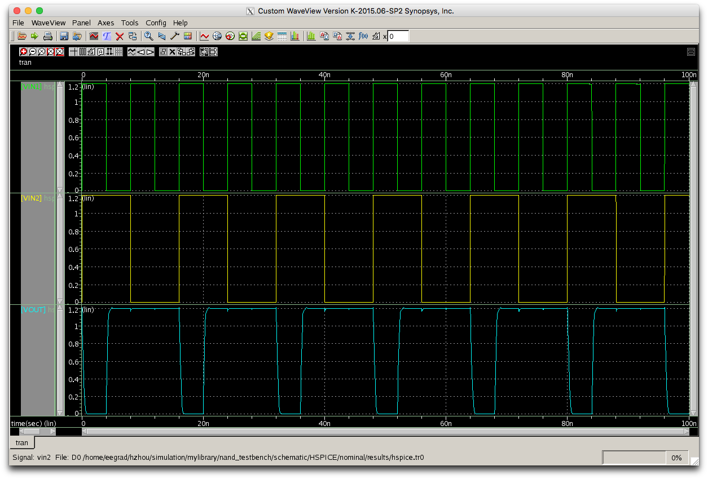

_**Fig. 66. Expected NAND Simulation Result**_

* Your NAND gate layout

* An DRC Result with `no errors` for your NAND gate layout.

* An LVS Result with `CLEAN` for your NAND gate layout.


* Some of the issues if you have (One paragraph)

### What to submit

* Lab report (PDF format)

file name should be following

`lab2-[My UCR NET ID].pdf`

for example, my UCR Net ID is `tkim049`, so filename should be

`lab2-tkim049.pdf`

* Tar and Zip your design folder you made

`cd ~/eecs168` or you made

`tar -cvzf lab2-[My UCR NET ID].tgz ./`

for example, my ucr Net ID is `tkim049`, so do like following

`tar -cvzf lab2-tkim049.tgz ./`

* You need to submit two files (\*.pdf, \*.tgz) in iLearn

### Lab Report Due

* One week.

* eecs168-021: by 11:59pm on 2/1
* eecs168-022: by 11:59pm on 1/28

### Next lab

In lab 3, you will learn Parasitic Extraction, post-simulation with parasitic extraction, and Hierarchical design with 4-bit Full Adder. In addition, we will start to design Standard Cell for our full chip later.
