# Lab/Tutorial 3

In this tutorial, some contexts use Synopsys tutorials from Vazgen Melikyan (Synopsys) and Hamid Nahmoodi (SFSU). All the tools and PDK are given thru Synopsys University Program.

## Introduction

In this tutorial, you will learn how to do parasitic extraction/ post layout simulation and hierarchical design. You will use your Inverter design for your parasitic extraction and post layout simulation. For your hierarchical design, you will eventually design Ring Oscillator. You need to check off until Ring Oscillator.

This work design for two weeks lab, so for your lab report, you need to design 4-bit binary full adder schematic, layout (DRC,LVS pass) and post layout simulation, which requires Hierarchical Design skill. The 1-bit adder requires 5 NAND gates.

## Part 9: Parasitic Extraction (continues from lab1 and lab2)

You need to keep working on Inverter schematic and layout for this extraction.

From your lab2, after passing DRC and LVS you can now move on to LPE (Layout Parasitic Extraction). In this phase, resistances and capacitances will be extracted from the layout. In layout window go to `Verification -> LPE -> Setup and Run`. Please make sure your setup the Fig.1 for the Main tab, you need to click the "View output" Option to see the output window.

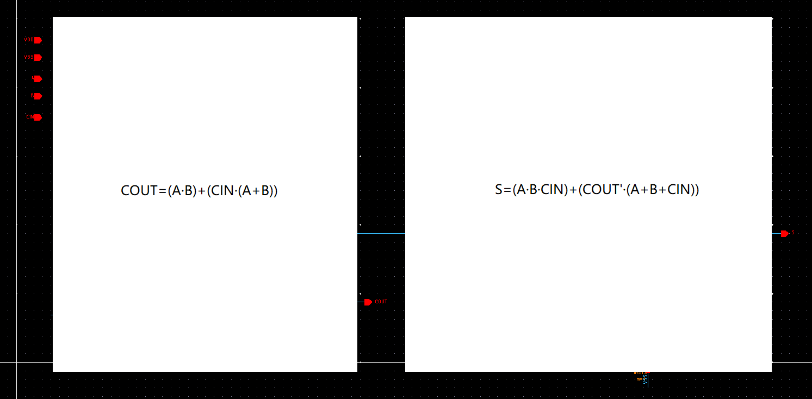

_**Fig. 1. LPE Setup -- Main**_

In Fig.2, 'Extraction Options' tab, you need to change your `Runset Report File` to yours. It is located under `pvjob_[your library name]_[your cellview name].icv.lvs` folder.

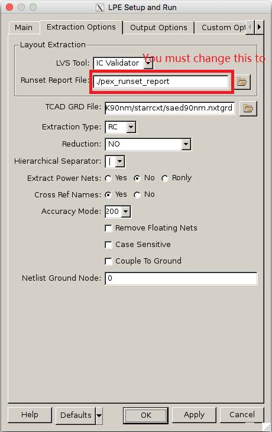

_**Fig. 2. LPE Setup -- Extract Options**_

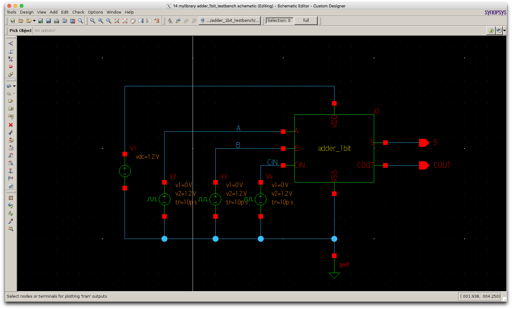

_**Fig. 3. Select ICV Runset Report File**_

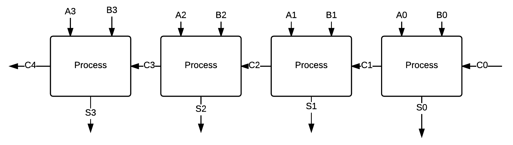

_**Fig. 4. Select ICV Runset Report File**_

In Fig.5, you should make sure the netlist ground node matches the ground node name in the schematic and lyout. Here, choose 'VSS' for our ground. Note that you cannot use 'GND' or 'gnd' as ground node name.

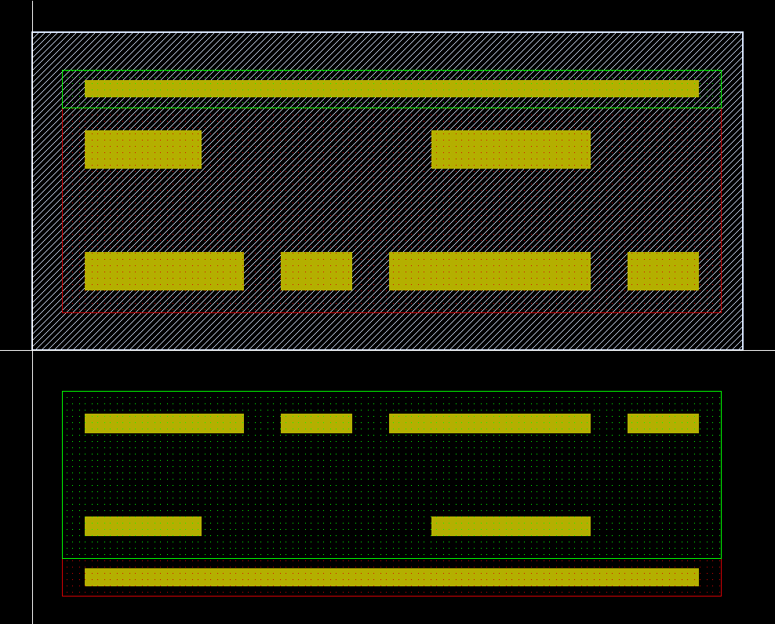

_**Fig. 5. LPE Setup -- Extract Options**_


_**Fig. 6. LPE Setup -- Output Options**_

Make sure the other options in this tab match up with Fig.2-6.

Device Map:
```
/usr/local/synopsys/pdk/SAED_PDK90nm/starrcxt/device_map
```
Layer Map:
```
/usr/local/synopsys/pdk/SAED_PDK90nm/starrcxt/output_layer_map
```

Now click on `OK`. Then you will see Customer Designer as Fig.7.


_**Fig. 7. LPE Output**_

After some time you should able to see the following message as shown in the console window if the parasitics were generated correctly. See Fig.8.


_**Fig. 8. Console Output**_

After LPE has successfully run, a parasitic view window should open. See Fig 9 and 10 for reference. The RC components are very small in the window that opens up (Fig.9) so you may need to zoom in to see the details (Fig.10). It may help to drag a box around the RC components using the mouse cursor to highlight them, then zoom in to see them. Also note that your parasitic view may not match exactly as shown below which is fine since this depends on differences in layout

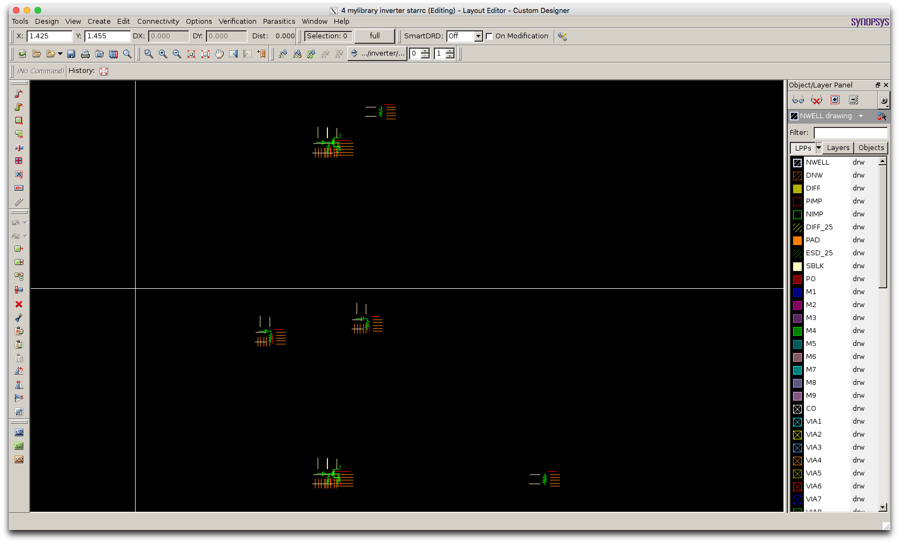

_**Fig. 9. Parasitic View**_


_**Fig. 10. Parasitic View Zoom In**_

You have successfully generated the parasitic view for the inverter and are ready to run post layout simulation. Save the parasitic view with `Design -> Save`. The parasitic view will be saved as “starrc” for the view name.


## Part 10: Post Layout Simulation

After parasitic extraction we want to apply the parasitics to the schematic for a more accurate representation of our inverter and test it. From the Custom Designer Console window go to `File -> Open Design` and open the inverter circuit schematic created earlier.

Select the following options for the following columns:

- Libraries: mylibrary
- Cells: inverter_schematic
- Views: schematic

See Fig.11 for reference. Once all options are highlighted, click `Open` and the schematic that was created earlier for testing the inverter will open, see Fig.12 for reference.

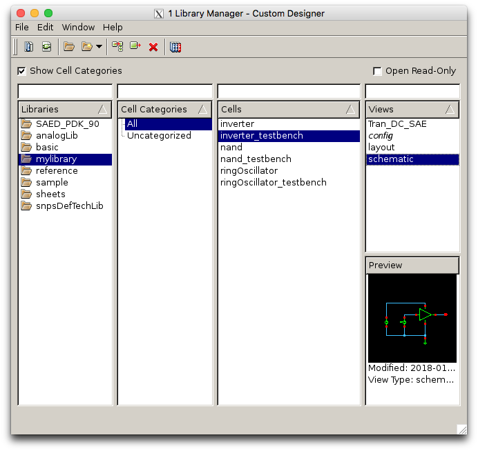

_**Fig. 11. Opening Circuit with Inverter Schematic**_

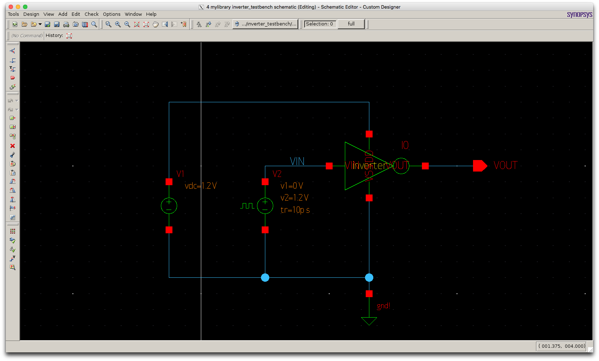

_**Fig. 12. Testbench Circuit for Inverter**_

After opening the testbench circuit, make sure the circuit is similar to the one shown in Fig.12. Now the parasitics need to be loaded into the inverter cell used in the circuit. From the Custom Designer Console window, go to `File -> New -> CellView`. In the New CellView window, create a new configurations file as follows:

- Select inverter_testbench for the cell.
- Set view name to config
- Set editor to Hierarchy Editor

See Fig.13 below for reference and click `OK`.

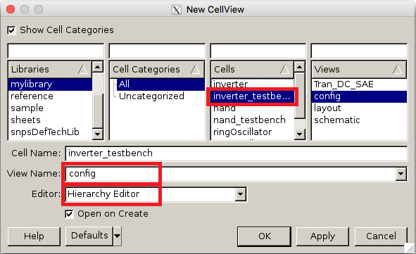

_**Fig. 13. Configurations File Setup**_

A Hierarchy Editor window will display. Setup the view and list options as noted in Fig.14 below.

- View: schematic
- View Search List: schematic hspice symbol
- View Stop List: symbol

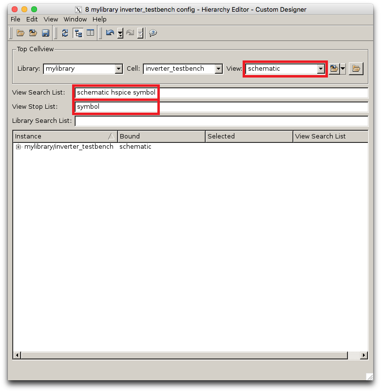

_**Fig. 14. Hierarchy Editor**_

In order to map the parasitics generated from LPE to your inverter cell, select `starrc` under the 'Selected' column for the inverter instance, see Fig.15 for reference. The format for your inverter instance name in the instance column is schematic_instance_name (mylibrary, inverter). Notice that as starrc is selected, resistor and capacitor instances will show up under the instance column, this substitution replaces the inverter cell with its equivalent schematic containing its resistive and capacitive components. Afterwards save the settings by going to `File -> Save`.

For future reference, to apply parasitics for a general case, a schematic must have its equivalent schematic symbol and layout created since a layout is used to generate the parasitics and a schematic symbol is used as a vessel to hold the parasitics. The testbench schematic is created to test the symbol containing the schematic with its applied parasitics.


_**Fig. 15. Loading Parasitics into the Inverter**_

To start simulation with parasitics, go to `Tool -> Library Manager` from the Custom Designer Console window. In the Open Design window that opens, select `inverter_testbench` under the cells column and `config` under the views column and right click on config under views. Select `Open Design` from the drop down menu. See Fig.16 below for reference.


_**Fig. 16. Open Design with Parasitics**_

Afterwards, a schematic view should open up with parasitics applied, see Fig.17 below for reference. To check if the parasitics were applied, you can double click on the inverter symbol/cell and it should display the same parasitics view that was generated from running LPE. To change between parasitic and schematic views, select the desired view in the yellow box noted in Fig.18.


_**Fig. 17. Schematic with Parasitics Applied to the Inverter**_

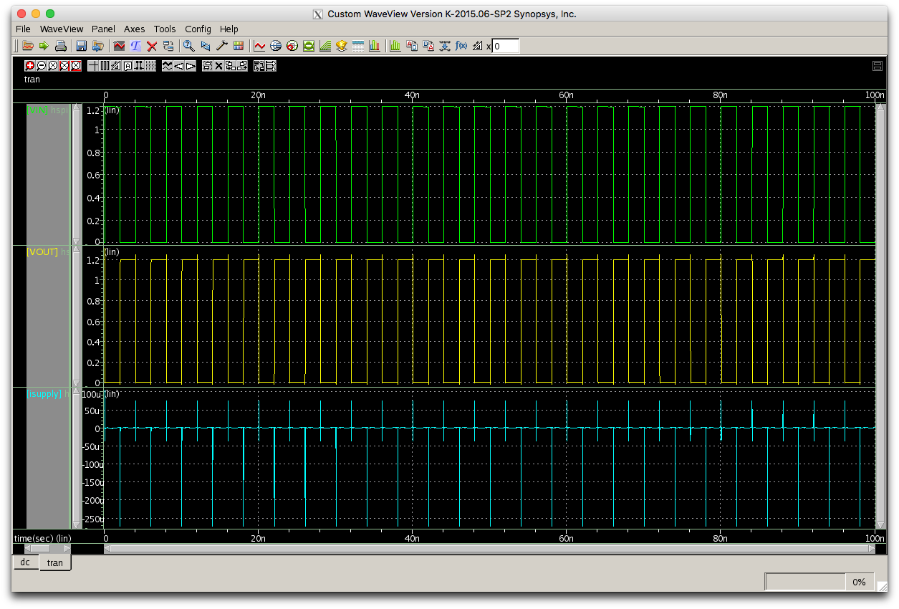

_**Fig. 18. Simulation result with parasitic extraction**_

Now go ahead and simulate your circuit as you did previously in Part 3 of the tutorial. From the schematic window, go to `Tools -> SAE` to open a new SAE window. When comparing the two waveforms (inverter parasitics to inverter without parasitics) take note of the difference between delays from VIN to VOUT for transient waveforms. The result can be seen in Fig.18.


__Tip__:
If there is a mismatch error in the console regarding mismatched nets that are uppercase and lowercase between parasitics (starrc) and the symbol when running the SAE simulation, set all pin names to use uppercase letters in schematic and set all layout labels to use `uppercase letters` as well. After this change, you need to run LVS, LPE, regenerate the inverter symbol, redo the configurations file for the testbench, and rerun the SAE.


## Part 11: Hierarchical Design - (Last tutorial)

Using smaller instances of circuits to create a larger design is what hierarchical design is all about. In this section, we use an inverter we created earlier and use several instances of it to create a five stage oscillator in schematic and layout views.

Create a new schematic for the ring oscillator by going to `New -> CellView` from the Custom Designer Console and setup the options as shown in Fig.19 below. The setup is as follows:

- Library: mylibrary
- Cell Name: ringOscillator
- View Name: schematic
- Editor: Schematic Editor

Click `OK` when done.

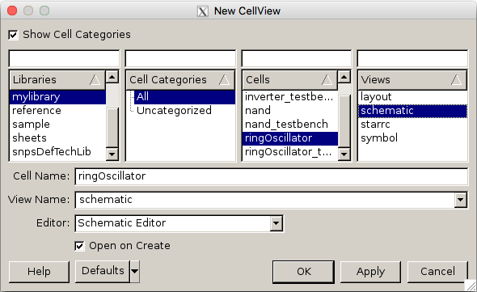

_**Fig. 19. Ring Oscillator Schematic Setup**_

In the schematic window, building a ring oscillator circuit with pins as shown below in Fig.20.
For the inverter instances, look for them in `Add -> Instance` to open the add instance window. In the add instance window, choose `mylibrary` for library, `inverter` for cell, and `symbol` for the view and place five instances of the inverter on the schematic.

Add wires with `Add -> Wire`.

For the pins, go to `Add -> Pins` and place two `input` pins for the VDD and VSS signals, and place five input/Output pins at each inverter output. For the five `input/output` pins, I called them VIO1-5 in the schematic. Feel free to give the wires the same names as the pins using `Add -> Wire Name`. Also as a convention, use uppercase letters for pin names instead of lowercase letters.

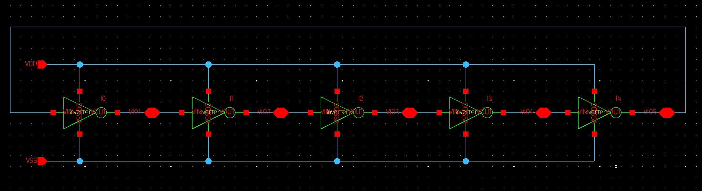

_**Fig. 20. Ring Oscillator Schematic**_

Save your schematic using `Design -> Save`. Now create a symbol of your inverter using `Design -> New CellView -> From CellView`. Make sure your options match up as shown below in Fig.21 and click `OK`.


_**Fig. 21. Ring Oscillator Symbol Setup**_

After clicking OK, a new schematic window opens up with the ring oscillator symbol. Feel free to move around the pin placements for a better pin organization. See Fig.22 below for reference. Save the symbol when done with `Design -> Save`.


_**Fig. 22. Ring Oscillator Symbol**_

Now create a new schematic to use as a testbench for the ring oscillator by going to `New -> CellView` from the Custom Designer Console and setup the options as shown in Fig.23 below. The setup is as follows:

- Library: mylibrary
- Cell Name: ringOscillator_testbench
- View Name: schematic
- Editor: Schematic Editor


_**Fig. 23. Ring Oscillator Testbench Setup**_

Afterwards a new schematic window should open. In the new schematic window, setup the ring oscillator testbench circuit as shown in Fig.24.

To place a ringOscillator instance, look for them in `Add -> Instance` to open the add instance window. In the add instance window, choose `mylibrary` for library, `ringOscillator` for cell, and `symbol` for the view and place an instance of your ring oscillator on the schematic. Also place an instance of ground and a voltage source in the schematic. You can find these instances under library: `analogLib` and cell: `gnd` and cell: `vsource` respectively. For the voltage source, set the voltage to 1.2 volts.

Add wires with `Add -> Wire`.

For the pins, go to `Add -> Pins` and place five output pins for each of the five `VIO#` pins. Feel
free to give the wires the same names as the pins using `Add -> Wire Name`.

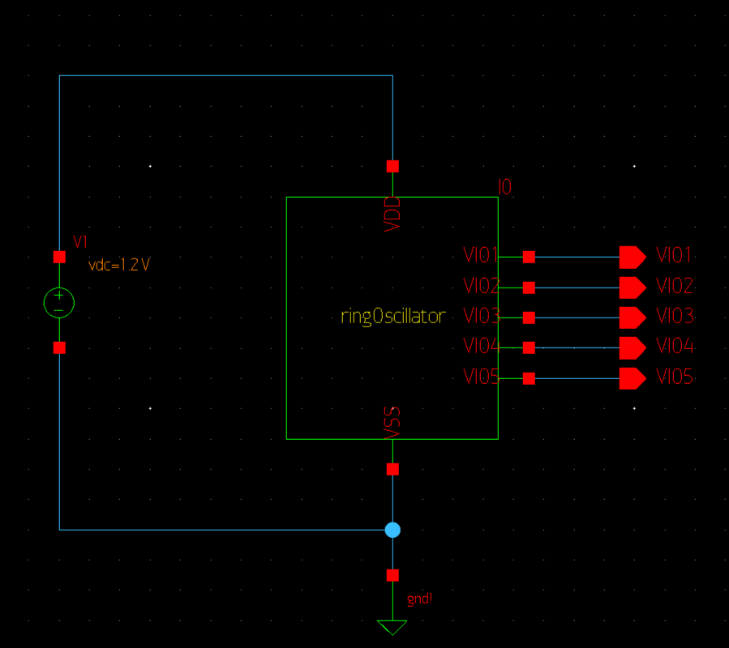

_**Fig. 24. Ring Oscillator Testbench Circuit**_

Save with `Design -> Save` once your testbench circuit is done. Now we need to create a new layout so go to `New -> CellView` from the Custom Designer Console and setup the options as shown in Fig.25 below.

- Library: mylibrary
- Cell Name: ringOscillator
- View Name: layout
- Editor: Layout Editor

Click `OK` when done.

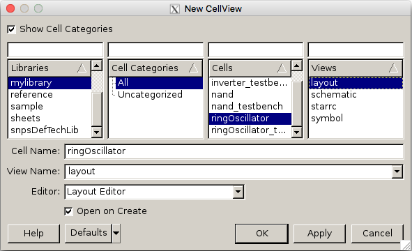

_**Fig. 25. Ring Oscillator Layout Setup**_

In the new layout window, we can use the layout of the inverter created earlier to build a ring oscillator circuit. Go to `Create -> Instance` to open up a new create instance window. In the window select `mylibrary` for library, `inverter` for cell, and `layout` for the view and place five instances of the inverter layout on the layout screen. See Fig.26 for reference.


_**Fig. 26. Placing Five Inverter Layout Instances**_

Notice that the layout components for the inverter layouts don’t display. This is because the inverter layouts are hiding one level up in the hierarchy. In order to view them, change the hierarchy bounds, which is the rightmost number from 0 to 1 or 32, as shown in Fig.27 below. The numbers represent a range of hierarchy levels that are displayed where the left number is the lower limit and the right number is the higher limit. Afterwards the inverter layouts are viewable as shown in Fig.28.

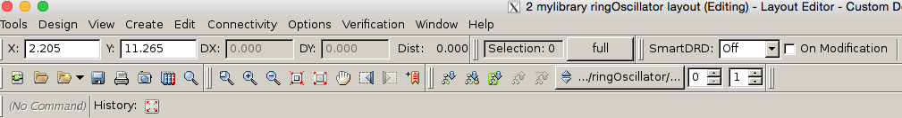

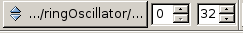

_**Fig. 27. placing Five Inverter Layout Instances**_

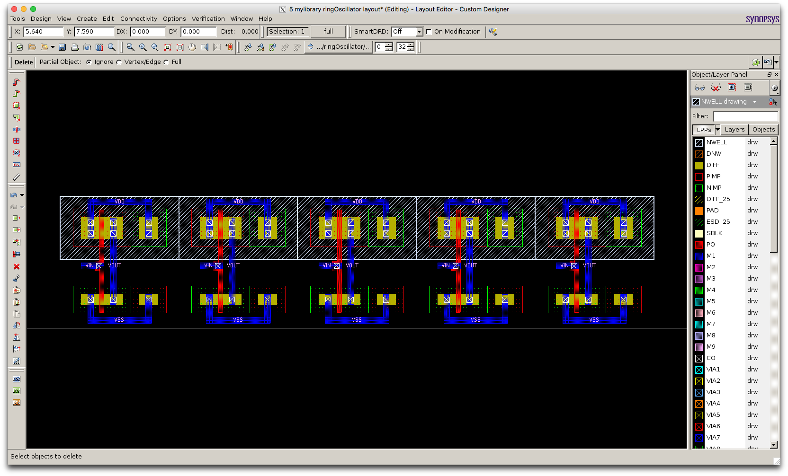

_**Fig. 28. Viewing Inverter Layout Instances**_

Now draw metal paths with `Create -> Path` using the `M1` layer under the LPP panel. Connect all VDD signals with a single M1 connection and all VSS signals with a single M1 connection. Also connect the output of an inverter to the input of the next inverter using the `M1` layer. See Fig.29 for M1 connections.

In addition you need to add labels for the metal connections just added. To add labels, select the `M1PIN` layer in the LPP panel and go to `Create -> Text -> Label`. Enter a name for each label in the box noted in Fig.30 and place the text labels as noted by the red boxes in Fig.29. Label names used are: `VDD, VSS, VIO1, VIO2, VIO3, VIO4, and VIO5`. Remember that in order to pass LVS, your M1PIN label names in layout need to match up with the pin names from your ring oscillator schematic. Also names for schematic pins and names for layout labels should use uppercase letters. Save the layout.


_**Fig. 29. Ring Oscillator Layout using Metal2 (refer Fig.43)**_

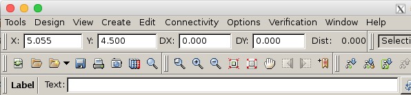
_**Fig. 30. Label Text**_

After your layout matches Fig.29, go to `Verification -> DRC -> Setup and Run` to setup and run DRC (as done earlier in lab2 of the tutorial). Leave the options on the custom tab as their defaults. Click `OK` when done.

Debug any DRC errors that come up. When DRC is passed, continue on to `Verification -> LVS -> Setup and Run` to run LVS. In LVS, leave the defaults for the custom options tab. Click `OK` when done.

Under main option select the file “rules.lvs.9m_saed90.ev” as `Run Dir` in the following directory:

```
[under your project folder]/pvjob_mylibrary.ringOscillator.icv.lvs
```

At this point if there are any LVS errors, an error window will show up. Debug any errors you have and rerun LVS until you pass it. After running LVS successfully, go to `Verification -> LPE -> Setup and Run` to run parasitic extraction.

See Fig.31 below for reference on setups.

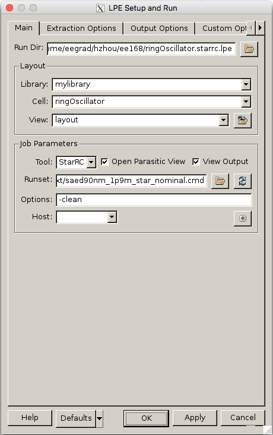

_**Fig. 31. LPE Setup -- Main**_


_**Fig. 32. LPE Setup -- Extraction Options**_

Under the Output Options tab make sure that you have the same setup as shown in Fig.33. Make sure the Device Map and Layer Map  files are set as noted below if not already set by default.

Device Map:
```
/usr/local/synopsys/pdk/SAED_PDK90nm/starrcxt/device_map
```
Layer Map:
```
/usr/local/synopsys/pdk/SAED_PDK90nm/starrcxt/output_layer_map
```

Leave the custom options tab with their set defaults. Click `OK` when done.


_**Fig. 33. LPE Setup -- Output Options**_

If LPE ran successfully, a parasitics view will open up. The parasitics are small so drag a box over it with a mouse cursor and zoom in to see individual components if you don’t see it at first. See Fig.34 below for reference. Afterwards save the parasitics view with `Design -> Save`.

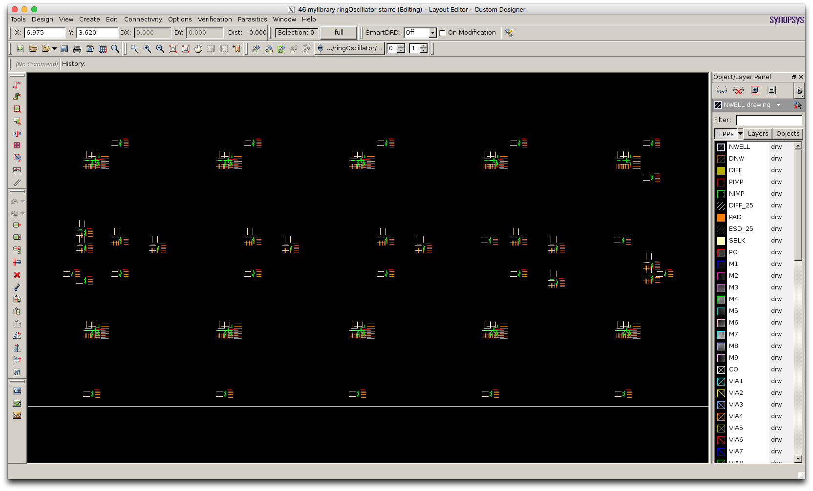

_**Fig. 34. Parasitics View**_

After parasitic extraction, create a new configuration files by going to `File -> New -> CellView` in the custom designer console. Setup the options as noted in Fig.35 to setup a configurations file for the ring oscillator testbench. Click `OK` when done.

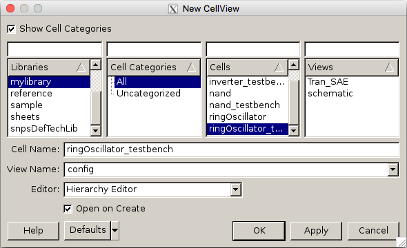

_**Fig. 35. Configurations File Setup**_

A new configurations file will open up. From here, setup the options as noted in Fig.36 to load the ring oscillator parasitics into the ring oscillator symbol. Save with `File -> Save` when done.


_**Fig. 36. Configurations File Setup**_

To start simulation with parasitics, go to `File -> Open Design` from the Custom Designer Console window. In the Open Design window that opens, select `ringOscillator_testbench` under the cells column and config under the views column and right click on `config` under views. Select `Open Design` from the drop down menu. See Fig.37 below for reference.

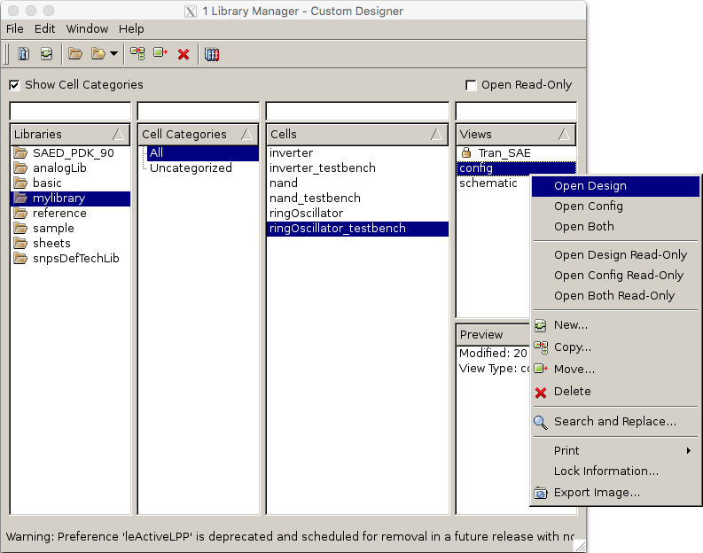

_**Fig. 37. Open Design with Parasitics**_

Afterwards a schematic window opens up with the ring oscillator testbench circuit created earlier, see Fig.38 for reference. To check if the parasitics were properly loaded into the ring oscillator, double click the ring oscillator symbol and the parasitics view generated from LPE earlier should display.


_**Fig. 38. Ring Oscillator Testbench Circuit**_

From the ring oscillator testbench window, you can simulate the circuit by using SAE as noted in part 3 of the tutorial. To open SAE, go to `Tools -> SAE` from the schematics window and setup the simulation for a transient analysis and plot the voltages for the VIO1, VIO2, VIO3, VIO4, and VIO5 voltages. For the transient analysis setup in SAE, use 1ps for step time and 1ns for stop time.

Side Notes for Using Convergence Aids to Initialize Voltages:
Also note that it may be helpful to give a wire in the circuit an initial voltage before running simulation. This particular setup applies to circuits such as a five stage ring oscillator circuit shown in Fig.39. In addition to the setup noted in part 3 for SAE, before running the simulation, go to `Setup -> Convergence Aids` in the SAE window.


_**Fig. 39. Where to Click on Schematic for Node Setup in Ring Oscillator**_

Setup the options as noted in Fig.40 below. You may need to setup multiple initial voltages to drive the inverters since one initial voltage may not be enough to drive the entire ring oscillator. It is suggested that you setup at least two initial voltages using alternating voltages of 0 and 1.2 for consecutive inverter nodes in the ring oscillator circuit. See Fig.41 for multi- node initialization and see Fig.39 on where to click in the schematic for node setups. Click `OK`, when done and run the simulation as noted in part 3 of the tutorial in Fig.42.


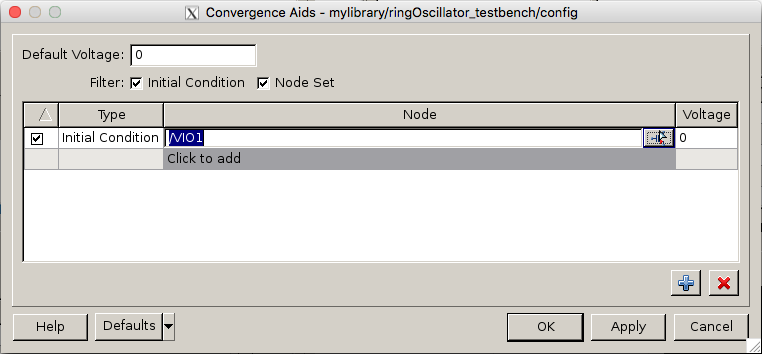

_**Fig. 40. Setting up Convergence Aids**_


_**Fig. 41. Setup for Multiple Initial Voltages**_


_**Fig. 42. Simulation result for ring oscillator**_


You have now finished transient simulation of the ring oscillator circuit with applied parasitics.

## Extra tutorial 

### Use multiple layers

- Using M2 Layer (or higher like M3, M4...) in Layout

For designs that require require an extra metal layers in layout, designers can use a metal layer higher up (like M2) to make connections if the lower metal layers (like M1) are too constricting to allow any other connections.

In the ring oscillator layout, M1 (blue layer) is replaced with M2 (pink layer). See Fig.43 for reference (Ring Oscillator with M2 layer). Also note that M1 layers can run under M2 layers without physically connecting unless there is a VIA1 layer in between them.


_**Fig. 43. Multiple layer (M2) example**_

In order to connect different layers to each other, all metal layers and contacts/VIAs must exist in between them. For example, to connect a metal 2 layer (M2) to diffusion (DIFF), a contact layer (CO), metal 1 layer (M1), and a VIA1 layer must exist between them. See figure.43 for reference. Also see figure.106 in circle A for a layout drawing example.
To use higher metal layers not shown, use their corresponding VIA layers to interconnect between the desired layers. For example, to connect M2 to M3, a VIA2 layer/contact must be drawn in between them.

Contact (CO) size is 0.13um x 0.13um and VIA1 size is 0.14um x 0.14um for 90nm design.

### Source-drain sharing

- Connect MOS in parallel

Fig.44 shows an example of two NMOS connecting in parallel (body is not connected in this example). Fig.45 shows the layout of Fig.44. Fig.46 shows another layout with source-drain sharing. 

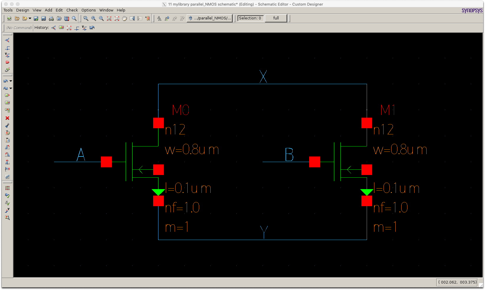

_**Fig. 44. Two parallel-connected NMOS transistors**_

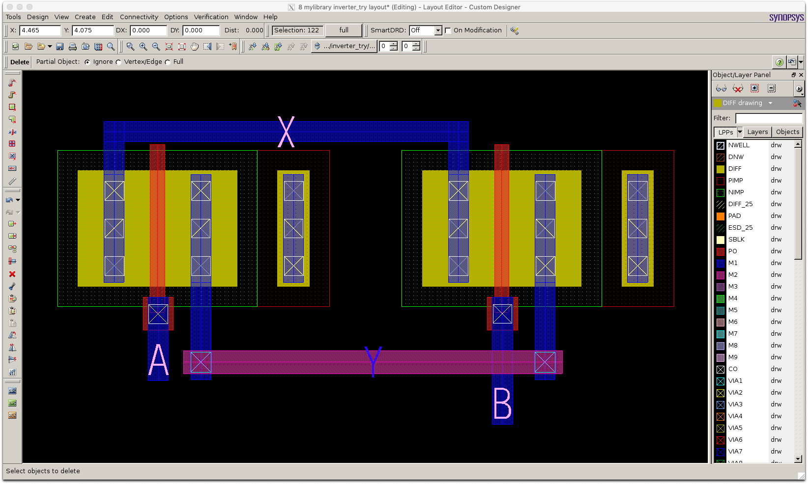

_**Fig. 45. Use two independent NMOS layout**_


_**Fig. 46. Layout with source-drain sharing**_

- Connect MOS in series

Fig.47 shows an example of two PMOS connecting in series (body is not connected in this example). Fig.48 shows the layout of Fig.47. Fig.49 shows another layout with source-drain sharing. 

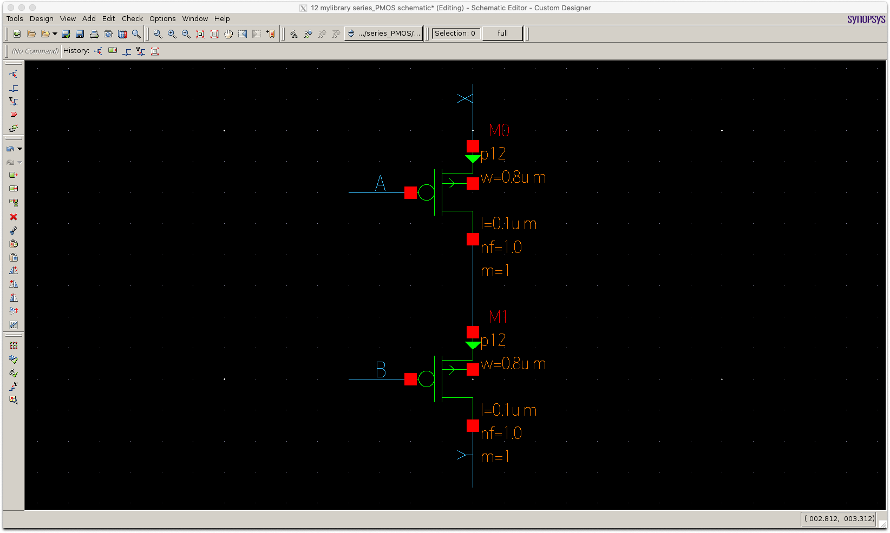

_**Fig. 47. Two series-connected PMOS transistors**_


_**Fig. 48. Use two independent PMOS layout**_


_**Fig. 49. Layout with source-drain sharing**_

### Place body along the top

Fig.50 shows an example of PMOS circuit (body is not connected in this example). Fig.51 shows the layout of Fig.50.

In digital circuit design, usually M1, M3, M5 are used for vertical routing, M2, M4, M6 are used for horizontal routing.

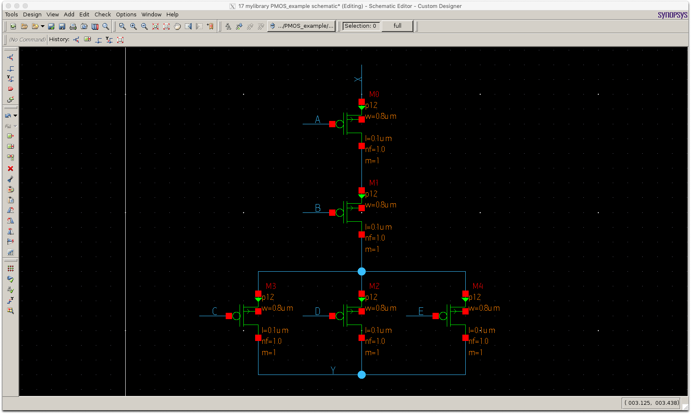

_**Fig. 50. Five PMOS circuit**_

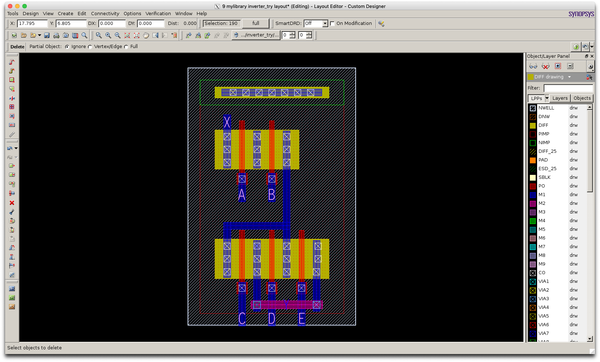

_**Fig. 51. Layout with source-drain sharing and body along the top**_

## Lab3

### Objective

Lab3 is to learn how to do parasitic extraction/post layout simulation and hierarchical design. You will use your inverter design for your parasitic extraction and post layout simulation. For your hierarchical design, you will eventually design ring oscillator. You need to check off until Ring Oscillator.

This lab is designed for four weeks, so for your lab report, you need to design `Ripple-carry 4-bit binary full adder` schematic, layout (DRC,LVS pass) and post layout simulation, which requires Hierarchical Design skill. The 1-bit adder requires 14-PMOS, 14-NMOS, total 28 transistors. Inputs are A, B, CIN and outputs are S and COUT.

### Deliverables for your lab report.

* Name, SID, Session(021,022,023), ENGR ID, UCR NetID

* Summary of what you learned thru this lab (One paragraph)

---- week1 checkoff from here

* Your inverter parasitic view in Fig.9.

* Your post simulation result in Fig.18.

* Your ring oscillator schematic (with hierarchical design)

* Your ring oscillator layout

* Your ring oscillator testbench

* Your ring oscillator __POST (Layout) SIMULATION__ result (with parasitic extraction)

---- until here for week1 check off

---- week 2 checkoff from here

* Your 1-bit full adder schematic - it must be transistor-level not logic-level

* Your 1-bit full adder simulation

* Your 1-bit full adder stick diagram

* Your 1-bit full adder layout

* An DRC Result with `CLEAN` for your 1-bit full adder

* An LVS Result with `PASS` for your 1-bit full adder

* Your 1-bit full adder __POST (Layout) SIMULATION__ result (with parasitic extraction) - you need to have your test bench and the test results should include 0+0, 0+1, 1+0, 1+1 (Hint: the frequency of input signal B can be twice that of A.)

---- until here for week2 check off

---- week 3 checkoff from here

* Your 4-bit full adder schematic (with hierarchical design)

* Your 4-bit full adder layout (with hierarchical design)

* An DRC Result with `CLEAN` for your 4-bit full adder

* An LVS Result with `PASS` for your 4-bit full adder

* Your 4-bit full adder __PRE (Schematic) SIMULATION__ result - you need to have your test bench and the input signals should cover from 0000 to 1111 (Hint: the frequency of A0, A1, A2, A3, B0, B1, B2, B3 should be doubled by bit.)

* Your 4-bit full adder __POST (Layout) SIMULATION__ result (with parasitic extraction) - you need to have your test bench and the input signals should cover from 0000 to 1111

---- week 3 checkoff

* Some of the issues if you have (One paragraph)

### Hint


A full adder adds binary number with carry in and out. A 1-bit full adder adds three one-bit number, such as A, B, and CIN. A and B are the operands and CIN is a bit carried in from the previous less significant stage.


_**Fig. 52. 1-bit Full Adder Schematic**_

In Fig.52, there are two-stage. The first one is to generate `COUT` and the second one is to generate `S` which is final sum. It requires 28 transistors including two inverters. You can use your own design but you need to transistor-level design.


_**Fig. 53. 1-bit adder simulation (Pre-simulation)**_


_**Fig. 54. 1-bit adder testbench schematic**_


_**Fig. 55. 4-bit ripple carry adder**_


_**Fig. 56. 1-bit full adder layout hint (Diffusion width must be the same as schematic Width = 0.5um for PMOS and Width = 0.25um for NMOS**_

### What to submit

* Lab report (PDF format)

file name should be following

`lab3-[My UCR NET ID].pdf`

for example, my UCR Net ID is `tkim049`, so filename should be

`lab3-tkim049.pdf`

* Tar and Zip your design folder you made

`cd ~/eecs168` or you made

`tar -cvzf lab3-[My UCR NET ID].tgz ./`

for example, my ucr Net ID is `tkim049`, so do like following

`tar -cvzf lab3-tkim049.tgz ./`

* You need to submit two files (\*.pdf, \*.tgz) in iLearn

### Lab Report Due

* 02/10/2021 (Wednesday) by 10:59am

### Checkoff

* First week: Check off your parasitic extraction and ring oscillator layout and post-simulator

* Second week: Check off your 1-bit full adder layout (DRC, LVS should be okay) and post-simulation

* Third week: Check off your 4-bit full adder layout (DRC, LVS should be okay) and post-simulation

* Fourth week: Extra work time in case you cannot finish within 3 weeks, you should have everything checked off by the end of this week's lab

### Next lab

In lab 4 (last one), you will full chip design.
