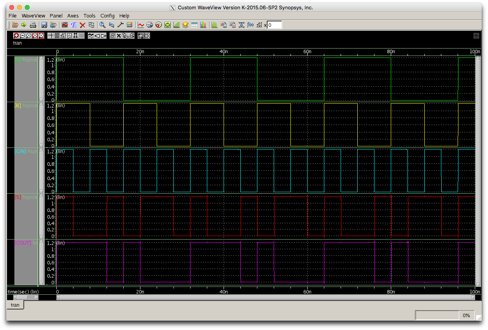

# Lab/Tutorial 3

In this tutorial, some contexts use Synopsys tutorials from Vazgen Melikyan (Synopsys) and Hamid Nahmoodi (SFSU). All the tools and PDK are given thru Synopsys University Program.

## Introduction

The next 2 weeks will revolve around designing 1-bit full adder and hierarchical 4-bit full adder. So for your lab report, you need to submit results for all three weeks, which includes ring oscillator, 1-bit and 4-bit binary full adder schematic, layout (DRC,LVS pass) and post layout simulation.

### Lab Report Due

* __Nov. 14 2025__ (Friday)

### Checkoff

* __First week__: Check off your 1-bit full adder layout (DRC, LVS should be completed without error) and post-simulation

* __Second week__: Check off your 4-bit full adder layout (DRC, LVS should be completed without error) and post-simulation

<!-- * Third week: Extra work time in case you cannot finish within 3 weeks, you should have everything checked off by the end of this week's lab -->


## Lab3

### Objective

Lab3 is to learn how to do parasitic extraction/post layout simulation and hierarchical design. You will use your inverter design for your parasitic extraction and post layout simulation. For your hierarchical design, you will eventually design ring oscillator. You need to check off until Ring Oscillator.

This lab is designed for three weeks, so for your lab report, you need to design `1-bit full adder` and `Ripple-carry 4-bit binary full adder` schematic, layout (DRC,LVS pass) and post layout simulation, which requires Hierarchical Design skill. 

### Deliverables for your lab report.

* Name, SID, Session(021,022,023), ENGR ID, UCR NetID

* Summary of what you learned thru this lab (One paragraph)


---- week 1 check-off from here

* Your 1-bit full adder schematic - it must be transistor-level not logic-level

* Your 1-bit full adder simulation

* Your 1-bit full adder layout

* An DRC Result with `CLEAN` for your 1-bit full adder

* An LVS Result with `PASS` for your 1-bit full adder

* Your 1-bit full adder __POST (Layout) SIMULATION__ result (with parasitic extraction) - you need to have your test bench and the test results should include 0+0+0 to 1+1+1 (Hint: the frequency of input signal A can be twice that of B and 4 times of C. This can be achieved by setting).

---- until here for week1 check-off

---- week-2 check-off from here

* Your 4-bit full adder schematic (with hierarchical design)

* Your 4-bit full adder layout (with hierarchical design)

* An DRC Result with `CLEAN` for your 4-bit full adder

* An LVS Result with `PASS` for your 4-bit full adder

* Your 4-bit full adder __PRE (Schematic) SIMULATION__ result - you need to have your test bench and the input signals should cover from 0000 to 1111 (Hint: the frequency of A0, A1, A2, A3, B0, B1, B2, B3 should be doubled by bit.)

* Your 4-bit full adder __POST (Layout) SIMULATION__ result (with parasitic extraction) - you need to have your test bench and the input signals should cover from 0000 to 1111

* Some of the issues if you have (One paragraph)

### Hint

A full adder adds binary number with carry in and out. A 1-bit full adder adds three one-bit number, such as A, B, and CIN and outputs S and COUT. A and B are the operands and CIN is a bit carried in from the previous less significant stage. __The 1-bit adder requires 14-PMOS, 14-NMOS, total 28 transistors.__

Step.1: Write the expression of Output signal:
```Input Signal: A, B, Cin```

$$
S = (A\cdot B\cdot Cin)+(\overline{\text{COUT\mkern4mu}}\cdot (A +B +Cin))\\
COUT = (A \cdot B) + (Cin \cdot(A + B))
$$

Step.2: Build Pull-up (PMOS) or Pull-down (NMOS) network first, then apply De Morgan’s theorem to build the other.


_**Fig. 1. 1-bit Full Adder Schematic**_

In Fig.1, there are two-stage. The first one is to generate `COUT` and the second one is to generate `S` which is final sum. It requires 28 transistors including two inverters. You can use your own design but you need to have transistor-level design.



_**Fig. 2. 1-bit adder simulation (Pre-simulation)**_


_**Fig. 3. 1-bit adder testbench schematic**_


_**Fig. 4. 4-bit ripple carry adder**_


_**Fig. 5. 1-bit full adder layout hint (Diffusion width must be the same as schematic Width = 0.5um for PMOS and Width = 0.25um for NMOS**_

### What to submit

* Lab report (PDF format)

file name should be following

`lab3-[My UCR NET ID].pdf`

for example, my UCR Net ID is `tkim049`, so filename should be

`lab3-tkim049.pdf`

* Tar and Zip your design folder you made

`cd ~/eecs168` or you made

`tar -cvzf lab3-[My UCR NET ID].tgz ./`

for example, my ucr Net ID is `tkim049`, so do like following

`tar -cvzf lab3-tkim049.tgz ./`

* You need to submit two files (\*.pdf, \*.tgz) in iLearn

### Lab Report Due

* __11/14/2025__ (Friday)

### Checkoff

* First week: Check off your parasitic extraction and ring oscillator layout and post-simulator

* Second week: Check off your 1-bit full adder layout (DRC, LVS should be okay) and post-simulation

* Third week: Check off your 4-bit full adder layout (DRC, LVS should be okay) and post-simulation

* Fourth week: Extra work time in case you cannot finish within 3 weeks, you should have everything checked off by the end of this week's lab


### Useful tips
- When performing shcematic design, if the wire routing looks confusing or messy, try labeling the matching wires with the same name. The tool will automatically combine them even if they are not physically connected. 

### Next lab

In lab 4 (last one), you will experience a full chip design flow.

