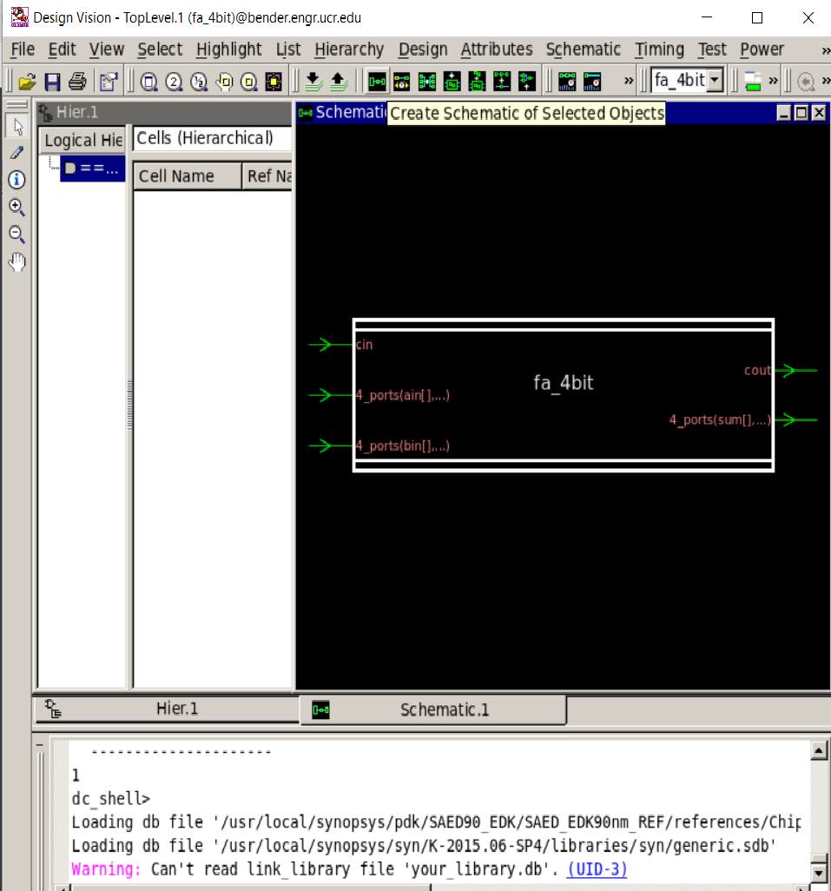

# Lab/Tutorial 4

In this tutorial, some contexts use Synopsys tutorials from Hamid Nahmoodi (SFSU) and John Sanguinetti (verilog dot com). All the tools and EDK are given thru Synopsys University Program. Some lab examples are referred from [MIT 6.375](http://csg.csail.mit.edu/6.375/6_375_2016_www/index.html) and [UCSD CSE141L](https://cseweb.ucsd.edu/classes/wi08/cse141L/Slides/verilog_deux.pdf).

## Introduction

In this tutorial, you will learn how to do RTL (register transfer level) design to build your circuit with HDL (hardware description language) for EDA (electronic design automation)

You will synthesize two sets of HDL, which are 4-bit binary full adder (week1) and greatest common devisor (gcd) (week2-3).


In this lab4, we introduce Synopsys RTL design toolkit, which are VCS, Design Compiler, IC Compiler, VCS RTL Verification solution.

In this lab, you need to review at least 2 hours for the following website to review your Verilog programming skill, debugging method, and design examples. After 2 hours review, you need to follow RTL design step to make the final layout with design automation process.

## Lab4 Schedule

Lab4 is 2-week lab and here are the details for given lab

- Lab4-week1: Verilog Review, 4-bit full adder Chip.

- Lab4-week2: Synthesis of the given GCD design.


## Lab4-Week1: Part 1. HDL (Hardware Description Language)- Verilog Language

We will use Verilog, which is standardized as IEEE 1364, a hardware description language (HDL) used to model electronic systems. It is most commonly used in the design and verification of digital circuits at the register-transfer level (RTL) of abstraction. ([refer Wikipedia](https://en.wikipedia.org/wiki/Verilog))

Here is Verilog tutorials consist of 5 Chapters as follows:

| Chapter  | Title | Detail |
| -------- | ------ | ------- |
| 1 | Introduction, Hierarchy, and Modeling Structures. | This section provides background about the history of Verilog. It also introduces some of the basic structures of Verilog models. |
| 2 | Syntax, Lexical Conventions, Data Types, and Memories | This section addresses the syntax and semantics of the core features of the language. |
| 3 | Expressions and Simulation Mechanics | This section covers the components of Verilog expressions and the order of execution in Verilog models. |
| 4 | Gate Level Modeling | This section covers gate level modeling constructs. It covers the semantics of Verilog primitives, port expressions, delays, strengths, and user-defined primitives. |
| 5 | Behavioral and Register Transfer Level Modeling | This section covers the remainder of the language basics: assignments of all kinds, control constructs, time and event controls, tasks and functions, and examples. |

You need to review from chapter 1 thru Chapter 5, Chapter 6-9 can be references for your Verilog programming.


Go to the following Verilog tutorial

__[Click here for Verilog Tutorial](http://www.asic-world.com/verilog/index.html)__

You should finish this tutorial first for 2 hours at least.


There is better explanation for Verolog Operators [Click Here](https://embeddedmicro.com/tutorials/mojo/verilog-operators) - Thanks, Brandon

__This lab requires individual lab!__


## Lab4-Week1: Part 2. Synopsys Verilog Compiler Simulator (Verilog Compiler) Tutorial

For the Verilog editor, `vi` or `emacs` is recommended, but if you're beginner of Linux system, you can use `nano`, it's your choice.

Synopsys Verilog Compiler Simulator is a tool from Synopsys specifically designed to simulate and debug designs. This tutorial basically describes how to use VCS, simulate a verilog description of a design and learn to debug the design. VCS also uses VirSim, which is a graphical user interface to VCS used for debugging and viewing the waveforms.

There are three main steps in debugging the design, which are as follows
1. Compiling the Verilog/VHDL source code.
1. Running the Simulation.
1. Viewing and debugging the generated waveforms.

You can interactively do the above steps using the VCS tool. VCS first compiles the
verilog source code into object files, which are nothing but C source files. VCS can
compile the source code into the object files without generating assembly language files.
VCS then invokes a C compiler to create an executable file. We use this executable file to
simulate the design. You can use the command line to execute the binary file which
creates the waveform file

In this tutorial, we would be using a simple counter example . Find the verilog code and
testbench at the end of the tutorial.

- RTL Source code:

[counter.v](https://raw.githubusercontent.com/sheldonucr/ucr-eecs168-lab/master/lab4/counter.v)

- Testbench of RTL:

[counter_tb.v](https://raw.githubusercontent.com/sheldonucr/ucr-eecs168-lab/master/lab4/counter_tb.v)

From server, you can create your RTL folder and download

Under your eecs168 folder,

```
mkdir lab4-rtl
cd lab4-rtl
mkdir counter
cd counter
```

and download two files

```
wget https://raw.githubusercontent.com/sheldonucr/ucr-eecs168-lab/master/lab4/counter.v
wget https://raw.githubusercontent.com/sheldonucr/ucr-eecs168-lab/master/lab4/counter_tb.v
```

1. In the “lab4-rtl” directory, compile the verilog source code by typing the following at the
machine prompt.
```
vcs counter_tb.v counter.v +v2k
```

You can see the following successful compilation message

```
Warning-[LNX_OS_VERUN] Unsupported Linux version
  Linux version 'CentOS release 6.7 (Final)' is not supported on 'x86_64'
  officially, assuming linux compatibility by default. Set VCS_ARCH_OVERRIDE
  to linux or suse32 to override.
  Please refer to release notes for information on supported platforms.

                         Chronologic VCS (TM)
         Version K-2015.09-SP1-1 -- Mon Feb 22 13:43:12 2016
               Copyright (c) 1991-2015 by Synopsys Inc.
                         ALL RIGHTS RESERVED

This program is proprietary and confidential information of Synopsys Inc.
and may be used and disclosed only as authorized in a license agreement
controlling such use and disclosure.

Parsing design file 'counter_tb.v'
Parsing design file 'counter.v'
Top Level Modules:
       timeunit
       counter_testbench
TimeScale is 1 ns / 10 ps
Starting vcs inline pass...
2 modules and 0 UDP read.
recompiling module timeunit
recompiling module counter_testbench
Both modules done.
make: Warning: File `filelist.cu' has modification time 0.17 s in the future
make[1]: Warning: File `filelist.cu' has modification time 0.16 s in the future
rm -f _csrc*.so linux_scvhdl_*.so pre_vcsobj_*.so share_vcsobj_*.so
make[1]: warning:  Clock skew detected.  Your build may be incomplete.
make[1]: Warning: File `filelist.cu' has modification time 0.15 s in the future
make[1]: warning:  Clock skew detected.  Your build may be incomplete.
if [ -x ../simv ]; then chmod -x ../simv; fi
g++  -o ../simv   -Wl,-rpath-link=./ -Wl,-rpath='$ORIGIN'/simv.daidir/ -Wl,-rpath=./simv.daidir/ -Wl,-rpath='$ORIGIN'/simv.daidir//scsim.db.dir  -m32 -m32 -rdynamic   amcQwB.o objs/amcQw_d.o   _22827_archive_1.so  SIM_l.o       rmapats_mop.o rmapats.o rmar.o  rmar_llvm_0_1.o rmar_llvm_0_0.o          /usr/local/synopsys/K-2015.09-SP1-1/linux/lib/libzerosoft_rt_stubs.so /usr/local/synopsys/K-2015.09-SP1-1/linux/lib/libvirsim.so /usr/local/synopsys/K-2015.09-SP1-1/linux/lib/liberrorinf.so /usr/local/synopsys/K-2015.09-SP1-1/linux/lib/libsnpsmalloc.so    /usr/local/synopsys/K-2015.09-SP1-1/linux/lib/libvcsnew.so /usr/local/synopsys/K-2015.09-SP1-1/linux/lib/libsimprofile.so /usr/local/synopsys/K-2015.09-SP1-1/linux/lib/libuclinative.so   -Wl,-whole-archive /usr/local/synopsys/K-2015.09-SP1-1/linux/lib/libvcsucli.so -Wl,-no-whole-archive          /usr/local/synopsys/K-2015.09-SP1-1/linux/lib/vcs_save_restore_new.o /usr/local/synopsys/K-2015.09-SP1-1/linux/lib/ctype-stubs_32.a -ldl  -lc -lm -lpthread -ldl
../simv up to date
make: warning:  Clock skew detected.  Your build may be incomplete.
CPU time: .132 seconds to compile + .249 seconds to elab + .230 seconds to link
```


Here, the `+v2k` option is used if you are using Verilog IEE 1364-2000 syntax; otherwise there
is no need for the option.

By default the output of compilation would be a executable binary file is named `simv`.
You can specify a different name with the -o compile-time option. VCS compiles the
source code on a module by module basis. You can incrementally compile your design
with VCS, since VCS compiles only the modules which have changed since the last
compilation.

Now, execute the simv command line with no arguments. You should see the output
from both vcs and simulation and should produce a waveform file called counter.dump in
your working directory.

```
./simv
```

Simulation result will be shown as below

```
Chronologic VCS simulator copyright 1991-2015
Contains Synopsys proprietary information.
Compiler version K-2015.09-SP1-1; Runtime version K-2015.09-SP1-1;  Feb 22 13:45 2016
time=    0 ns, clk=0, reset=0, out=xxxx
time=   10 ns, clk=1, reset=0, out=xxxx
time=   11 ns, clk=1, reset=1, out=xxxx
time=   20 ns, clk=0, reset=1, out=xxxx
time=   30 ns, clk=1, reset=1, out=xxxx
time=   31 ns, clk=1, reset=0, out=0000
time=   40 ns, clk=0, reset=0, out=0000
time=   50 ns, clk=1, reset=0, out=0000
time=   51 ns, clk=1, reset=0, out=0001
time=   60 ns, clk=0, reset=0, out=0001
time=   70 ns, clk=1, reset=0, out=0001
time=   71 ns, clk=1, reset=0, out=0010
time=   80 ns, clk=0, reset=0, out=0010
time=   90 ns, clk=1, reset=0, out=0010
time=   91 ns, clk=1, reset=0, out=0011
time=  100 ns, clk=0, reset=0, out=0011
time=  110 ns, clk=1, reset=0, out=0011
time=  111 ns, clk=1, reset=0, out=0100
time=  120 ns, clk=0, reset=0, out=0100
time=  130 ns, clk=1, reset=0, out=0100
time=  131 ns, clk=1, reset=0, out=0101
time=  140 ns, clk=0, reset=0, out=0101
time=  150 ns, clk=1, reset=0, out=0101
time=  151 ns, clk=1, reset=0, out=0110
time=  160 ns, clk=0, reset=0, out=0110
time=  170 ns, clk=1, reset=0, out=0110
All tests completed sucessfully


$finish called from file "counter_tb.v", line 55.
$finish at simulation time  171.0 ns
           V C S   S i m u l a t i o n   R e p o r t
Time: 171000 ps
CPU Time:      0.350 seconds;       Data structure size:   0.0Mb
Mon Feb 22 13:45:00 2016
```


## Lab4-Week1: Part 3. Design Compiler for Synthesis

In this tutorial you will gain experience using Synopsys Design Compiler (DC) to perform hardware synthesis. A synthesis tool takes an RTL hardware description and a standard cell library as input and produces a gatelevel netlist as output. The resulting gate-level netlist is a completely structural description with standard cells only at the leaves of the design.

Internally, a synthesis tool performs many steps including high-level RTL optimizations, RTL to unoptimized boolean logic, technology independent optimizations, and finally technology mapping to the available standard cells. Good RTL designers will familiarize themselves with the target standard cell library so that they can develop an intuition on how their RTL will be synthesized into gates.

In this tutorial you will use Synopsys Design Compiler to elaborate the RTL for our example 4-bit full adder circuit, set optimization constraints, synthesize the design to gates, and prepare various area and timing reports. You will also learn how to read the various DC text reports and how to use the graphical Synopsys Design Vision tool to visualize the synthesized design.

First, go to `lab4-rtl` folder and make workspace folder for `4-bit full adder`

open 'vi', 'emacs', or 'nano' to edit this file

```
nano fa_4bit.v
```

`fa_4bit.v` file should contain the following code

```
module fa_4bit( cin, cout, ain, bin, sum );

	input cin;
	input [3:0] ain, bin;
	output [3:0] sum;
	output cout;

	assign {cout,sum} = ain + bin + cin;

endmodule // fa_4bit
```

One Verilog file is ready. We need to do SYNTHESIS, which is a transformation process from RTL to gate-level design (another synthesized Verilog). Type the following command to launch Design Compiler.

```
dc_shell
```

- launch dc_shell for design compiler.


_**Fig. 1. Launch Design Compiler**_

- launch gui_start for design vision, which is GUI interface for design compiler


_**Fig. 2. Launch Design Vision for GUI Version of Design Compiler**_

First we need to choose Synopsys 90nm model for design process.

- File-> Setup and choose model for your library


_**Fig. 3. Choose Setup for library setup.**_

**Replace** the default your_library with the following files
- Link library
```
/usr/local/synopsys/pdk/SAED90_EDK/SAED_EDK90nm_REF/references/ChipTop/ref/saed90nm_fr/LM/saed90nm_typ.db
```
- Target Library
```
/usr/local/synopsys/pdk/SAED90_EDK/SAED_EDK90nm_REF/references/ChipTop/ref/saed90nm_fr/LM/saed90nm_typ.db
```
- Symbol Library
```
/usr/local/synopsys/pdk/SAED90_EDK/SAED_EDK90nm_REF/references/ChipTop/ref/icons/saed90nm.sdb
```


_**Fig. 4. Application setup window**_

Now, we need to set logic VDD and VSS net wire name.

in the dc_shell command shell at the bottom, the following inputs should be typed.

```
set mw_logic1_net "VDD"
```


_**Fig. 5. VDD Setup**_

```
set mw_logic0_net "VSS"
```


_**Fig. 6. VSS Setup**_


Use your 4-bit full adder you already typed.

You already made new Verilog file, (fa_4bit.v)


Syntax error checking for your Verilog file.

```
analyze -format verilog "fa_4bit.v"
```

Elaborate your design module, during elaboration DC will report all state inferences. This is a good way to verify that latches and flip-flops are not being accidentally inferred.

```
elaborate fa_4bit -architecture verilog -library DEFAULT
```

Link your design module

```
link
```

The check_design command checks that the design is consistent. You will not be able to synthesize your design until you eliminate all ERRORS. Many WARNINGS are not an issue, but it is still useful to skim through this output.

```
check_design
```

Compile your design module, The `compile` command begins the actual synthesis process that transforms your design into a gate-level netlist.

```
compile
```

After your compilation done, you need to create schematic of the synthesized RTL code.

Once you click the symbol (fa_4bit), you can see how it was compiled/synthesized as shown in fig50. 


_**Fig. 50. Synthesized schematic**_

We finished the synthesis and we need to generate output file for IC Compiler for layout.

```
write -format ddc -output "fa_4bit_synthesized.ddc"
```

We also need to create gate-level verilog synthesized file.

```
write -format verilog -output "fa_4bit_synthesized.v"
```

You can check this file to see what Design Compiler has done for us.

Furthermore, we need to write a design constraint file.

```
write_sdc -nosplit "fa_4bit_const.sdc"
```

Now, it's time to use IC Compiler, so you need to exit Design Compiler

```
exit
```

Now, it's ready for placement and router for your IC.

## Lab4-Week1: Part 4. IC Compiler (ICC) for Placement and Routing Layout

In this tutorial you will gain experience transforming a gate-level netlist into a placed and routed layout using Synopsys IC Compiler (ICC). ICC takes a synthesized gate-level netlist and a standard cell library as input, then produces layout as an output.

To launch IC Compiler, you need to run the following command in the linux shell.

The first goal of a Place and Route (P&R) tool is to determine where each gate should be located on the physical chip (the placement portion of place and route). This process leverages heuristic algorithms to group related gates together in hopes of minimizing routing congestion and wire delay. Typically P&R tools will focus their effort on minimizing the delay through the critical path, and to this end will resize gates, insert new buffers, and even perform local re-synthesis. Additionally, P&R tools often have secondary algorithms to help reduce area for non-critical paths. After the placement, ICC will attempt to route the design while minimizing wire delay. Along with the routing, P&R tools often handle clock tree synthesis, power routing, and block level floorplanning.

For this tutorial we will generate layout for the gate-level netlist of the 4-bit full adder circuit synthesized in the previous section. Once the netlist has successfully been placed and routed, you should be able to see all the instantiated standard cells and routed metals of the physical implementation. We will then use the IC Compiler GUI to visualize the layout of your final placed and routed design.

```
icc_shell -shared_license
```

To use GUI interface, you need to run the following command in the icc shell.

```
gui_start
```


_**Fig. 18. ICC launch**_


_**Fig. 19. ICC GUI launch**_


_**Fig. 20. Application Setup**_

click Link library and choose

- Link library
```
/usr/local/synopsys/pdk/SAED90_EDK/SAED_EDK90nm_REF/references/ChipTop/ref/saed90nm_fr/LM/saed90nm_typ.db
```
- Target Library
```
/usr/local/synopsys/pdk/SAED90_EDK/SAED_EDK90nm_REF/references/ChipTop/ref/saed90nm_fr/LM/saed90nm_typ.db
```

- Symbol Library
```
/usr/local/synopsys/pdk/SAED90_EDK/SAED_EDK90nm_REF/references/ChipTop/ref/icons/saed90nm.sdb
```


_**Fig. 21. Setup the library in the application setup**_


_**Fig. 22. Create Library**_


Now, we need to create our own library

For the new library path, just click the folder button and choose the
current folder.

File-> Create library and type your new library name `fa_4bit_icc`

and then, you need to choose Technology file as follows:


```
/usr/local/synopsys/pdk/SAED90_EDK/SAED_EDK90nm_REF/references/ChipTop/ref/tech/saed90nm.tf
```

for input reference libraries, you need to add the following file.

```
/usr/local/synopsys/pdk/SAED90_EDK/SAED_EDK90nm_REF/references/ChipTop/ref/saed90nm_fr
```


make sure open library is checked


If somehow you cannot create this new library through GUI, you can try doing it through command.

```
create_mw_lib  -technology /usr/local/synopsys/pdk/SAED90_EDK/SAED_EDK90nm_REF/references/ChipTop/ref/tech/saed90nm.tf -mw_reference_library {/usr/local/synopsys/pdk/SAED90_EDK/SAED_EDK90nm_REF/references/ChipTop/ref/saed90nm_fr} -bus_naming_style {[%d]}  -open  ./Fa_4bit_icc
```

_**Fig. 23. Create Library**_


_**Fig. 24. TLU+**_

The parasitic RC (Resistance Capacitance) for interconnect is estimated through the use of TLU+ models, generated using STAR-RCXT an extraction tool from synopsys. TLU+ contains resistance and capacitance look up tables and model ultra deep submicron process effects. Now, we setup TLU+ for the parasitic RC model.

Next, you need to set TLU+

File-> Set TLU+

Max TLU+ file:
```
/usr/local/synopsys/pdk/SAED90_EDK/SAED_EDK90nm_REF/references/ChipTop/ref/tlup/saed90nm_1p9m_1t_Cmax.tluplus
```

Min TLU+ file:
```
/usr/local/synopsys/pdk/SAED90_EDK/SAED_EDK90nm_REF/references/ChipTop/ref/tlup/saed90nm_1p9m_1t_Cmin.tluplus
```

Layer name mapping file

```
/usr/local/synopsys/pdk/SAED90_EDK/SAED_EDK90nm_REF/references/ChipTop/ref/tlup/tech2itf.map
```


_**Fig. 25. TLU+ setup**_


Now, we can start layout, so we need to import design

File-> Import -> Read Verilog, choose verilog and click [Add] button to add
synthesized verilog design what we made `fa_4bit_synthesized.v` and
click okay, then layout window will open below.


_**Fig. 26. Import Verilog**_


_**Fig. 27. Read Verilog**_


_**Fig. 28. Read synthesized gate-level Verilog**_

Now we can see the standard cells as layout


File->Import->Read SDC, choose SDC and import `fa_4bit_const.sdc` you
exported from Design Compiler.


_**Fig. 29. Standard Cell View**_


_**Fig. 30. Synopsys Design Constraints (SDC)**_

You need to save at least now for your design.

Go to File->Save


_**Fig. 32. Save your design**_


_**Fig. 33. Save your design**_


Now, we need to create power-ground network.

Go to Preroute -> Derive Power Ground Connection.


_**Fig. 34. Derive Power Ground Connection**_


Click Manual connection and put "VDD" in the power net and "VSS" in
the Ground net. Also put "VDD" in the Power pin and "VSS" in the
Ground pin. Create port should be "Top"


_**Fig. 35. Derive Power Ground Connection**_

Now, we need to create the floorplan. Floorplan -> Create Floorplan

For the spacing between core are and terminals, we can set 20um for left, right, bottom, and top.


_**Fig. 36. Floor plan**_

We can also write a floorplan.

```
create_floorplan -use_vertical_row -start_first_row -left_io2core 20 -bottom_io2core 20 -right_io2core 20 -top_io2core 20
```


_**Fig. 37. Floor plan**_


_**Fig. 38. Floor plan is ready**_


Let's do placement now

```
create_fp_placement
```


_**Fig. 39. Floor plan is ready**_


_**Fig. 40. Standard cell placed**_

Now, we make floorplan rail for VDD and VSS.

```
synthesize_fp_rail \
  -power_budget "1000" -voltage_supply "1.2" -target_voltage_drop "250" \
  -output_dir "./pna_output" -nets "VDD VSS" -create_virtual_rails "M1" \
  -synthesize_power_plan -synthesize_power_pads -use_strap_ends_as_pads
```


_**Fig. 42. Rail Placed**_

Once your rail is okay, you need to commit for the real rail in your design.

```
commit_fp_rail
```


_**Fig. 44. Rail Placed**_

After finishing placement, we need to have metal wire routing. So we need to have two following steps for the routing.

```
route_opt -initial_route_only
```

```
route_opt -skip_initial_route -effort low
```


_**Fig. 47. Routing Done**_

Finally, we need standard cell fillers, which are used to fill any spaces between regular library cells to avoid planarity problems. They are need when the density of the required metal or layer has not meet the foundry or fabrication requirement. Thus, you need to add it whether it is low or high frequency.

By the following command, we can put standard cell fillers.

```
insert_stdcell_filler \
 -cell_with_metal "SHFILL1 SHFILL2 SHFILL3" \
 -connect_to_power "VDD" -connect_to_ground "VSS"
```


_**Fig. 49. Final Layout after putting standard cell filler**_


## Lab4-Week2 : Synthesis of a GCD design.

First you need to download the relevant verilog files. It is recommended that you create a new directory dedicated to GCD.

```
wget https://raw.githubusercontent.com/sheldonucr/ucr-eecs168-lab/master/lab4/gcd_ctrl.v
wget https://raw.githubusercontent.com/sheldonucr/ucr-eecs168-lab/master/lab4/gcd_dpath.v
wget https://raw.githubusercontent.com/sheldonucr/ucr-eecs168-lab/master/lab4/gcd_toplevel.v
```

Then you can follow the instructions with Design Compiler again, except some changes covered below.

### Design Compiler and IC Compiler for GCD

GCD requires clock and you also need to synthesize clock tree. For your GCD, every step is __the same as above 4-bit full adder steps__ from RTL to Layout except the following extra steps.

###### Design Compiler Changes for GCD (you need to follow above 4-bit fulladder example for this step except the following extra steps)

- For analyze, you need to use the command for multiple verilog file
```
analyze -format verilog "gcd_ctrl.v gcd_dpath.v gcd_toplevel.v"
```

- For elaborate, you can use top-level design block name
```
elaborate "gcdGCDUnit_rtl"
```


- After `check_design` in Design Compiler, you need to build clock period constraint as extra step before compile
```
create_clock clk -name ideal_clock1 -period 1
```

- Instead of `compile` in Design Compiler, we use a more advanced version (`compiler_ultra`).	
```	
compile_ultra	
```

Let's get some timing, area, power reports from `Design Compiler`. After `compile_ultra` step, you need to have more steps to generate report

Let's see timing report.

```
report_timing -transition_time -nets -attributes -nosplit
```

Then you can see timing report.

```
Information: Updating design information... (UID-85)

****************************************
Report : timing
        -path full
        -delay max
        -nets
        -max_paths 1
        -transition_time
Design : gcdGCDUnit_rtl
Version: K-2015.06-SP4
Date   : Mon Mar  5 14:06:38 2018
****************************************

Operating Conditions: TYPICAL   Library: saed90nm_typ
Wire Load Model Mode: top

  Startpoint: GCDdpath0/A_reg_reg[4]
              (rising edge-triggered flip-flop clocked by ideal_clock1)
  Endpoint: GCDdpath0/A_reg_reg[9]
            (rising edge-triggered flip-flop clocked by ideal_clock1)
  Path Group: ideal_clock1
  Path Type: max

Attributes:
    d - dont_touch
    u - dont_use
   mo - map_only
   so - size_only
    i - ideal_net or ideal_network
  inf - infeasible path

  Point                                       Fanout     Trans      Incr       Path      Attributes
  ---------------------------------------------------------------------------------------------------------
  clock ideal_clock1 (rise edge)                                    0.00       0.00
  clock network delay (ideal)                                       0.00       0.00
  GCDdpath0/A_reg_reg[4]/CLK (DFFARX1)                    0.00      0.00       0.00 r
  GCDdpath0/A_reg_reg[4]/Q (DFFARX1)                      0.04      0.24       0.24 f
  result_bits_data[4] (net)                     5                   0.00       0.24 f
  U153/QN (NAND2X1)                                       0.04      0.03       0.28 r
  n294 (net)                                    2                   0.00       0.28 r
  U251/QN (INVX0)                                         0.03      0.03       0.31 f
  n183 (net)                                    2                   0.00       0.31 f
  U133/QN (NAND2X0)                                       0.06      0.04       0.35 r
  n149 (net)                                    1                   0.00       0.35 r
  U252/QN (NAND2X1)                                       0.05      0.04       0.39 f
  n314 (net)                                    3                   0.00       0.39 f
  U253/QN (NAND2X2)                                       0.03      0.02       0.41 r
  n153 (net)                                    1                   0.00       0.41 r
  U258/QN (NAND2X1)                                       0.03      0.03       0.44 f
  n154 (net)                                    1                   0.00       0.44 f
  U259/Q (AO21X1)                                         0.04      0.08       0.52 f
  n227 (net)                                    4                   0.00       0.52 f
  U177/Q (LSDNX1)                                         0.04      0.08       0.60 f
  n308 (net)                                    2                   0.00       0.60 f
  U320/Q (AO21X1)                                         0.03      0.09       0.69 f
  n233 (net)                                    1                   0.00       0.69 f
  U322/Q (XOR2X1)                                         0.04      0.12       0.81 r
  n234 (net)                                    1                   0.00       0.81 r
  U140/QN (NAND2X0)                                       0.05      0.04       0.84 f
  n238 (net)                                    1                   0.00       0.84 f
  U324/QN (NAND4X0)                                       0.07      0.04       0.88 r
  n91 (net)                                     1                   0.00       0.88 r
  GCDdpath0/A_reg_reg[9]/D (DFFARX1)                      0.07      0.00       0.88 r
  data arrival time                                                            0.88

  clock ideal_clock1 (rise edge)                                    1.00       1.00
  clock network delay (ideal)                                       0.00       1.00
  GCDdpath0/A_reg_reg[9]/CLK (DFFARX1)                              0.00       1.00 r
  library setup time                                               -0.12       0.88
  data required time                                                           0.88
  ---------------------------------------------------------------------------------------------------------
  data required time                                                           0.88
  data arrival time                                                           -0.88
  ---------------------------------------------------------------------------------------------------------
  slack (MET)                                                                  0.00

```

You can go to terminal/output window and copy above report and paste into your lab report for timing analysis.

Next, we can see area report

```
report_area -nosplit -hierarchy
```

then, you can see the report
```
****************************************
Report : area
Design : gcdGCDUnit_rtl
Version: K-2015.06-SP4
Date   : Mon Mar  5 14:07:59 2018
****************************************

Library(s) Used:

    saed90nm_typ (File: /usr/local/synopsys/pdk/SAED90_EDK/SAED_EDK90nm_REF/references/ChipTop/ref/saed90nm_fr/LM/saed90nm_typ.db)

Number of ports:                           54
Number of nets:                           384
Number of cells:                          317
Number of combinational cells:            283
Number of sequential cells:                34
Number of macros/black boxes:               0
Number of buf/inv:                         34
Number of references:                      30

Combinational area:               1995.864012
Buf/Inv area:                      199.999007
Noncombinational area:            1081.958015
Macro/Black Box area:                0.000000
Net Interconnect area:      undefined  (No wire load specified)

Total cell area:                  3077.822028
Total area:                 undefined

Hierarchical area distribution
------------------------------

                                  Global cell area          Local cell area
                                  ------------------  ----------------------------
Hierarchical cell                 Absolute   Percent  Combi-     Noncombi-  Black-
                                  Total      Total    national   national   boxes   Design
--------------------------------  ---------  -------  ---------  ---------  ------  ---------
gcdGCDUnit_rtl                    3077.8220    100.0  1995.8640  1081.9580  0.0000  gcdGCDUnit_rtl
--------------------------------  ---------  -------  ---------  ---------  ------  ---------
Total                                                 1995.8640  1081.9580  0.0000


```

You can go to terminal/output window and copy above report and paste into your lab report for area analysis.

Third, you can see power analysis,

```
report_power -nosplit -hierarchy
```

Then, you can see power report for each block for Switching/Dynamic/Leaking Powers

```
****************************************
Report : power
        -hier
        -analysis_effort low
Design : gcdGCDUnit_rtl
Version: K-2015.06-SP4
Date   : Sat Mar  5 08:26:58 2016
****************************************


Library(s) Used:

    saed90nm_typ (File: /usr/local/synopsys/pdk/SAED90_EDK/SAED_EDK90nm_REF/references/ChipTop/ref/saed90nm_fr/LM/saed90nm_typ.db)


Operating Conditions: TYPICAL   Library: saed90nm_typ
Wire Load Model Mode: top


Global Operating Voltage = 1.2
Power-specific unit information :
    Voltage Units = 1V
    Capacitance Units = 1.000000pf
    Time Units = 1ns
    Dynamic Power Units = 1mW    (derived from V,C,T units)
    Leakage Power Units = 1pW


--------------------------------------------------------------------------------
                                       Switch   Int      Leak     Total
Hierarchy                              Power    Power    Power    Power    %
--------------------------------------------------------------------------------
gcdGCDUnit_rtl                            0.140    0.926 1.06e+07    1.077 100.0
  GCDctrl0 (gcdGCDUnitCtrl)            9.74e-03 5.17e-02 5.34e+05 6.20e-02   5.8
  GCDdpath0 (gcdGCDUnitDpath_W16)         0.130    0.875 1.01e+07    1.015  94.2
```
You can go to terminal/output window and copy above report and paste into your lab report for power analysis.

For more information of standard cell area report, you need to type the following command

```
report_reference -nosplit -hierarchy
```

```
Information: Updating graph... (UID-83)

****************************************
Report : reference
Design : gcdGCDUnit_rtl
Version: K-2015.06-SP4
Date   : Mon Mar  5 14:11:39 2018
****************************************

Attributes:
    b - black box (unknown)
   bo - allows boundary optimization
    d - dont_touch
   mo - map_only
    h - hierarchical
    n - noncombinational
    r - removable
    s - synthetic operator
    u - contains unmapped logic

Reference          Library       Unit Area   Count    Total Area   Attributes
-----------------------------------------------------------------------------
AND2X1             saed90nm_typ     7.445000       1     7.445000
AO21X1             saed90nm_typ    10.138000       1    10.138000
AO221X1            saed90nm_typ    12.902000       4    51.608002
AO222X1            saed90nm_typ    14.746000      20   294.920006
DFFARX1            saed90nm_typ    32.256001      32  1032.192017 n
DFFX1              saed90nm_typ    24.882999       2    49.765999 n
FADDX1             saed90nm_typ    29.490999      11   324.400991 r
INVX0              saed90nm_typ     5.530000       9    49.770002
ISOLANDX1          saed90nm_typ     7.373000       4    29.492001
ISOLORX1           saed90nm_typ     7.387000       4    29.548000
MUX21X1            saed90nm_typ    11.059000       4    44.236000
NAND2X0            saed90nm_typ     5.443000      47   255.820992
NAND3X0            saed90nm_typ     7.373000      17   125.341002
NAND4X0            saed90nm_typ     8.294000       3    24.881999
NOR2X0             saed90nm_typ     5.530000       7    38.710001
NOR3X0             saed90nm_typ     8.294000       2    16.587999
NOR4X0             saed90nm_typ     9.216000       4    36.863998
OA21X1             saed90nm_typ     9.216000       3    27.647999
OA22X1             saed90nm_typ    11.059000      19   210.121000
OA221X1            saed90nm_typ    12.902000       1    12.902000
OR4X1              saed90nm_typ    10.152000       1    10.152000
XNOR2X1            saed90nm_typ    13.824000       1    13.824000
-----------------------------------------------------------------------------
Total 22 references                                  2696.369010
```

You can go to terminal/output window and copy above report and paste into your lab report for standard-cell area analysis.


Finally, you can get some detail rtl design resource report.

```
report_resources -nosplit -hierarchy
```

Then, the report is like below.

```
****************************************
Report : resources
Design : gcdGCDUnit_rtl
Version: K-2015.06-SP4
Date   : Mon Mar  5 14:12:48 2018
****************************************


Resource Report for this hierarchy in file ./gcd_dpath.v
=============================================================================
| Cell           | Module         | Parameters | Contained Operations       |
=============================================================================
| sub_x_2        | DW01_sub       | width=16   | GCDdpath0/sub_45 (gcd_dpath.v:45) |
| lt_x_3         | DW_cmp         | width=16   | GCDdpath0/lt_51 (gcd_dpath.v:51) |
=============================================================================


Implementation Report
===============================================================================
|                    |                  | Current            | Set            |
| Cell               | Module           | Implementation     | Implementation |
===============================================================================
| sub_x_2            | DW01_sub         | apparch (area)     |                |
| lt_x_3             | DW_cmp           | apparch (area)     |                |
===============================================================================

```

- When you write a synthesized file and ddc file, you need to have a `-hierarchy` option

```
write -format ddc -hierarchy -output "gcdGCDUnit_rtl_synthesized.ddc"
```

```
write -f verilog -hierarchy -output "gcdGCDUnit_rtl_synthesized.v"
```
- Also, remember to write the sdc file

```
write_sdc -nosplit "gcdGCDUnit_const.sdc"
```


###### IC Compiler Changes for GCD.

- For the floorplan, enough sizes are needeed. Use 30 instead of 20.

```
create_floorplan -use_vertical_row -start_first_row -left_io2core 30 -bottom_io2core 30 -right_io2core 30 -top_io2core 30
```

- After `commit_fp_rail`, you need to optimize your placing.

```
route_zrt_global
optimize_fp_timing -fix_design_rule -effort high
route_zrt_global
place_opt  -power -area_recovery  -effort high
place_opt  -power  -effort high
derive_pg_connection -power_net {VDD} -ground_net {VSS} -power_pin {VDD} -ground_pin {VSS} -create_ports top
psynopt -congestion -area_recovery
derive_pg_connection -power_net {VDD} -ground_net {VSS} -power_pin {VDD} -ground_pin {VSS} -create_ports top
```

- You also need to generate clock tree after placing.
```
clock_opt -only_cts -no_clock_route
```

```
route_zrt_group -all_clock_nets -reuse_existing_global_route true
```
- For Routing one more after `insert_stdcell_filler`
```
route_opt -incremental -size_only
```
- Extra final step, Generate the post place and route netlist, the constraint file, and parasitics files to generate power estimates.
```
change_names -rules verilog -hierarchy
```

```
write_verilog "gcdGCDUnit_rtl.output.v"
```

```
write_sdf "gcdGCDUnit_rtl.output.sdf"
```

```
write_sdc "gcdGCDUnit_rtl.output.sdc"
```

```
extract_rc -coupling_cap
```

```
write_parasitics -format SBPF -output "gcdGCDUnit_rtl.output.sbpf"
```


- Final GCD layout ready.


_**Fig. 51. Final GCD Layout**_


## Lab4 Logistics

### Objective

In this tutorial, you will learn how to do RTL (register transfer level) design to build your circuit with HDL (hardware description language) for EDA (electronic design automation)


In this lab4, we introduce Synopsys RTL design toolkit, which are VCS, Design Compiler, IC Compiler, VCS RTL Verification solution.

### Deliverables for your lab report.

* Name, SID, Session(021,022,023), ENGR ID, UCR NetID

---- week1 checkoff from here

  * Simulation result of example counter.

  * The result of gate-level for 4-bit full adder, fa_4bit_synthesized.v

  * Final layout in Fig 49 for 4-bit full adder.

---- until here for week1 check off

---- week 2 checkoff from here

  * Final Layout in Figure 51

  * 5 design compiler report (timing, power, area, reference, and resource)
  
---- until here for week 2 check off

* Some of the issues if you have (One paragraph)

### What to submit

* Lab report (PDF format)

file name should be following

`lab4-[My UCR NET ID].pdf`

for example, my UCR Net ID is `tkim049`, so filename should be

`lab4-tkim049.pdf`

* Tar and Zip your design folder you made

`cd ~/eecs168/lab4-rtl` or you made

`tar -cvzf lab4-[My UCR NET ID].tgz ./`

for example, my ucr Net ID is `tkim049`, so do like following

`tar -cvzf lab4-tkim049.tgz ./`

* You need to submit two files (\*.pdf, \*.tgz) in iLearn

### Lab Report Due

* All sessions: by 11am on 3/10

### Checkoff

* First week: Refer above deliverables

* Second week: Refer above deliverables
